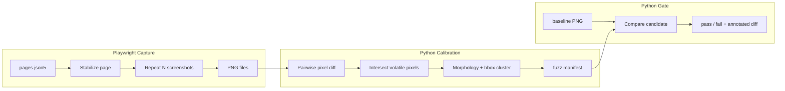
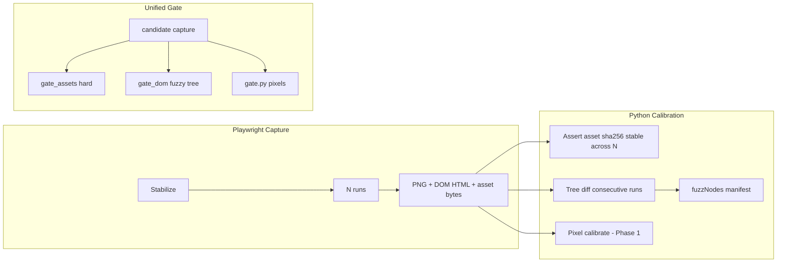

# Fuzzy Validator — Architecture

**Status:** Implemented — see [12-design-and-implementation.md](./12-design-and-implementation.md) for as-built design; this doc retains algorithm and stabilization detail.  
**Stack:** Playwright (TypeScript) + Python (Pillow, NumPy, OpenCV)  
**License / cost:** OSS only, no SaaS

---

## 1. Problem statement

Megiddo R-* sprints refactor PHP frontend code while requiring **no user-visible regression** and **minimal markup/asset drift**. Functional Playwright tests assert behavior; this validator asserts **refactor stability** across four layers:

| Layer | Phase | Gate |
|-------|-------|------|
| Pixels | 1 | Fuzzy bbox allowlist |
| CSS / JS | 2 | Hard byte-for-byte |
| DOM tree | 2 | Tree compare + fuzz nodes/branches |

Dynamic regions (timestamps, tokens, live widgets) would cause false failures. The validator **learns** where volatility lives by diffing several stabilized captures of the **same** page on the **same** commit — pixels and DOM use the same consecutive-intersection calibration pattern; assets must be identical across calibration runs or the page is not ready to baseline.

---

## 2. Design principles

| Principle | Phase 1 (pixels) | Phase 2 (assets + DOM) |
|-----------|------------------|------------------------|
| Refactor = stability | Layout must not drift outside fuzz | CSS/JS bytes unchanged; DOM unchanged outside fuzz nodes |
| Coarse over precise | Bbox fuzz + pixel budget | Tree-path fuzz; zero asset tolerance |
| Automate production | Auto bbox discovery | Auto DOM fuzz nodes; asset self-check across N runs |
| Separate concerns | TS captures; Python analyzes; JSON manifest | Same |
| Determinism first | Stabilize time, animations, fonts | Same + asset manifest must match across calibration runs |
| Fail outside fuzz only | Ignore diffs inside bbox | Ignore text/attrs/subtree per manifest; assets have no fuzz |
| Git-friendly artifacts | Manifests + baselines committed | Same |

---

## 3. Pipeline overview

### Phase 1 — pixel gate



### Phase 2 — asset + DOM gate

See [05-phase2-asset-dom-gate.md](./05-phase2-asset-dom-gate.md) for full detail. Summary:



Modes:

| Mode | Input | Output |
|------|-------|--------|
| **capture** | Page registry entry | PNG + `run-*.dom.html` + `run-*.assets.json` + raw asset files |
| **calibrate (visual)** | N PNGs | `{pageId}.fuzz.json` + overlay |
| **calibrate (dom)** | N DOM trees | `{pageId}.dom-fuzz.json` + debug report |
| **calibrate (assets)** | N asset manifests | `baselines/{pageId}.assets.json` or abort if unstable |
| **gate --phase all** | Baselines + candidate + manifests | Exit 0/1; reports per layer |

---

## 4. Playwright capture layer (Phase 1 + 2)

### 4.1 Location

```
tools/fuzzy-validator/
  playwright/
    capture.spec.ts      # driven by pages.json5
    lib/stabilize.ts     # shared stabilization hooks
    lib/auth.ts          # login helper (mirrors tests/e2e patterns)
```

Reuse root `playwright.config.ts` with a dedicated project or env flag:

```bash
FUZZ_CAPTURE=1 npx playwright test tools/fuzzy-validator/playwright/capture.spec.ts
```

### 4.2 Page registry

Central list in `tools/fuzzy-validator/manifests/pages.json5` (see [03-manifest-schema.md](./03-manifest-schema.md)). Each entry defines:

- Stable `id` (filesystem key)
- `url` path relative to `ORK3_E2E_BASE_URL`
- `auth`: `none` | `login`
- `viewport` (default 1280×720)
- `repeat`: calibration run count (default 5)
- Optional `waitAfterMs`, `readySelector`

Capture spec iterates registry; no hand-written test per page.

**Phase 2 extension:** same loop also writes DOM HTML and records CSS/JS asset bodies (see [05-phase2-asset-dom-gate.md](./05-phase2-asset-dom-gate.md)).

### 4.3 Render stabilization (JavaScript)

Applied on every capture **before** screenshot:

| Technique | Implementation |
|-----------|----------------|
| Fixed clock | `await page.clock.install({ time: new Date('2026-06-15T12:00:00Z') })` |
| Disable animations | Inject CSS: `*, *::before, *::after { animation: none !important; transition: none !important; }` |
| Hide carets | `caret-color: transparent` on inputs |
| Scroll reset | `window.scrollTo(0, 0)` |
| Font readiness | `await document.fonts.ready` |
| Network settle | `waitForLoadState('networkidle')` then optional `readySelector` |
| Lazy images | Optional: scroll full page once to force lazy load, then scroll top |

Optional v1.1: stub known noisy XHR (weather, analytics) via `page.route()` when `ENVIRONMENT=TEST` endpoints exist.

### 4.4 Screenshot settings

```typescript
await page.screenshot({
  path: outPath,
  fullPage: true,
  animations: 'disabled',
  caret: 'hide',
});
```

Fixed viewport in config (not device emulation randomness). Single browser project: **Desktop Chrome headless** only for v1.

### 4.5 Output layout

```
tools/fuzzy-validator/
  calibrations/{pageId}/
    run-001.png … run-005.png              # Phase 1
    run-001.dom.html                       # Phase 2 raw HTML
    run-001.dom.json                       # Phase 2 canonical tree (Python)
    run-001.assets.json                    # Phase 2 asset manifest
    assets/run-001/css-*.css js-*.js       # Phase 2 raw bytes (gitignored)
  baselines/
    {pageId}.png                           # Phase 1
    {pageId}.dom.json                      # Phase 2
    {pageId}.assets.json                   # Phase 2
    assets/{pageId}/                       # Phase 2 baseline bytes (committed)
  manifests/
    {pageId}.fuzz.json                     # Phase 1 bbox
    {pageId}.dom-fuzz.json                 # Phase 2 tree nodes
  reports/                                 # gitignored
```

---

## 5. Python pixel fuzz discovery (Phase 1)

### 5.1 Location

```
tools/fuzzy-validator/python/
  requirements.txt
  discover_fuzz.py      # CLI: calibrate mode
  gate.py               # CLI: regression mode
  lib/
    diff_regions.py     # core algorithms
    manifest.py         # load/save JSON
    overlay.py          # draw boxes on PNG for human review
```

Dependencies (minimal):

```
pillow>=10.0
numpy>=1.26
opencv-python-headless>=4.9
```

### 5.2 Algorithm (coarse, first pass)

For one page with calibration images `I_1 … I_N`:

1. **Resize check** — all images same dimensions; abort if not.
2. **Pairwise diff masks** — for each pair `(I_a, I_b)`:
   - Convert to RGB arrays
   - Per-pixel absolute difference; channel max or L2 norm
   - Mask pixel if `diff > color_threshold` (default 20/255)
3. **Volatile pixel set** — pixels that differ in **every** pairwise comparison involving at least two distinct runs, OR (simpler v1): pixels that differ between `I_1` and `I_2` **and** `I_2` and `I_3` (intersection of consecutive diffs). Consecutive intersection is cheaper and good enough for first pass.
4. **Morphology** — binary dilate (kernel 5×5) to merge adjacent noise; optional erode.
5. **Connected components** — OpenCV `connectedComponentsWithStats`
6. **Bounding boxes** — for each component with area ≥ `min_area_px` (default 64), emit `{ x, y, width, height }`
7. **Padding** — expand each box by `pad_px` (default 4) clamped to image bounds
8. **Merge overlapping boxes** — union rectangles that intersect

Tunable defaults in `manifests/defaults.json5`:

```json5
{
  "colorThreshold": 20,
  "minAreaPx": 64,
  "padPx": 4,
  "calibrationRuns": 5,
  "gateMaxOutsideDiffPx": 500,
  "gateColorThreshold": 20
}
```

### 5.3 Calibration overlay (human review aid)

`discover_fuzz.py` writes `reports/{pageId}-calibration-overlay.png`:

- Base: median or `run-003.png`
- Red semi-transparent rectangles over each fuzz box
- Optional heatmap of volatile pixels

Reviewer confirms overlay looks reasonable before committing `manifests/{pageId}.fuzz.json`.

### 5.4 Fuzz manifest contents

Per page:

```json
{
  "pageId": "home-authenticated",
  "imageWidth": 1280,
  "imageHeight": 4200,
  "calibratedAt": "2026-07-07T12:00:00Z",
  "calibrationRuns": 5,
  "params": { "colorThreshold": 20, "minAreaPx": 64, "padPx": 4 },
  "fuzzZones": [
    { "x": 980, "y": 12, "width": 280, "height": 40, "source": "auto" }
  ]
}
```

v2 enhancement: map bbox center to DOM path via `elementFromPoint` to cross-check pixel vs DOM fuzz.

---

## 6. Python pixel regression gate (Phase 1)

### 6.1 Inputs

- `baselines/{pageId}.png` — golden screenshot (stable branch, post-calibration)
- `calibrations/{pageId}/candidate.png` — single capture from R-* branch (or dedicated gate capture)
- `manifests/{pageId}.fuzz.json`

### 6.2 Algorithm

1. Load baseline and candidate; assert same dimensions (or fail with resize diff).
2. Compute full-image diff mask (same threshold as calibration).
3. **Subtract fuzz zones** — zero out diff mask pixels inside any `fuzzZones` rectangle.
4. Count remaining diff pixels → `outside_diff_px`.
5. Compute **visual stability score** = `1.0 - (outside_diff_px / comparable_px)` where `comparable_px` = total pixels minus fuzz-covered pixels.
6. **Pass** if `visual_score >= visualMinScore` (default `1.0`) **and** `outside_diff_px <= gateMaxOutsideDiffPx` (secondary cap).
7. Emit annotated PNG: **green** = fuzz boxes, **red** = failure regions (see [06-gate-output-and-report.md](./06-gate-output-and-report.md)).

Global gate fails if **any** page fails. `gate_run.py` sets exit code and writes HTML bundle.

### 6.3 Why normalized scores

Sub-pixel anti-aliasing may shift slightly between captures. Prefer lowering **`visualMinScore`** (e.g. `0.98`) over enlarging fuzz boxes. **`assetsMinScore`** stays at `1.0` for refactor gates. Full pass/fail and report spec: [06-gate-output-and-report.md](./06-gate-output-and-report.md).

---

## 7. Phase 2 — CSS, JavaScript, DOM (summary)

Full specification: [05-phase2-asset-dom-gate.md](./05-phase2-asset-dom-gate.md).

| Layer | Calibration | Gate |
|-------|-------------|------|
| **CSS** | N captures must yield **identical** sha256 per asset | **Hard** — any byte change fails |
| **JavaScript** | Same | **Hard** — any byte change fails |
| **DOM tree** | Consecutive-intersection on subtree hashes → `fuzzNodes` | Tree diff vs baseline; ignore fuzz paths |

DOM fuzz modes: `subtree` (ignore branch), `text` (ignore text nodes), `attributes` (ignore named attrs on node).

Refactor sign-off after FU-10: `gate.sh --phase all` → pass/fail exit code + `reports/run-{id}/index.html`.

---

## 8. Gate outputs (pass/fail + HTML report)

Every gate run produces **two deliverables**:

| # | Output | Details |
|---|--------|---------|
| 1 | **Pass / Fail** | Exit `0`/`1`; per-page scores in `[0,1]` vs `*MinScore` thresholds; stdout `FUZZ_GATE …` line |
| 2 | **HTML report** | Static site `reports/run-{id}/`: JaCoCo-style dashboard, per-page drill-down, green/red annotated screenshots, optional long-form CSS/JS/DOM diffs, `summary.json` |

Orchestrated by `gate_run.py`. Full specification: [06-gate-output-and-report.md](./06-gate-output-and-report.md).

---

## 9. CI and environment

| Context | Recommendation |
|---------|----------------|
| Local dev | Run calibrate on macOS; accept platform-specific baselines |
| Sign-off / CI | Linux container with fixed fonts; baselines generated in CI only |
| Docker | Same `docker-compose.php8.yml` stack as existing e2e |

Playwright in CI:

```bash
docker compose -f docker-compose.php8.yml up -d
npm ci && npx playwright install chromium
sh tools/fuzzy-validator/bin/calibrate.sh --pages home-authenticated
sh tools/fuzzy-validator/bin/gate.sh
```

Pin baseline PNGs to **Linux Chromium** to match CI. Document in [04-operating-guide.md](./04-operating-guide.md).

---

## 10. Failure modes and mitigations

| Risk | Mitigation |
|------|------------|
| Flaky networkidle | Add `readySelector`; increase `waitAfterMs` per page |
| Large fuzz zones eat real regressions | Review calibration overlay; lower threshold; increase N |
| Platform font diffs | CI-only baselines; disable gate on macOS local optional |
| Dynamic content outside learned zones | Re-calibrate; add page-specific route stubs |
| Full-page height changes | Dimension mismatch fails fast; update baseline intentionally |

---

## 11. Security

- Credentials via env vars only (`ORK3_E2E_USERNAME`, `ORK3_E2E_PASSWORD`)
- No secrets in manifests or PNG paths
- Calibration/gate runs against local docker only by default
