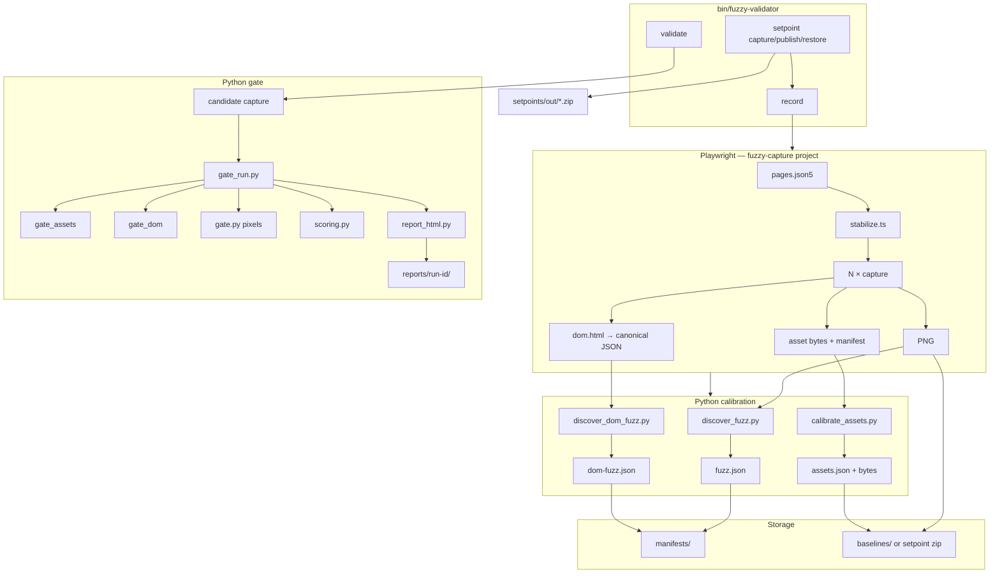

# Fuzzy Validator — Design & Implementation

**Status:** Implemented (FU-0 … FU-16 complete)  
**Audience:** Maintainers, architects, agents extending the tool  
**Companion docs:** [USER-GUIDE.md](./USER-GUIDE.md) · [DEVELOPER-GUIDE.md](./DEVELOPER-GUIDE.md)

This document captures **why** the tool is shaped the way it is and **how** it is built today. Historical planning detail remains in [01-architecture.md](./reference/01-architecture.md) and [02-implementation-plan.md](./archive/02-implementation-plan.md).

---

## 1. Problem and scope

Megiddo R-* refactors change PHP templates and routing while requiring **no user-visible regression** and **minimal accidental asset drift**. Functional Playwright e2e tests assert behavior; the fuzzy validator asserts **output stability** across four layers:

| Layer | Strictness | Rationale |
|-------|------------|-----------|
| **CSS / JS bytes** | Hard (zero tolerance) | Refactor should not touch static bundles or inline script bodies |
| **DOM tree** | Fuzzy (calibrated nodes) | Tokens, timestamps, session chrome drift without structural change |
| **Pixels** | Fuzzy (calibrated bboxes) | Same volatility as DOM, expressed visually |
| **Scores + report** | Pass/fail exit code + HTML | CI lights-out + human drill-down on failure |

**Out of scope:** commercial visual-diff SaaS, manual dashboard ignore regions, replacing PHPUnit or behavior e2e.

---

## 2. High-level design decisions

### 2.1 Two-language split (TypeScript capture, Python analysis)

| Decision | Choice | Why |
|----------|--------|-----|
| Capture runtime | Playwright (TS) | Reuses ORK3 e2e stack, auth, docker reachability |
| Diff / gate / report | Python | Pillow, NumPy, OpenCV for pixels; rich text diff for assets; faster iteration for algorithms |
| Contract between layers | Files on disk (PNG, JSON, HTML, bytes) | Debuggable, git-diffable manifests, no RPC between capture and gate |

### 2.2 Calibration-learned fuzz vs manual ignore lists

Dynamic pages (session labels, relative dates, heraldry rotation) would false-fail a naive screenshot diff. Instead of maintainer-drawn ignore regions:

1. Capture **N** stabilized renders on a **stable commit** (default N=5).
2. Diff consecutive runs; **intersect** volatile regions (pixels) or subtree hashes (DOM).
3. Commit small JSON manifests (`*.fuzz.json`, `*.dom-fuzz.json`) — diffable in PRs.

Manual zones/nodes remain supported for corners auto-discovery misses.

### 2.3 Hard asset gate (no fuzz for CSS/JS)

Refactor assumption: CSS and JS should not change. If asset bytes differ across calibration runs, **record aborts** — the page is not ready to baseline. At validate time, any byte change fails with a unified diff in the report.

### 2.4 Dual database profiles (test strict, mirror lenient)

| Profile | DB | Thresholds | Purpose |
|---------|-----|------------|---------|
| **test** | `ork_test` sandbox @ 19307 | visual/dom/assets ≥ 1.0 | Deterministic dataset; strict refactor gate |
| **mirror** | Local `ork` @ 19306 | visual ≥ 0.98, dom ≥ 0.99 | Realistic prod-like data; catches mirror-only drift |

`record` and `validate` default to `--profiles test,mirror`, switching app DB via `bin/ork-db use` between passes. See [11-dual-database-profiles.md](./reference/11-dual-database-profiles.md).

### 2.5 Setpoint bundles (FU-16) — git vs off-git storage

| Artifact | In git | Off git (zip on Google Drive) |
|----------|--------|-------------------------------|
| `manifests/**/*.fuzz.json`, `*.dom-fuzz.json` | Yes | Copy in zip |
| `setpoint.json` (filename pointer + metadata) | Yes | — |
| `pages.json5`, `profiles.json5`, `defaults.json5` | Yes | — |
| `baselines/**` PNG, DOM, asset bytes | No | Yes (canonical in zip) |

**Why:** 20+ pages × 2 profiles × PNG + raw CSS/JS does not scale in git (especially Google Drive sync repos). PRs show `latestBundle` filename change; maintainers upload zip to a world-readable Drive folder.

### 2.6 Two test tiers

| Tier | What | Docker | Blocks CI |
|------|------|--------|-----------|
| **Unit** | pytest on synthetic fixtures | No | Yes (≥ 90% coverage) |
| **Evidence** | Committed integration proof under `evidence/` | Optional re-run | No |

Unit tests prove algorithms; evidence proves the full discover → validate → report pipeline on real page snapshots with controlled mutations.

### 2.7 OSS-only stack

Playwright, Python (Pillow, NumPy, OpenCV, Jinja2). No paid visual regression services.

---

## 3. System architecture (as built)



### 3.1 Commands and responsibilities

| Command | Orchestrator | Primary outputs |
|---------|--------------|-----------------|
| `record` | `fuzzy_validator/cli.py` | `baselines/{profile}/`, `manifests/{profile}/`, calibration overlays in `reports/` |
| `validate` | `cli.py` → `gate_run.py` | Exit 0/1, `FUZZ_GATE` stdout line, `reports/run-{id}/index.html` |
| `setpoint capture` | `cli.py` → `record` + `lib/setpoint.py` | Zip under `setpoints/out/` |
| `setpoint publish` | `lib/setpoint.py` | Updates `setpoint.json` |
| `setpoint restore` | `lib/setpoint.py` | Extracts zip → `baselines/` |

Legacy shell wrappers (`bin/calibrate.sh`, `bin/gate.sh`) still exist; **`bin/fuzzy-validator`** is the supported entry point.

---

## 4. Repository layout (implemented)

```
tools/fuzzy-validator/
  bin/fuzzy-validator              # bash → python -m fuzzy_validator.cli
  bin/gate.sh, calibrate.sh        # legacy; prefer bin/fuzzy-validator
  manifests/
    pages.json5                    # page registry (26+ routes)
    profiles.json5                 # test / mirror DB + thresholds
    defaults.json5                 # calibration + gate tunables
    {profile}/{pageId}.fuzz.json
    {profile}/{pageId}.dom-fuzz.json
  setpoint.json                    # latest bundle pointer (committed)
  setpoints/
    bootstrap/                     # committed pilot zip for restore/CI
    out/                           # capture output (gitignored)
    cache/                         # optional --base-url downloads (gitignored)
  baselines/                       # gitignored; populated by restore or record
    {profile}/*.png, *.dom.json, *.assets.json
    assets/{profile}/{pageId}/*    # raw CSS/JS bytes
  calibrations/                    # gitignored ephemeral captures
  reports/                         # gitignored gate + record debug output
  evidence/                        # committed integration proof (FU-12+)
  playwright/
    capture.spec.ts
    lib/stabilize.ts, auth.ts, captureDom.ts, captureAssets.ts
  python/
    fuzzy_validator/cli.py         # record | validate | setpoint
    discover_fuzz.py, discover_dom_fuzz.py, calibrate_assets.py
    gate.py, gate_assets.py, gate_dom.py, gate_run.py
    lib/                           # algorithms + report (see §5)
    tests/unit/, tests/integration/
```

Entry from repo root: **`bin/fuzzy-validator`** → `tools/fuzzy-validator/bin/fuzzy-validator`.

---

## 5. Module map (Python)

| Module | Role |
|--------|------|
| `fuzzy_validator/cli.py` | Argparse, profile activation (`ork-db`), Playwright subprocess, setpoint subcommands |
| `discover_fuzz.py` | N-run PNG calibration → `fuzz.json` + overlay PNG |
| `discover_dom_fuzz.py` | N-run DOM calibration → `dom-fuzz.json` + debug text |
| `calibrate_assets.py` | Assert identical asset sha256 across N runs; write baseline manifest + bytes |
| `gate.py` | Pixel diff minus fuzz zones; annotated PNG |
| `gate_assets.py` | Byte compare; unified diff snippets |
| `gate_dom.py` | Tree diff minus fuzz nodes |
| `gate_run.py` | Layer orchestration, `summary.json`, multi-profile finalize |
| `lib/diff_regions.py` | Pairwise masks, consecutive intersection, bbox clustering |
| `lib/canonical_dom.py` | HTML → stable tree JSON |
| `lib/tree_diff.py` | Structural compare with fuzz node modes (`subtree`, `text`, `attributes`) |
| `lib/asset_manifest.py`, `lib/asset_store.py` | sha256 manifests and byte paths |
| `lib/scoring.py` | Normalized scores in [0,1]; threshold pass/fail |
| `lib/report_html.py` | JaCoCo-style static HTML bundle (Jinja2) |
| `lib/page_registry.py` | Load/validate `pages.json5` |
| `lib/profiles.py` | Profile config, baseline existence checks, auth env |
| `lib/setpoint.py` | Zip create/publish/restore, content sha256 verification |
| `lib/tool_paths.py` | Default vs `--tool-root` (evidence suite) path resolution |

---

## 6. Capture layer (Playwright)

Driven by env vars set from Python:

| Env var | Purpose |
|---------|---------|
| `FUZZ_PAGES` | Comma-separated page ids |
| `FUZZ_TOOL_ROOT` | Baselines/manifests root (default or `evidence/`) |
| `FUZZ_PAGES_MANIFEST` | Path to `pages.json5` |
| `FUZZ_REPEAT` | Calibration run count |
| `FUZZ_MODE=candidate` | Single capture for validate |

**Stabilization** (`playwright/lib/stabilize.ts`): fixed clock (`2026-06-15T12:00:00Z`), disabled animations/transitions, scroll top, `document.fonts.ready`, `networkidle`, optional `readySelector`.

**Auth** (`playwright/lib/auth.ts`): mirrors `tests/e2e/` login patterns; credentials from profile config or env.

Project name in root `playwright.config.ts`: **`fuzzy-capture`**.

---

## 7. Algorithms (summary)

Detailed specs: [01-architecture.md](./reference/01-architecture.md) §5–7, [05-phase2-asset-dom-gate.md](./archive/05-phase2-asset-dom-gate.md).

### 7.1 Pixel fuzz discovery

1. Load N calibration PNGs; assert equal dimensions.
2. Consecutive pairwise diff masks (threshold from `defaults.json5`).
3. Intersect masks → volatile pixel set.
4. Morphology + connected components → bounding boxes (min area, padding, merge overlaps).
5. Write `fuzzZones` to manifest; draw red overlay for human review.

### 7.2 Pixel gate

1. Diff candidate vs baseline; zero mask inside `fuzzZones`.
2. Count outside diff pixels; compute visual score.
3. Pass if score ≥ profile threshold and outside count ≤ budget.
4. Annotate: **green** = fuzz, **red** = failure.

### 7.3 DOM fuzz discovery

1. Canonicalize N DOM JSON trees from calibration HTML.
2. Consecutive tree diffs; intersect volatile paths/attrs/text.
3. Emit `fuzzNodes` with mode per node.

### 7.4 Asset gate

Compare candidate asset manifest and byte files to baseline; any added/removed/changed sha256 fails.

---

## 8. Gate outputs

Every `validate` run produces:

| Output | Location |
|--------|----------|
| Exit code | `0` pass, `1` fail, `2` harness error |
| Stdout | `FUZZ_GATE run=… pass=N fail=M exit=…` |
| JSON summary | `reports/run-{id}/summary.json` |
| HTML dashboard | `reports/run-{id}/index.html` |

Multi-profile runs add per-profile sections. Full spec: [06-gate-output-and-report.md](./reference/06-gate-output-and-report.md).

---

## 9. Evidence suite (integration proof)

Location: `tools/fuzzy-validator/evidence/`

Proves discover → validate → report on **real** page snapshots with **controlled mutations** (heraldry patch, session token, CSS/JS +1 byte). Validate steps use `--skip-capture` to replay staged candidates — see [evidence/mutations.md](../../../tools/fuzzy-validator/evidence/mutations.md).

Committed HTML entry points:

- `evidence/reports/index.html` — **top-level hub** (start here)
- `evidence/reports/pixel-proof/index.html`
- `evidence/reports/dom-proof/index.html`
- `evidence/reports/assets-proof/index.html`
- `evidence/reports/unified-proof/index.html`

---

## 10. Quality gates (local)

This project does not use GitHub Actions for the fuzzy validator. Expected local checks:

| Check | Required for tool changes |
|-------|---------------------------|
| `pytest` with `--cov-fail-under=95` on production Python sources | Yes |
| Optional pilot `validate` after `setpoint restore` | When touching capture / visual gate |
| Evidence suite under `evidence/` | When changing proof/report pipelines |

---

## 11. Relationship to other ORK3 tooling

| Tool | Relationship |
|------|--------------|
| `tests/e2e/` | Behavior tests; page ids in fuzzy registry derived from e2e routes |
| `bin/ork-db` | Profile switching, sandbox deploy for test profile |
| Megiddo R-* | Optional `validate --phase all` at sign-off |
| PHPUnit | Unchanged; fuzzy validator complements, does not replace |

---

## 12. Failure modes (operational)

| Symptom | Likely cause | Mitigation |
|---------|--------------|------------|
| Validate exit 2, missing baselines | No `setpoint restore` | `bin/fuzzy-validator setpoint restore` |
| Record aborts on assets | Unstable scripts across N runs | Stub network; fix env; increase waits |
| Huge fuzz boxes | Page still loading | `readySelector`, `waitAfterMs` in registry |
| macOS vs Linux pixel diff | Font rendering | Treat CI Linux baselines as canonical |
| False DOM fail on token | Missing fuzz node | Re-record or add `manualNodes` |

---

## 13. Further reading

| Topic | Doc |
|-------|-----|
| Manifest JSON schemas | [03-manifest-schema.md](./reference/03-manifest-schema.md) |
| CLI flags | [10-cli-reference.md](./reference/10-cli-reference.md) |
| Day-to-day workflows | [USER-GUIDE.md](./USER-GUIDE.md) |
| Tests and extending code | [DEVELOPER-GUIDE.md](./DEVELOPER-GUIDE.md) |
| Milestone history | [08-milestone-checklist.md](./archive/08-milestone-checklist.md) |
