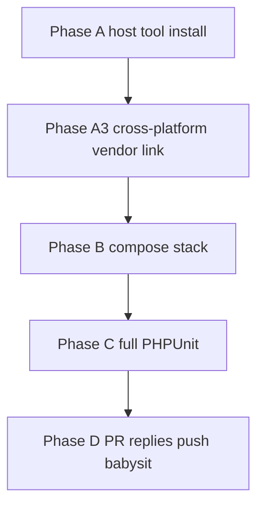

# PR #492 Batch 5 — Host readiness + Rev4 closeout

## Mac host note (2026-08-01)

Phase A (Linux host tool install / cross-platform vendor bootstrap) applies only to the separate Linux Insync agent and is **skipped on Mac**. This Mac checkout already has PHP 8.4+, Docker compose stack, `vendor` → `$HOME/.cache/ork3/vendor`, and authenticated `gh`. Execution continues at Phase B verification → Phase C → Phase D. Progress: [`docs/megiddo/refactor/pr-492-review-fixes/batch5-rev4-closeout-checklist.md`](../refactor/pr-492-review-fixes/batch5-rev4-closeout-checklist.md).

**Mac Batch5 progress (2026-08-01):** M0–M2 closed (PHPUnit green; Infection floors raised). **M3 docs closed** on `fix-pr-492-batch5-m3-docs` — checklist Commit SHAs filled (C-28/C-29 + verified C-01…C-18; C-27 corrected to `6834b1cd`). Next: **M4 / Phase D** (post pending-replies + REVISION-4; push/mirror). Do not touch fuzzy-validator stash.

## Current state (already done locally)

On `fix-pr-492`, C-19…C-31 code/docs are committed; checklist is fully checked; pending thread replies live under [`docs/megiddo/refactor/pr-492-review-fixes/pending-replies/`](docs/megiddo/refactor/pr-492-review-fixes/pending-replies/); `origin/master` was merged cleanly. Tip is ahead of `origin/fix-pr-492`.

**Blocked previously:** this Linux host had no Docker Engine, no PHP CLI, a Drive-synced Mac absolute `vendor` path artifact, and no GitHub credentials for push/`gh` replies. That is now an explicit plan phase — not a silent skip.

## Goal

Make the host satisfy Megiddo local-dev prerequisites ([`06-test-framework.md`](docs/megiddo/refactor/06-test-framework.md)), prove Rev4 with a green full PHPUnit run, then finish PR hygiene (replies + push/mirror). **Preserve Mac:** Composer packages stay at `$HOME/.cache/ork3/vendor` on each OS; the shared Drive checkout only holds a per-host link, never a Linux-only in-tree `vendor/` that would clobber Mac.



---

## Phase A — Host tool prerequisites

Install and verify on **this** machine (Ubuntu/Linux Insync checkout). Prefer Docker Engine + Compose plugin (project canonical); do not substitute Podman unless Docker cannot be installed and the user approves.

### A1. Docker Engine + Compose

- Install Docker Engine and the `docker compose` plugin (official Docker apt repo or distro-supported path).
- Ensure `docker` group membership (or documented `sudo` usage) so `docker ps` works without failing.
- Verify:
  - `docker --version`
  - `docker compose version`
  - `systemctl is-active docker` (or equivalent service running)
  - `/var/run/docker.sock` present

### A2. PHP 8.2+ host CLI (tests run on host)

Per [`06-test-framework.md`](docs/megiddo/refactor/06-test-framework.md): PHPUnit runs on **host** PHP 8.2+, not the app container PHP 8.1.

Install at least:

- `php8.2-cli` (or newer 8.x matching project needs)
- Extensions commonly required: `mysql`/`mysqli`/`pdo_mysql`, `mbstring`, `xml`, `curl`, `zip`, `gd` (as needed by composer/platform reqs)
- Preferred coverage: `pcov` (optional for Infection; not required for plain PHPUnit green)

Verify: `php -v` ≥ 8.2; `php -m` shows mysql/mbstring/xml.

### A3. Composer + cross-platform `vendor` (shared Drive)

`vendor` is gitignored. On the shared Insync/Google Drive tree it currently appears as a **34-byte file** containing the Mac absolute path `/Users/inoahsmi/.cache/ork3/vendor` (Drive often flattens symlinks). That must not be “fixed” by installing a full `vendor/` directory into the shared checkout — that would sync huge trees and fight the Mac layout.

**Canonical layout (both OS):**

| Location | Role |
|----------|------|
| `$HOME/.cache/ork3/vendor` | Real Composer install (Mac: `/Users/inoahsmi/...`, Linux: `/home/megiddo/...`) |
| `<repo>/vendor` | Symlink → `$HOME/.cache/ork3/vendor` on **this** host only |

**Do:**

1. Install Composer 2 if missing.
2. Add or extend a small bootstrap (prefer `bin/setup-dev-hooks.sh` or `bin/link-vendor`) that:
   - `mkdir -p "$HOME/.cache/ork3"`
   - Removes only a broken Drive artifact / wrong-target link at `<repo>/vendor` (file or symlink whose target is not `$HOME/.cache/ork3/vendor`)
   - `ln -sfn "$HOME/.cache/ork3/vendor" <repo>/vendor`
   - Runs `composer install` with packages landing in `$HOME/.cache/ork3/vendor` (symlink-aware install from repo root is fine once the link exists and points at an empty/real dir)
3. On Mac, leave `/Users/inoahsmi/.cache/ork3/vendor` intact; the bootstrap is a no-op if the symlink already targets `$HOME/.cache/ork3/vendor`.
4. Document that after Drive sync, Linux/Mac may need to re-run the link script (absolute symlink targets do not travel). Prefer excluding `vendor` from Insync selective sync so each machine keeps its own link.

**Do not:**

- Commit `vendor/` or the symlink into git
- `composer install` into a real directory at `<repo>/vendor` on the shared Drive
- Delete or overwrite the Mac home-cache tree from Linux
- Replace the Mac absolute path with a Linux absolute path inside a synced plain file and call it done

**Verify (Linux):** `readlink -f vendor` → `/home/megiddo/.cache/ork3/vendor`; `test -x vendor/bin/phpunit`.

### A4. GitHub CLI (`gh`) + auth

- Install `gh` (tarball to `~/.local/bin` or apt).
- Authenticate (`gh auth login` or token) so the agent can:
  - `git push` to `origin`
  - Post PR review replies and the Revision 4 issue comment
- Verify: `gh auth status`; `gh api user -q .login`.

### A5. Stop conditions

- If sudo/interactive approval is required for apt/docker install, pause and ask the user rather than inventing workarounds.
- Do not claim PHPUnit green until Phase C succeeds on this host.

---

## Phase B — Local stack bring-up

Assume Phase A3 already linked `<repo>/vendor` → `$HOME/.cache/ork3/vendor` and ran `composer install` into that cache.

Follow the test-framework / test-database-tool docs:

```bash
docker compose -f docker-compose.php8.yml up -d
bin/ork-db deploy-sandbox
bin/seed-test-credentials
```

### Verify

| Check | Expect |
|-------|--------|
| `docker compose -f docker-compose.php8.yml ps` | app + mirror DB + sandbox DB healthy |
| Ports | `19306` (mirror `ork`), `19307` (sandbox `ork_test`), app UI typically `19080` |
| `bin/ork-db drift-check --strict` | passes (also run by `bin/run-unit-tests.sh`) |
| `ENVIRONMENT=TEST` DB reachability | sandbox usable by PHPUnit |

Optional but recommended once stack is up: confirm `admin`/`password` and `megiddo`/`test-db-player` login paths still work (credential seeder).

---

## Phase C — Prove Rev4 (PHPUnit)

**Mac closeout (2026-08-01):** Proven green on stacked branch `fix-pr-492-batch5-m1-phpunit` (see checklist M1 result log). Five baseline failures cleared (C-22 auth test wiring + SearchService session Token cache).

On branch `fix-pr-492` (or stacked M1 tip before merge):

```bash
sh bin/run-unit-tests.sh
```

- Must be **full suite** green (no filter), matching orchestrator / Rev2 bar.
- If failures are caused by Rev4 C-19…C-30 changes: fix with new `FIX-PR492 C-XX: …` (or a single follow-up commit if clearly one regression), re-run full suite.
- If failures are environment/data: fix host/sandbox setup, do not weaken tests.

Update checklist Commit/PR-reply columns only if new fix commits land.

---

## Phase D — PR hygiene

1. Post each draft under [`pending-replies/`](docs/megiddo/refactor/pr-492-review-fixes/pending-replies/) to the matching review thread (comment ids in filenames / plan.md). Prefer:
   `gh api repos/amtgard/ORK3/pulls/492/comments/<ID>/replies -f body='…'`
2. Post [`REVISION-4.md`](docs/megiddo/refactor/pr-492-review-fixes/pending-replies/REVISION-4.md) as a PR issue comment; refresh tip SHA if HEAD moved after PHPUnit fixes.
3. Push (user-approved; credentials required):
   ```bash
   git push origin fix-pr-492
   git push origin fix-pr-492:megiddo/fuzzy-validator-v2
   ```
4. Optional `/babysit`: confirm mergeable vs `master`, unresolved threads triaged, CI green.

---

## Already completed (do not redo unless regression)

| ID | Topic | Primary commit |
|----|-------|----------------|
| C-19 | RemoveRsvp Token | `71ddcd29` |
| C-20 | GetRsvpList gate | `53fffd48` |
| C-21 | Player getters Token | `8574690a` |
| C-22 | Report getters Token | `96445e11` |
| C-23 | Weather summary admin | `a3aec596` |
| C-24 | DbStatus Wanted whitelist | `9a6b9b78` |
| C-25 | AddAttendance ReactivateInactive | `2654ca7b` |
| C-26 | QualTest reporters | `56a3220a` |
| C-27 | Park ladder master parity | `6834b1cd` |
| C-28 | KD: search sort | `ea4a6608` |
| C-29 | Weather coords sentinel | `ae4f0864` |
| C-30 | Award option order | `6d06e4c0` |
| C-31 | Auth inventory doc | `d9a17b36` |

Baked policies unchanged: C-25 explicit reactivation flag; C-27 master park ladder parity; C-31 analysis-only (no mass gating).

---

## Out of scope

- Replacing Docker with Podman/LXD without an explicit user decision
- Mass-gating every pre-existing ungated JsonServer method on master
- Splitting tooling vs refactor into a second PR
- A second full adversarial review pass (follow-up after Rev4 lands on GitHub)

---

## Relation to `/babysit`

`/babysit` remains a **post-green** merge-readiness sweep. Host setup + PHPUnit are hard prerequisites before babysit is meaningful for CI/comment closure.
