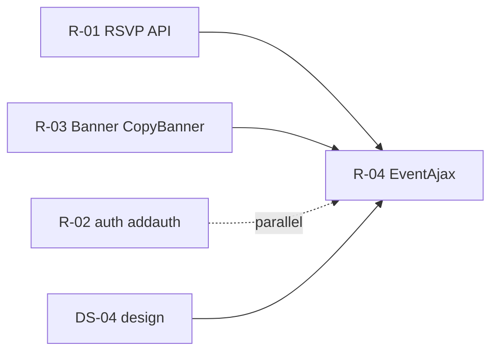

# DS-04: EventAjax Core — Discovery Design Note

**Milestone:** DS-04  
**Branch:** `megiddo/ds-04-eventajax-discovery`  
**Target IDs:** T-EVA-01 through T-EVA-13  
**Depends on:** M0.1 (test framework), DS-01 (RSVP — partial overlap), DS-02 (auth INSERT — partial overlap)  
**Execution sprint:** R-04
**Test sprint:** T-04

---

## 1. Backend survey

### 1.1 Scope summary

`Controller_EventAjax` (~1,880 lines) is the largest frontend violation cluster in the Megiddo inventory. It mixes:

- **Thin API wrappers** — `create`, `cancel` call `Model_Event` → `EventService` for core event CRUD.
- **Direct `$DB` writes/reads** — status, preview, staff, schedule, copy-from-past-event, heraldry remove, draft flag.
- **`Ork3::$Lib` bypass** — authorization checks, danger audit, heraldry upload, ghettocache busting.

The backend **`class.Event.php`** covers legacy event/calendar-detail lifecycle (`CreateEvent`, `GetEvent`, `SetEventDetails`, `DeleteEvent`, …) but has **no** methods for event planning expansion tables (`event_staff`, `event_schedule`, `event_schedule_lead`), publish/draft status, preview aggregation, or copy-from-past-event orchestration.

`orkservice/Event/EventService.function.php` is **empty** — SOAP handlers are registered in `EventService.registration.php` but delegate to domain via the framework loader (same pattern as other services).

### 1.2 Database tables touched (EventAjax core)

| Table | DS-04 usage |
|-------|-------------|
| `ork_event` | Status draft/published; heraldry flag; scope validation |
| `ork_event_calendardetail` | Preview, copy target INSERT, date queries for cache bust |
| `ork_event_staff` | Staff CRUD; delegated permission checks (`can_manage`, `can_attendance`, `can_schedule`, `can_feast`) |
| `ork_event_schedule` | Schedule CRUD; feast vs non-feast category rules |
| `ork_event_schedule_lead` | Lead INSERT/DELETE with schedule rows |
| `ork_event_rsvp` | Preview counts; staff delete path (via `Model_Event`) |
| `ork_event_fees`, `ork_event_links` | Copied in `create_with_copy` when `modules.details` |
| `ork_mundane`, `ork_park`, `ork_kingdom` | Joins for preview, staff persona, attendance response |

Migrations: [`2026-03-16-add-event-staff.sql`](../../../db-migrations/2026-03-16-add-event-staff.sql), schedule/feast migrations under `db-migrations/2026-03-*` and `2026-04-*`.

### 1.3 Frontend violations (target IDs)

#### T-EVA-01: `create` — post-create draft status

| Lines | Behavior |
|-------|----------|
| 5–51 | Calls `Model_Event::create_event` (backend `CreateEvent`); on success, if `POST Status=draft`, raw `UPDATE ork_event SET status='draft'` |

**Gap:** `CreateEvent` always creates with default DB status (`published`). Draft is a frontend-only follow-up UPDATE.

#### T-EVA-02: `set_status` — publish / unpublish

| Lines | Behavior |
|-------|----------|
| 54–115 | Auth: `AUTH_EVENT/EDIT` **or** staff `can_manage` on any occurrence; UPDATE `ork_event.status`; `ghettocache->bust_event_search`; loop calendar dates busting `Event.GetActiveEventsAtScope` for park+kingdom |

**Gap:** No domain method; cache bust logic duplicated from other event write paths.

#### T-EVA-03: `preview` — calendar quick-look modal

| Lines | Behavior |
|-------|----------|
| 119–252 | Multi-query read: event row + park name; detail row (by id or “current” fallback); draft visibility gate; RSVP SUM CASE counts + caller status; markdown excerpt truncation; returns structured JSON |

**Gap:** Duplicates RSVP aggregation patterns documented in DS-01 (`EventRsvpAjax::counts`, `Model_Event::get_rsvp_count`).

#### T-EVA-04: `add_attendance` — staff sign-in shortcut

| Lines | Behavior |
|-------|----------|
| 254–343 | Auth: event CREATE **or** staff `can_attendance`; 24h-before-start gate; calls `Model_Attendance::add_attendance` (backend); **post-success** raw SELECT JOIN to build rich JSON row for UI |

**Gap:** Write path is mostly backend; enrichment query and staff-auth SQL are frontend.

#### T-EVA-05: `delete_rsvp` — staff removes player RSVP

| Lines | Behavior |
|-------|----------|
| 345–379 | Auth: event EDIT **or** staff `can_attendance`; `Model_Event::remove_rsvp` (frontend `$DB` DELETE) |

**Overlap:** Primary RSVP refactor is DS-01 / R-01. R-04 should switch to backend RSVP API once R-01 lands; until then preserve behavior.

#### T-EVA-06: `auth` — **split scope**

| Portion | Lines | Owner sprint |
|---------|-------|--------------|
| `addauth` — raw authorization INSERT | 493–528 | **DS-02 / R-02** (done discovery) |
| `removeauth` | 530–548 | Already uses `Model_Authorization::del_auth` ✓ |
| `playersearch` | 434–491 | **DS-11 / R-11** (search) |

**DS-04 note:** No R-04 work on `addauth` or `playersearch`; only document cross-reference.

#### T-EVA-07: `add_staff`

| Lines | Behavior |
|-------|----------|
| 552–702 | Auth: event CREATE **or** staff `can_manage`; INSERT or UPDATE `ork_event_staff`; danger audit; returns staff JSON |

#### T-EVA-08: `remove_staff`

| Lines | Behavior |
|-------|----------|
| 704–771 | Auth: same as add_staff; DELETE with prior-state capture; danger audit |

#### T-EVA-09: `add_schedule`

| Lines | Behavior |
|-------|----------|
| 773–929 | Auth: event EDIT **or** staff capabilities (`can_schedule`, `can_feast`, feast category rules); INSERT schedule + `event_schedule_lead` rows |

**Related (not in inventory ID):** `remove_schedule` (931–980) — DELETE schedule row; same auth pattern. Include in R-04 domain API.

#### T-EVA-10: `update_schedule`

| Lines | Behavior |
|-------|----------|
| 982–1168 | Auth: feast vs schedule permission split; selective SET clauses; UPDATE schedule; DELETE+re-INSERT leads |

#### T-EVA-11: `heraldry`

| Lines | Behavior |
|-------|----------|
| 1171–1260 | Auth: event EDIT **or** staff `can_manage`; **`remove`:** raw UPDATE `has_heraldry=0` + unlink files + cache bust; **`update`:** delegates to `Ork3::$Lib->heraldry->SetEventHeraldry` ✓ |

**Gap:** Remove path bypasses `HeraldryService`; upload path is already canonical.

#### T-EVA-12: `copy_source_list`

| Lines | Behavior |
|-------|----------|
| 1262–1331 | Session-gated; scoped query of past published events with occurrences; LIKE filter; LIMIT 25; JSON list for “copy from past event” dropdown |

#### T-EVA-13: `create_with_copy`

| Lines | Behavior |
|-------|----------|
| 1334–1738+ | Orchestration: validate scope; `create_event`; optional draft UPDATE; INSERT calendardetail; copy fees/links/schedule+leads/staff; time-shift schedule; optional banner file copy (`modules.banner`); rollback DELETE cascade on failure |

**Overlap:** Banner file copy defers to DS-03 `CopyBanner` domain helper (R-03 implements, R-04 calls).

### 1.4 Backend surface (existing)

| Layer | Location | Relevant to R-04 |
|-------|----------|------------------|
| Domain | `class.Event.php` | `CreateEvent`, `DeleteEvent`, `SetEvent`, `CreateEventDetails`, `SetEventDetails`, `GetEvent`, `GetEventDetail(s)`, `GetActiveEventsAtScope` |
| Domain | `class.Attendance.php` | `add_attendance` — used by T-EVA-04 |
| Domain | `class.Heraldry.php` | `SetEventHeraldry` — used by T-EVA-11 update |
| Domain | `class.Authorization.php` | `HasAuthority` — should stay in domain; frontend calls are DS-14 |
| Domain | `class.SearchService.php` | Event search; cache keys busted from EventAjax |
| Service | `EventService.registration.php` | Registers Create/Get/Set/Delete — **no** staff/schedule/status/preview/copy |
| Service | `EventService.test.php` | Existing event service tests — no planning expansion coverage |
| Frontend model | `model.Event.php` | `create_event`, `delete_event` via API; RSVP methods still `$DB` (DS-01) |

### 1.5 Repeated permission pattern (extract in R-04)

Many methods re-implement the same **delegated staff** checks:

```
AUTH_EVENT + scope + AUTH_EDIT|CREATE
  OR EXISTS event_staff row on detail_id (or event_id for set_status/heraldry)
     with can_manage | can_attendance | can_schedule | can_feast
```

Proposed domain helper: `EventPlanning::CanManageDetail($mundane_id, $event_id, $detail_id, $capability)` where `$capability` ∈ `manage`, `attendance`, `schedule`, `feast`, `edit`.

### 1.6 Existing test coverage

| Asset | Status |
|-------|--------|
| `EventService.test.php` | Core event CRUD only |
| `EventService.testrig.php` | Manual rig; not in PHPUnit suite |
| PHPUnit integration | **No** staff/schedule/status/preview/copy tests |
| DS-01 design | RSVP test matrix for R-01 |

### 1.7 Behavioral gaps

| Topic | Frontend today | R-04 should |
|-------|----------------|-------------|
| Draft on create | Second UPDATE after CreateEvent | `CreateEvent` accepts optional `Status` or atomic `SetEventStatus` |
| Heraldry remove | Raw SQL + unlink | `Heraldry::RemoveEventHeraldry` or extend `SetEventHeraldry` |
| Staff upsert | ON DUPLICATE KEY UPDATE without unique constraint | Preserve semantics; domain documents duplicate-row risk |
| Cache bust | Inline in `set_status`, heraldry, banner | Centralize in domain after event mutations |
| Preview RSVP | Inline SQL | Reuse RSVP API from R-01 when available |
| Attendance response | Post-INSERT JOIN | Optional `GetAttendanceRow` domain read or keep thin SELECT in controller |

### 1.8 Gaps

- No `class.EventPlanning.php` (or extended `class.Event.php`) for staff/schedule/copy.
- `EventService.function.php` empty — new handlers need implementation.
- `create_with_copy` is ~400 lines of transactional logic — highest regression risk; needs integration test suite.
- T-EVA-06 `addauth` and `playersearch` explicitly **out of R-04** (R-02, R-11).

---

## 2. Test design

### 2.1 Backend unit/integration tests (implement in T-04)

Add `tests/Integration/EventPlanningTest.php`:

| Test case | Target | Validates |
|-----------|--------|-----------|
| `testCreateEventAsDraft` | T-EVA-01 | `CreateEvent` + status draft in one call; no orphan published row |
| `testSetEventStatusPublished` | T-EVA-02 | Status flip; authorized staff can_manage |
| `testSetEventStatusRejectsUnauthorized` | T-EVA-02 | Non-staff → `NoAuthorization` |
| `testSetEventStatusBustsScopeCache` | T-EVA-02 | Spy/mock `ghettocache` bust calls |
| `testGetEventPreviewPublished` | T-EVA-03 | JSON shape: name, dates, excerpt, rsvp counts |
| `testGetEventPreviewDraftHidden` | T-EVA-03 | Anonymous caller blocked on draft |
| `testAddStaffInsertAndUpdate` | T-EVA-07 | INSERT new; UPDATE by StaffId; danger audit called |
| `testRemoveStaff` | T-EVA-08 | Row deleted; audit prior_state |
| `testAddScheduleWithLeads` | T-EVA-09 | Schedule row + lead rows |
| `testAddScheduleFeastRequiresFeastCap` | T-EVA-09 | Feast category without can_feast → denied |
| `testUpdateSchedulePartialFeastFields` | T-EVA-10 | can_feast-only user can edit menu/cost |
| `testRemoveSchedule` | remove_schedule | DELETE + auth |
| `testRemoveEventHeraldry` | T-EVA-11 | has_heraldry=0; files removed |
| `testCopySourceListScoped` | T-EVA-12 | Park scope excludes kingdom-only events |
| `testCreateWithCopyModules` | T-EVA-13 | Modules flags copy schedule/staff/fees; time shift |
| `testCreateWithCopyRollback` | T-EVA-13 | Failure mid-copy leaves no orphan event row |

Add `tests/Integration/EventAttendanceAjaxTest.php` (or section in above):

| Test case | Target | Validates |
|-----------|--------|-----------|
| `testStaffAddAttendance` | T-EVA-04 | Staff can_attendance path; 24h gate |
| `testStaffDeleteRsvp` | T-EVA-05 | Staff removes RSVP (or skip until R-01 API exists) |

Skip when `ork3_test_db_available()` is false.

### 2.2 Service-layer tests

Wire new SOAP functions in `EventService.function.php` (or new `EventPlanningService`) and assert wrapper parity with domain for at least `SetEventStatus`, `AddEventStaff`, `AddEventSchedule`.

### 2.3 Infection scope (T-04, DS-7)

Primary source paths:

```bash
sh bin/run-infection.sh \
  --filter=class.Event.php \
  --filter=class.EventPlanning.php \
  --test-framework-options="--filter=EventPlanningTest"
```

If heraldry remove moves to `class.Heraldry.php`:

```bash
sh bin/run-infection.sh \
  --filter=class.Heraldry.php \
  --test-framework-options="--filter=EventPlanningTest::testRemoveEventHeraldry"
```

Include `EventService.function.php` once handlers exist. Target ≥ `minMsi` / `minCoveredMsi` (15).

### 2.4 Frontend functional tests (implement in T-04)

| Flow | Steps | Assert |
|------|-------|--------|
| Create draft event | Kingdom events → New → save as draft | Event hidden from public calendar |
| Publish toggle | Draft event → Publish | Appears on calendar; attendance scope updated |
| Calendar preview | Click event on grid | Modal shows excerpt + RSVP counts |
| Staff delegate | Grant can_manage staff → add/remove staff | Rows update without full event admin |
| Schedule editor | Add tournament block + leads | Persisted on reload |
| Feast tab | Feast-capable staff adds feast row | Menu/cost saved |
| Copy from past | Select source → copy schedule+staff | New occurrence shifted to chosen dates |
| Heraldry remove | Remove event logo | Flag off; image 404 |

Auth: event admin + delegated staff personas documented in T-04 commit.

---

## 3. Proposed revision

### 3.1 Principle

Extend the backend event domain with **planning operations** behind `EventService` (or a co-located `EventPlanningService` if file size warrants). Controllers retain JSON/HTML adaptation only — no `$DB`, no danger-audit SQL, no cache bust loops.

Coordinate with **R-01** (RSVP API) and **R-03** (`CopyBanner`) — R-04 consumes those APIs where T-EVA-03/05/13 overlap.

### 3.2 New domain API (R-04)

Recommended new class `system/lib/ork3/class.EventPlanning.php` (keeps `class.Event.php` from growing unbounded):

| Method | Maps from | Notes |
|--------|-----------|-------|
| `SetEventStatus` | T-EVA-01, T-EVA-02 | Accept `draft`\|`published`; auth + cache bust |
| `GetEventPreview` | T-EVA-03 | Returns DTO; RSVP counts via RSVP API when R-01 done |
| `GetAttendanceDisplayRow` | T-EVA-04 (optional) | Post-add attendance enrichment |
| `AddEventStaff` / `UpdateEventStaff` | T-EVA-07 | Danger audit in controller or domain (match current: controller after success) |
| `RemoveEventStaff` | T-EVA-08 | |
| `AddEventSchedule` | T-EVA-09 | Includes leads array |
| `UpdateEventSchedule` | T-EVA-10 | |
| `RemoveEventSchedule` | remove_schedule | |
| `ListCopySourceEvents` | T-EVA-12 | |
| `CreateEventWithCopy` | T-EVA-13 | Transactional; calls `Banner::CopyBanner` when module set |

Extend `class.Event.php`:

| Method | Maps from | Notes |
|--------|-----------|-------|
| `CreateEvent` | T-EVA-01 | Add optional `Status` request field |

Extend `class.Heraldry.php`:

| Method | Maps from | Notes |
|--------|-----------|-------|
| `RemoveEventHeraldry` | T-EVA-11 remove | Mirror `SetEventHeraldry` auth; unlink + flag |

Shared helper (either class):

| Method | Purpose |
|--------|---------|
| `CanManageEventDetail($requester, $eventId, $detailId, $capability)` | Centralize staff delegation |

### 3.3 Service registration (R-04)

Add to `EventService.registration.php` + `EventService.definitions.php` (or new service):

- `Event.SetEventStatus`
- `Event.GetEventPreview`
- `Event.AddEventStaff`, `Event.RemoveEventStaff`
- `Event.AddEventSchedule`, `Event.UpdateEventSchedule`, `Event.RemoveEventSchedule`
- `Event.ListCopySourceEvents`
- `Event.CreateEventWithCopy`

Implement bodies in `EventService.function.php` (currently empty).

Add `Model_EventPlanning` or extend `Model_Event` with thin `APIModel` wrappers.

### 3.4 Per-target replacement (R-04)

| ID | Controller method | Change |
|----|-------------------|--------|
| T-EVA-01 | `create` | Pass `Status` to `CreateEvent`; delete post-create UPDATE |
| T-EVA-02 | `set_status` | `Model_Event->set_status(...)` → domain; delete `$DB` + inline cache loop |
| T-EVA-03 | `preview` | `get_event_preview(...)` → domain |
| T-EVA-04 | `add_attendance` | Keep `Model_Attendance` write; move staff-auth + optional enrichment to domain helpers |
| T-EVA-05 | `delete_rsvp` | `EventService` RSVP remove when R-01 complete |
| T-EVA-06 | `auth` | **No change in R-04** (R-02 addauth, R-11 search) |
| T-EVA-07 | `add_staff` | Domain add/update + controller danger audit |
| T-EVA-08 | `remove_staff` | Domain remove + controller danger audit |
| T-EVA-09 | `add_schedule` | Domain |
| T-EVA-10 | `update_schedule` | Domain |
| T-EVA-11 | `heraldry` | Remove → `RemoveEventHeraldry`; update unchanged |
| T-EVA-12 | `copy_source_list` | Domain list |
| T-EVA-13 | `create_with_copy` | Domain orchestration |

Also refactor `remove_schedule` (same sprint, same domain class).

### 3.5 Danger audit and cache bust

| Concern | R-04 placement |
|---------|----------------|
| `dangeraudit->audit` for staff | Keep in controller after successful API call (matches authorization R-02 pattern) **or** move to domain if other write paths do — pick one consistently |
| `ghettocache->bust_event_search` | Domain method after status/heraldry/banner mutations |
| `GetActiveEventsAtScope` bust loop | Inside `SetEventStatus` domain method |

### 3.6 Out of scope for R-04

| Item | Deferred to |
|------|-------------|
| T-EVA-06 addauth INSERT | R-02 |
| T-EVA-06 playersearch | R-11 |
| T-EVA-14 banner CRUD | R-03 (banner copy module calls R-03 helper) |
| T-RSV-* full RSVP subsystem | R-01 |
| `Ork3::$Lib->authorization` in controllers | DS-14 |
| `cancel` method | Uses `delete_event` API already — optional cleanup only |

### 3.7 Execution order (R-04)

**Post-rebase (RB-D1, 2026-07-09):** §1 line ranges verified against `orkui/` at base `e6417645` (`origin/master`). Staff/schedule/heraldry blocks shifted slightly (e.g. `add_schedule` 773+, `heraldry` 1171+); no upstream gap closures; §3 revision unchanged.

1. Implement `CanManageEventDetail` + tests.
2. `SetEventStatus` / extend `CreateEvent` (T-EVA-01, T-EVA-02).
3. Staff CRUD (T-EVA-07, T-EVA-08).
4. Schedule CRUD (T-EVA-09, T-EVA-10, remove_schedule).
5. `RemoveEventHeraldry` (T-EVA-11).
6. `GetEventPreview` (T-EVA-03) — stub RSVP counts until R-01 if needed.
7. `ListCopySourceEvents` + `CreateEventWithCopy` (T-EVA-12, T-EVA-13) — last, highest risk.
8. Attendance/RSVP paths (T-EVA-04, T-EVA-05) — integrate with R-01 when merged.
9. Thin controller replacements; verify no `$DB` in touched EventAjax methods.
10. Milestone Infection + full suite.

### 3.8 Dependency graph



---

## Related documents

| Doc | Link |
|-----|------|
| DS-01 RSVP discovery | [ds-01-rsvp-discovery.md](./ds-01-rsvp-discovery.md) |
| DS-02 auth INSERT discovery | [ds-02-auth-insert-discovery.md](./ds-02-auth-insert-discovery.md) |
| DS-03 banner discovery | [ds-03-banner-discovery.md](./ds-03-banner-discovery.md) |
| Implementation plan | [03-implementation-plan.md](./03-implementation-plan.md) |
| Test framework | [06-test-framework.md](./06-test-framework.md) |
| [validations/v-04-eventajax-validation.md](./validations/v-04-eventajax-validation.md) | Phase 1.6 — canary URLs + test mutation boundaries (V-04) |
