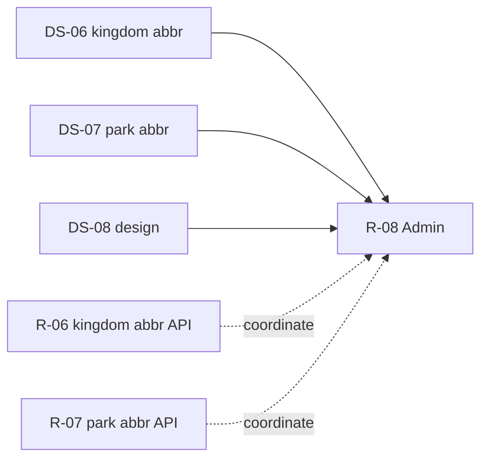

# DS-08: Admin Dashboard & Health — Discovery Design Note

**Milestone:** DS-08  
**Branch:** `megiddo/ds-08-admin-discovery`  
**Target IDs:** T-ADM-01 through T-ADM-10, T-ADM-12  
**Depends on:** M0.1, DS-02 (auth INSERT — T-ADM-11 excluded), DS-06 (kingdom abbr — T-ADM-07), DS-07 (park abbr — T-ADM-06), DS-11 (search — T-ADM-10 excluded)  
**Execution sprint:** R-08
**Test sprint:** T-08

---

## 1. Backend survey

### 1.1 Scope summary

Admin frontend violations cluster in two controllers:

- **`controller.Admin.php`** (~2,666 lines) — dashboard (`index`), permissions listings, danger audit log, server health page + `ajax` JSON actions, State of Amtgard page shell.
- **`controller.AdminAjax.php`** (~175 lines) — global permissions AJAX and State of Amtgard chart JSON endpoints.

**Partially idiomatic today:** `index` uses `APIModel('Report')->GetActiveKingdomsSummary()`; inactive kingdoms/parks, top parks, and many write paths use `Model_Admin` → Report service. **Violations** are direct `$DB` SQL, ops/infra reads in controller, domain business rules in controller (suspension by-id, date caps), and `Ork3::$Lib` calls that bypass a service façade.

**`class.Administration.php`** — only `PurgeLogs` / `OptimizeTable`; **not used** by any DS-08 target.  
**`class.DangerAudit.php`** — write-only (`audit()`); **no read/list API**.  
**`class.StateOfAmtgard.php`** — chart/query logic already in domain; controllers own HTTP validation and page bootstrap SQL.

Per milestone scope, **T-ADM-11** (auth INSERT) is **out of R-08** (DS-02). **T-ADM-10** (playersearch) is **out of R-08** (DS-11).

### 1.2 Database tables touched

| Table | DS-08 usage |
|-------|-------------|
| `ork_awards` | YoY dashboard stats; State of Amtgard award grants |
| `ork_attendance` | YoY stats; permissions last_credit; server health weather freshness; State of Amtgard date range |
| `ork_recommendations` | YoY dashboard stats |
| `ork_authorization` | Permissions listings |
| `ork_mundane` | Permissions listings; audit log actor; suspension read; playersearch (DS-11) |
| `ork_kingdom` | Permissions; server health DEV targets; kingdom abbr check |
| `ork_park` | Permissions; server health; park abbr check |
| `ork_officer` | Permissions officer linkage |
| `ork_event` | Event inherited permissions; server health upcoming events |
| `ork_event_calendardetail` | Server health upcoming events |
| `ork_danger_audit` | Audit log pagination |
| `ork_park_weather` | Server health freshness; weather admin refresh |
| `information_schema.PROCESSLIST` | Server health DB monitoring (not an app table) |

### 1.3 Frontend violations — `controller.Admin.php`

#### T-ADM-01: `index` (YoY stats)

| Lines | Behavior |
|-------|----------|
| 43–58 | Eight correlated subqueries for YoY counts: awards, attendance sign-ins, distinct active players (rolling 1yr vs prior 1yr), recommendations |
| 62–97 | Prior-period kingdom weekly (52→26 weeks ago) and monthly (24→12 months ago) deduped attendance counts keyed by `kingdom_id` for trend arrows |

**Existing backend:** `Report::GetActiveKingdomsSummary()` (registered); `Report::GetDistinctActivePlayerCount($weeks)` (cached, **not** in orkservice).

**Gap:** No admin dashboard trend-stats endpoint; trend date semantics are controller-defined.

#### T-ADM-02: `permissions`

| Lines | Behavior |
|-------|----------|
| 802–846 | Global ORK admin grants with last login and last_credit subquery |
| 880–1034 | Scoped grants at kingdom/park/event; inherited park/kingdom access on event pages |

**Existing backend:** `Report::GetAuthorizations()`, `Kingdom::GetKingdomAuthorizations()`, `Park::GetParkAuthorizations()` — partial shapes; no global admin list, no event inherited rollup.

**Gap:** `permissions()` bypasses all registered auth-list APIs in favor of bespoke SQL.

#### T-ADM-03: `auditlog`

| Lines | Behavior |
|-------|----------|
| 2021–2107 | Dynamic filter `$where`; COUNT + paginated SELECT (50/page) JOIN `ork_mundane`; DISTINCT `method_call` for dropdown |

**Existing backend:** `DangerAudit::audit()` write only; no read API.

**Gap:** Entire read path is frontend SQL.

#### T-ADM-04: `serverhealth` + `ajax` → `serverhealth_stats`

| Lines | Behavior |
|-------|----------|
| 2176–2183 | Kingdom list for DEV load-test targets |
| 2351–2497 | FPM status, `SHOW GLOBAL STATUS`, `PROCESSLIST`, weather-freshness aggregate SQL, memcache stats |
| 2499–2561 | Disk/inode/opcache on-demand panels |

**Existing backend:** `Weather::refresh_all_active_parks()`, `api_stats()` — no admin freshness aggregate.

**Gap:** No health/monitoring service; weather staleness SQL duplicated with T-ADM-08.

**Note:** FPM URL fetch, memcache, disk probes are infra — may remain in controller unless a thin `HealthService` is justified.

#### T-ADM-05: `ajax` → `suspendplayer`

| Lines | Behavior |
|-------|----------|
| 2207–2220 | Reads `suspended_by_id, suspended` from `ork_mundane`; infers `SuspendedById` in controller before `Model_Player->suspend_player()` |

**Existing backend:** `Player::SetPlayerSuspension()` accepts `SuspendedById` but does not infer it.

**Gap:** Suspension-by inference is business logic in controller.

#### T-ADM-06: `ajax` → `checkparkabbr`

| Lines | Behavior |
|-------|----------|
| 2265–2278 | Park abbreviation uniqueness within kingdom among Active parks, excluding self |

**Existing backend:** `Park::GetParkInKingdomByAbbreviation()` — lookup only, no exclude-current.

**Overlap:** DS-07 T-PRA-03 — single domain method should serve Admin and ParkAjax.

#### T-ADM-07: `ajax` → `checkabbr`

| Lines | Behavior |
|-------|----------|
| 2312–2322 | Kingdom abbreviation uniqueness with optional `ExcludeKingdomId` |

**Existing backend:** `Kingdom::GetKingdomByAbbreviation()` — existence lookup, no exclude.

**Overlap:** DS-06 T-KNA-04 — consolidate in R-06/R-08.

#### T-ADM-08: `ajax` → `serverhealth_weather_refresh` / `serverhealth_weather_stats`

| Lines | Behavior |
|-------|----------|
| 2567–2570 | `SELECT MAX(fetched_at) FROM ork_park_weather` before refresh |
| 2573, 2587 | `Ork3::$Lib->weather->refresh_all_active_parks()`, `api_stats(3)` |

**Existing backend:** Domain methods in `class.Weather.php`; cron uses same refresh; no orkservice façade.

**Gap:** Pre-read MAX should be part of refresh response; unify with T-ADM-04 weather freshness SQL.

#### T-ADM-09: `stateofamtgard` (page shell)

| Lines | Behavior |
|-------|----------|
| 2646 | `Ork3::$Lib->stateofamtgard->getActiveKingdoms()` |
| 2648–2656 | `$DB` query `MIN(date), MAX(date)` on `ork_attendance` for "All Time" range button |
| 2658–2659 | `RangeLimitMonths` env gate duplicated from AdminAjax |

**Gap:** No page bootstrap API; env-based 12-month cap defined in two controllers.

### 1.4 Frontend violations — `controller.AdminAjax.php`

#### T-ADM-10: `global` → `playersearch`

| Lines | Behavior |
|-------|----------|
| 25–53 | Direct `$DB` on `ork_mundane` with LIKE; filters `suspended=0`, `active=1`; LIMIT 20 |

**Owner:** R-11 (DS-11). Cross-reference only.

#### T-ADM-12: `stateofamtgard($section)`

| Lines | Behavior |
|-------|----------|
| 100–131 | Date validation (`YYYY-MM-DD`, round-trip `DateTime`), start≤end, production 12-month window cap |
| 133–138 | Kingdom ID sanitization |
| 141–168 | Switch dispatches to `Ork3::$Lib->stateofamtgard` methods — data layer correct; HTTP validation in controller |

**Existing backend:** Full chart logic in `class.StateOfAmtgard.php` (cached SQL).

**Gap:** Move validation into domain/service; register `StateOfAmtgardService`.

### 1.5 Backend surface (existing)

| Layer | Location | Relevant to R-08 |
|-------|----------|------------------|
| Domain | `class.Report.php` | `GetActiveKingdomsSummary`, `GetDistinctActivePlayerCount`, partial auth listings |
| Domain | `class.DangerAudit.php` | Write-only |
| Domain | `class.Administration.php` | Log purge only |
| Domain | `class.StateOfAmtgard.php` | All chart methods |
| Domain | `class.Weather.php` | Refresh + stats |
| Domain | `class.Player.php` | `SetPlayerSuspension` |
| Service | `ReportService.*` | Partial registration |
| Service | No Admin/Health/DangerAudit/StateOfAmtgard service | Gap |

### 1.6 Cross-milestone overlaps

| Target | Also in | Notes |
|--------|---------|-------|
| T-ADM-06 | DS-07 T-PRA-03 | Park abbr uniqueness |
| T-ADM-07 | DS-06 T-KNA-04 | Kingdom abbr uniqueness |
| T-ADM-10 | DS-11 | Player search consolidation |
| T-ADM-11 | DS-02 | **Out of scope** (auth INSERT) |

### 1.7 Existing test coverage

| Asset | Status |
|-------|--------|
| `ReportService.test.php` | Legacy reports only |
| PHPUnit | **No** admin dashboard, audit log, health, or StateOfAmtgard tests |

---

## 2. Test design

### 2.1 Backend unit/integration tests (implement in T-08)

Add `tests/Unit/AdminDashboardTrendStatsTest.php`:

| Test case | Target | Validates |
|-----------|--------|-----------|
| `testYoYWindowBoundaries` | T-ADM-01 | Calendar-year vs rolling player windows |
| `testPrevWeeklyMonthlyKingdomKeys` | T-ADM-01 | 52→26 week and 24→12 month dedup semantics |

Add `tests/Integration/AdminPermissionsTest.php`:

| Test case | Target | Validates |
|-----------|--------|-----------|
| `testGlobalAdminGrantList` | T-ADM-02 | Global admin filter; last_credit shape |
| `testEventInheritedPermissions` | T-ADM-02 | Creator + park/kingdom holders |

Add `tests/Integration/DangerAuditQueryTest.php`:

| Test case | Target | Validates |
|-----------|--------|-----------|
| `testAuditLogPagination` | T-ADM-03 | Page size, filters |
| `testEntityTypeGuard` | T-ADM-03 | Entity type only when entity ID set |

Add `tests/Unit/ServerHealthStatsTest.php`:

| Test case | Target | Validates |
|-----------|--------|-----------|
| `testWeatherFreshnessBuckets` | T-ADM-04, T-ADM-08 | Staleness bucket SQL |
| `testSetPlayerSuspensionByIdInference` | T-ADM-05 | New vs edit preserves prior `suspended_by_id` |

Add `tests/Unit/AbbreviationUniqueTest.php`:

| Test case | Target | Validates |
|-----------|--------|-----------|
| `testParkAbbreviationExcludeSelf` | T-ADM-06 | Active-only; exclude park_id |
| `testKingdomAbbreviationExcludeSelf` | T-ADM-07 | Optional exclude kingdom_id |

Add `tests/Unit/StateOfAmtgardValidationTest.php`:

| Test case | Target | Validates |
|-----------|--------|-----------|
| `testDateCapProduction` | T-ADM-09, T-ADM-12 | 12-month cap when not DEV |
| `testInvalidDateRejected` | T-ADM-12 | Impossible dates return 400 |
| `testRetentionIgnoresDateRange` | T-ADM-12 | Documented API contract |

Skip integration tests when `ork3_test_db_available()` is false.

### 2.2 Infection scope (T-08, DS-7)

```bash
sh bin/run-infection.sh \
  --filter=class.Administration.php \
  --filter=class.DangerAudit.php \
  --filter=class.StateOfAmtgard.php \
  --filter=class.Report.php \
  --filter=class.Player.php \
  --filter=class.Weather.php \
  --test-framework-options="--filter=AdminDashboardTrendStatsTest|AdminPermissionsTest|DangerAuditQueryTest|ServerHealthStatsTest|AbbreviationUniqueTest|StateOfAmtgardValidationTest"
```

Target ≥ `minMsi` / `minCoveredMsi` (15). Focus mutators on date window boundaries, suspension by-id branches, entity-type filter guard, 12-month cap, abbr exclude-id logic.

**Out of R-08 tests:** T-ADM-10 (DS-11), T-ADM-11 (DS-02).

### 2.3 Frontend functional tests (implement in T-08)

| Flow | Steps | Assert |
|------|-------|--------|
| Admin dashboard | Login as ORK admin → Admin index | YoY trend cards; kingdom summary arrows |
| Permissions | Open global / kingdom / event permission pages | Grant lists match pre-refactor |
| Audit log | Filter by date + method | Pagination; actor names |
| Server health | Load page + refresh weather | JSON stats shape; freshness buckets |
| State of Amtgard | Select date range + kingdom filter | Chart sections load; 12-month cap in prod |

---

## 3. Proposed revision

### 3.1 Principle

Move all admin read SQL and business-rule inference into domain classes (`Administration`, `DangerAudit`, `Report`, `StateOfAmtgard`, `Weather`, `Player`) with orkservice registration. Controllers retain auth gates, template assignment, and explicit infra probes (FPM, memcache, disk) unless a `HealthService` is added.

### 3.2 New domain / service API (R-08)

| Proposed API / domain method | Maps from | Notes |
|------------------------------|-----------|-------|
| `Report.GetAdminDashboardStats` | T-ADM-01 | YoY aggregates + prev weekly/monthly kingdom keys |
| Register `Report.GetDistinctActivePlayerCount` | T-ADM-01 | Currently domain-only |
| `Authorization.GetGlobalAdminGrants` + `GetScopedPermissionsListing` | T-ADM-02 | Global, kingdom rollup, event inherited |
| `DangerAudit.ListAuditLog` + `ListAuditMethods` | T-ADM-03 | Filters + pagination |
| `Administration.GetServerHealthStats` | T-ADM-04 | DB status + weather freshness slices |
| Move `SuspendedById` inference into `Player.SetPlayerSuspension` | T-ADM-05 | Remove pre-read in ajax |
| `Park.CheckAbbreviationUnique` / `Kingdom.CheckAbbreviationUnique` | T-ADM-06, T-ADM-07 | Shared with R-06/R-07 |
| `Weather.AdminRefresh` + `Weather.GetFreshnessSummary` | T-ADM-08, T-ADM-04 | Include prior `fetched_at` in response |
| `StateOfAmtgard.GetPageBootstrap` | T-ADM-09 | Kingdoms + attendance MIN/MAX + env cap |
| `StateOfAmtgardService.*` sections + shared validation | T-ADM-12 | Thin JSON adapter in AdminAjax |

### 3.3 Per-target replacement (R-08)

| ID | Location | Change |
|----|----------|--------|
| T-ADM-01 | `index` | `GetAdminDashboardStats` + registered distinct player count |
| T-ADM-02 | `permissions` | Scoped permissions listing APIs |
| T-ADM-03 | `auditlog` | `ListAuditLog` |
| T-ADM-04 | `serverhealth_stats` | `GetServerHealthStats` (DB + weather portions) |
| T-ADM-05 | `suspendplayer` | Domain infers `SuspendedById` |
| T-ADM-06 | `checkparkabbr` | `CheckAbbreviationUnique` |
| T-ADM-07 | `checkabbr` | `CheckAbbreviationUnique` |
| T-ADM-08 | weather ajax | Weather service façade |
| T-ADM-09 | `stateofamtgard` page | `GetPageBootstrap` |
| T-ADM-12 | AdminAjax charts | Service validation + dispatch |

### 3.4 Out of scope for R-08

| Item | Deferred to |
|------|-------------|
| T-ADM-10 playersearch | R-11 (DS-11) |
| T-ADM-11 addauth INSERT | R-02 (DS-02) |
| FPM/memcache/disk probes | Controller unless HealthService justified |

### 3.5 Execution order (R-08)

1. T-ADM-01 dashboard stats (unblocks index template).
2. T-ADM-03 audit read API (isolated domain).
3. T-ADM-02 permissions (largest SQL surface).
4. T-ADM-05 suspension rule move (small, high-value).
5. T-ADM-06/07 abbr checks (coordinate with R-06/R-07).
6. T-ADM-04/08 health + weather admin.
7. T-ADM-09/12 State of Amtgard service façade.

### 3.6 Dependency graph



---

## Related documents

| Doc | Link |
|-----|------|
| DS-02 auth INSERT discovery | [ds-02-auth-insert-discovery.md](./ds-02-auth-insert-discovery.md) |
| DS-06 kingdom discovery | [ds-06-kingdom-discovery.md](./ds-06-kingdom-discovery.md) |
| DS-07 park discovery | [ds-07-park-discovery.md](./ds-07-park-discovery.md) |
| Implementation plan | [03-implementation-plan.md](./03-implementation-plan.md) |
| Test framework | [06-test-framework.md](./06-test-framework.md) |
| [validations/v-08-admin-validation.md](./validations/v-08-admin-validation.md) | Phase 1.6 — canary URLs + test mutation boundaries (V-08) |

**Post-rebase (RB-D2, 2026-07-09):** §1 line ranges verified against `orkui/` at base `e6417645` (`origin/master`). Admin controller 2666 lines; suspend inference 2207–2220; checkparkabbr 2265–2278; no upstream gap closures; §3 revision unchanged.
