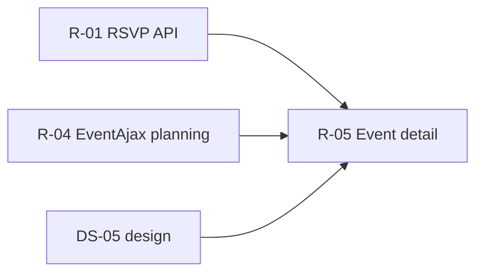

# DS-05: Event Controller Detail — Discovery Design Note

**Milestone:** DS-05  
**Branch:** `megiddo/ds-05-event-discovery`  
**Target IDs:** T-EVT-01 through T-EVT-08  
**Depends on:** M0.1, DS-01 (RSVP), DS-04 (EventAjax planning — partial overlap)  
**Execution sprint:** R-05
**Test sprint:** T-05

---

## 1. Backend survey

### 1.1 Scope summary

`Controller_Event` (~1,113 lines) is the **page-render** controller for the revised event UI (`Eventnew_*`, `Eventtemplatenew_*`, `Eventcreate_*` templates). Unlike `Controller_EventAjax` (DS-04), it handles full-page flows: event landing, occurrence detail tabs, create-occurrence form, and POST actions embedded in URL routes (`detail/{event}/{detail}/{action}`).

The controller mixes:

- **Thin API wrappers** — `Model_Event` / `Model_Attendance` for `get_event_details`, `update_event`, `add_event_detail`, `delete_calendar_detail`, attendance CRUD.
- **Direct `$DB` reads/writes** — RSVP batch counts, staff capability lookup, occurrence pick redirect, fees/links sync, reconcile attendance moves, dietary summary, display loads (staff, schedule, fees, links).
- **`Ork3::$Lib` bypass** — `authorization->HasAuthority`, `ghettocache` bust after edits.

Backend **`class.Event.php`** covers core event/calendar-detail lifecycle but has **no** methods for fees/links tables, event-type-only UPDATE bypass, reconcile attendance reassignment, or the composite **occurrence detail page DTO** (staff + schedule + dietary).

### 1.2 Database tables touched

| Table | DS-05 usage |
|-------|-------------|
| `ork_event` | Draft status gate; kingdom/park scope on delete redirect |
| `ork_event_calendardetail` | Ownership preflight; next-occurrence pick; event_type UPDATE |
| `ork_event_rsvp` | Batch counts (index/template); toggle/set via Model (DS-01) |
| `ork_event_staff` | Self staff capabilities; staff list display |
| `ork_event_schedule`, `ork_event_schedule_lead` | Schedule + leads display |
| `ork_event_fees`, `ork_event_links` | DELETE+INSERT sync on edit/create |
| `ork_attendance`, `ork_attendance_myisam` | Reconcile moves past-dated rows |
| `ork_mundane`, `ork_mundane_dietary` | Dietary summary UNION (RSVP going + checked-in) |
| `ork_park` | At-park address lookup; create form park name |

### 1.3 Frontend violations (target IDs)

#### T-EVT-01: `index` — RSVP counts and ownership

| Lines | Behavior |
|-------|----------|
| 51–59 | RSVP toggle: raw ownership check on `event_calendardetail` before `toggle_rsvp` |
| 75–98 | Batch RSVP COUNT GROUP BY status + per-user status for all calendar details |

**Gap:** Duplicates DS-01 RSVP aggregation; batch API should replace inline SQL.

#### T-EVT-02: `template` — RSVP counts per detail

| Lines | Behavior |
|-------|----------|
| 186–188 | Single-query COUNT per detail for template upcoming/past lists |

**Overlap:** Same RSVP count pattern as T-EVT-01; consolidate in R-01 RSVP API.

#### T-EVT-03: `detail` (reads) — guards and display scope

| Lines | Behavior |
|-------|----------|
| 241–265 | Pick next/past occurrence when `detail_id` omitted — raw SELECT |
| 308–316 | Load caller's `event_staff` capabilities for this occurrence |
| 325–363 | `deletedetail`: attendance/RSVP count guards; kingdom/park redirect scope |
| 365–383 | `rsvp` action: ownership preflight |
| 636–651 | At-park address SELECT |
| 691–721 | Event draft status + creator; calendar detail count |
| 718–927 | Staff list, schedule+leads, fees, links, dietary summary — all raw SQL |

**Gap:** No domain `GetEventOccurrencePageData` DTO; staff/schedule reads duplicate DS-04 inventory.

#### T-EVT-04: `detail` (writes) — fees, links, event type

| Lines | Behavior |
|-------|----------|
| 391–496 | `edit` action: ownership preflight; `event_type` raw UPDATE (bypasses `SetEventDetails` attendance lock); transactional fees/links DELETE+INSERT |

**Gap:** Fees/links logic duplicated in `create` (T-EVT-07) and EventAjax copy paths (DS-04). Should be one domain API.

#### T-EVT-05: `detail` (schedule copy / reconcile)

| Lines | Behavior |
|-------|----------|
| 515–595 | `reconcile`: create new detail via API, then raw UPDATE attendance rows to new `detail_id` |

**Gap:** Reconcile is domain orchestration (attendance integrity); no backend method.

#### T-EVT-06: `detail` (display load)

Same as T-EVT-03 display block (637–927): park address, draft gate, staff, schedule, fees, links, dietary.

#### T-EVT-07: `create` — new occurrence fees/links

| Lines | Behavior |
|-------|----------|
| 988–1090 | Park name lookup; post-`add_event_detail` fees/links transactional sync |

**Gap:** Identical fees/links SQL as T-EVT-04; should call shared domain method.

#### T-EVT-08: *(throughout)* — Lib bypass

| Pattern | Lines (examples) |
|---------|------------------|
| `Ork3::$Lib->authorization->HasAuthority` | 29, 65, 136, 213, 326, 391, 516, 681–688, 710, 995 |
| `Ork3::$Lib->ghettocache->bust*` | 404–442, 579–583, 1032 |

**Note:** Authorization lib calls deferred to DS-14; cache bust should move with write domain methods.

### 1.4 Backend surface (existing)

| Layer | Location | Relevant to R-05 |
|-------|----------|------------------|
| Domain | `class.Event.php` | `GetEvent`, `GetEventDetails`, `SetEventDetails`, `CreateEventDetails`, `DeleteEventDetail` |
| Domain | `class.Attendance.php` | `get_event_info`, `get_eventdetail_info`, attendance CRUD |
| Service | `EventService.*` | Core CRUD registered; no fees/links/reconcile/page DTO |
| Frontend model | `model.Event.php` | RSVP still `$DB` (DS-01); `update_event_detail` via API |
| DS-04 design | `EventPlanning` (proposed) | Staff/schedule CRUD — R-05 **reads** same tables for display |

### 1.5 Repeated patterns (extract in R-05)

1. **Detail ownership preflight** — `SELECT event_id FROM event_calendardetail WHERE id = ?` before writes (6+ call sites).
2. **Staff delegation flags** — same query as DS-04 `CanManageEventDetail`.
3. **Fees/links sync** — DELETE all + INSERT loop with URL scheme + icon allow-list (edit + create).
4. **Draft visibility gate** — status + creator + staff capabilities + admin (mirrors Kingdom/Park event lists).

### 1.6 Existing test coverage

| Asset | Status |
|-------|--------|
| `EventService.test.php` | Core event CRUD only |
| DS-01 design | RSVP test matrix |
| DS-04 design | Staff/schedule/planning tests |
| PHPUnit | **No** occurrence page DTO, fees/links, or reconcile tests |

### 1.7 Cross-sprint ownership

| Concern | Owner |
|---------|-------|
| RSVP counts/toggle/set | **R-01** (DS-01) — R-05 consumes API |
| Staff/schedule **writes** via AJAX | **R-04** (DS-04) — R-05 keeps page POST paths until aligned |
| Fees/links domain API | **R-04 or R-05** — implement once; both controllers call it (recommend R-04 first if R-04 lands first) |
| `Ork3::$Lib->authorization` | **DS-14** |

---

## 2. Test design

### 2.1 Backend unit/integration tests (implement in T-05)

Add `tests/Integration/EventOccurrenceTest.php`:

| Test case | Target | Validates |
|-----------|--------|-----------|
| `testGetOccurrenceDetailDto` | T-EVT-03, T-EVT-06 | Staff, schedule, fees, links shape |
| `testResolveDefaultOccurrenceId` | T-EVT-03 | Next upcoming; fallback to most recent past |
| `testDetailOwnershipPreflight` | T-EVT-03 | Wrong event_id rejected |
| `testSetCalendarDetailFeesLinks` | T-EVT-04, T-EVT-07 | Transactional replace; bad URL scheme stripped |
| `testSetEventTypeDespiteAttendance` | T-EVT-04 | event_type UPDATE when SetEventDetails blocked |
| `testReconcilePastAttendance` | T-EVT-05 | New detail created; past attendance moved |
| `testReconcileRejectsWithNoPastAttendance` | T-EVT-05 | Error when nothing to reconcile |
| `testGetDietarySummary` | T-EVT-06 | UNION RSVP going + attendance; detail_id=0 guard |
| `testDraftOccurrenceHiddenFromAnonymous` | T-EVT-06 | Draft gate |
| `testDraftVisibleToStaffDelegate` | T-EVT-06 | can_schedule staff sees draft |

Add `tests/Integration/EventRsvpBatchTest.php` (or section in DS-01 suite):

| Test case | Target | Validates |
|-----------|--------|-----------|
| `testBatchRsvpCountsForEvent` | T-EVT-01, T-EVT-02 | Per-detail going/interested/total |
| `testRsvpToggleOwnershipCheck` | T-EVT-01 | Foreign detail_id ignored |

Skip when `ork3_test_db_available()` is false.

### 2.2 Infection scope (T-05, DS-7)

Primary paths (after R-04/R-01 land shared helpers):

```bash
sh bin/run-infection.sh \
  --filter=class.Event.php \
  --filter=class.EventPlanning.php \
  --test-framework-options="--filter=EventOccurrenceTest"
```

Include fees/links methods whether placed in `Event` or `EventPlanning`. Target ≥ configured `minMsi` / `minCoveredMsi` (15).

### 2.3 Frontend functional tests (implement in T-05)

| Flow | Steps | Assert |
|------|-------|--------|
| Event landing RSVP | Open Event/index; toggle RSVP | Counts update; redirect safe |
| Occurrence detail tabs | Event/detail/{e}/{d} | Schedule, staff, fees render |
| Edit occurrence | Change dates + fees + links | Persisted; cache busted |
| Create occurrence | Event/create POST | New detail + fees |
| Reconcile | Past attendance on multi-day event | Split to new occurrence |
| Draft gate | Anonymous views draft event | Blocked unless staff delegate |
| Dietary tab | Feast manager opens dietary summary | RSVP + checked-in players listed |

---

## 3. Proposed revision

### 3.1 Principle

Move **occurrence page data** and **form POST orchestration** behind `EventService` domain methods. Controllers adapt request/response only. Reuse R-01 RSVP API and R-04 planning APIs where they exist; add R-05-specific methods for page DTO, reconcile, and fees/links if not already in R-04.

### 3.2 New domain API (R-05)

Extend `class.Event.php` or `class.EventPlanning.php`:

| Method | Maps from | Notes |
|--------|-----------|-------|
| `GetDefaultOccurrenceId` | T-EVT-03 | Next upcoming or latest past |
| `AssertDetailBelongsToEvent` | T-EVT-03 | Shared preflight |
| `GetOccurrencePageData` | T-EVT-03, T-EVT-06 | Staff, schedule+leads, fees, links, status, counts |
| `SetCalendarDetailFeesAndLinks` | T-EVT-04, T-EVT-07 | Transactional; URL/icon validation |
| `SetCalendarDetailEventType` | T-EVT-04 | Metadata bypass when attendance locked |
| `ReconcilePastAttendance` | T-EVT-05 | Create detail + move rows + cache bust |
| `GetDietarySummaryForOccurrence` | T-EVT-06 | Feast manager read |
| `GetBatchRsvpSummaryForEvent` | T-EVT-01, T-EVT-02 | Per-detail counts + user status |

Shared with R-04 (if not already done):

| Method | Purpose |
|--------|---------|
| `CanManageEventDetail(...)` | Staff delegation lookup |

### 3.3 Service registration (R-05)

Add to `EventService.registration.php`:

- `Event.GetOccurrencePageData`
- `Event.SetCalendarDetailFeesAndLinks`
- `Event.SetCalendarDetailEventType`
- `Event.ReconcilePastAttendance`
- `Event.GetDietarySummaryForOccurrence`
- `Event.GetBatchRsvpSummaryForEvent` (or RSVP service from R-01)

Extend `Model_Event` with thin wrappers.

### 3.4 Per-target replacement (R-05)

| ID | Controller method | Change |
|----|-------------------|--------|
| T-EVT-01 | `index` | Batch RSVP via API; ownership via domain preflight |
| T-EVT-02 | `template` | RSVP counts via batch API |
| T-EVT-03 | `detail` reads | `GetOccurrencePageData`, `GetDefaultOccurrenceId`, preflight helper |
| T-EVT-04 | `detail` edit | Domain fees/links + event_type; delete raw SQL |
| T-EVT-05 | `detail` reconcile | `ReconcilePastAttendance` |
| T-EVT-06 | `detail` display | Covered by page DTO + dietary API |
| T-EVT-07 | `create` | Domain fees/links after `add_event_detail` |
| T-EVT-08 | throughout | Cache bust in domain writes; auth stays until DS-14 |

### 3.5 Out of scope for R-05

| Item | Deferred to |
|------|-------------|
| EventAjax staff/schedule **AJAX writes** | R-04 |
| Full RSVP subsystem | R-01 |
| `Ork3::$Lib->authorization` | DS-14 |

### 3.6 Execution order (R-05)

1. Coordinate with R-04 on `SetCalendarDetailFeesAndLinks` (implement once).
2. `AssertDetailBelongsToEvent` + `GetDefaultOccurrenceId`.
3. `GetOccurrencePageData` (largest read refactor).
4. Edit/create fees/links + event_type paths.
5. `ReconcilePastAttendance`.
6. RSVP batch reads (integrate R-01 when merged).
7. `GetDietarySummaryForOccurrence`.
8. Thin controller; verify no `$DB` in touched methods.
9. Milestone Infection + full suite.

### 3.7 Dependency graph



---

## Related documents

| Doc | Link |
|-----|------|
| DS-01 RSVP discovery | [ds-01-rsvp-discovery.md](./ds-01-rsvp-discovery.md) |
| DS-04 EventAjax discovery | [ds-04-eventajax-discovery.md](./ds-04-eventajax-discovery.md) |
| Implementation plan | [03-implementation-plan.md](./03-implementation-plan.md) |
| Test framework | [06-test-framework.md](./06-test-framework.md) |
| [validations/v-05-event-validation.md](./validations/v-05-event-validation.md) | Phase 1.6 — canary URLs + test mutation boundaries (V-05) |
