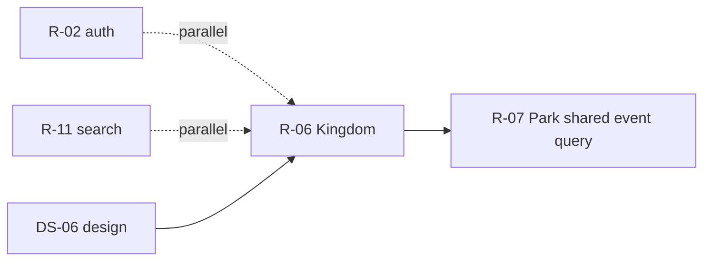

# DS-06: Kingdom Profile & AJAX — Discovery Design Note

**Milestone:** DS-06  
**Branch:** `megiddo/ds-06-kingdom-discovery`  
**Target IDs:** T-KNG-01 through T-KNG-11, T-KNA-01, T-KNA-02, T-KNA-04 through T-KNA-07  
**Depends on:** M0.1, DS-02 (auth INSERT — T-KNA-03 excluded), DS-03 (banner — T-KNA-08 excluded), DS-11 (search — T-KNA-06 excluded)  
**Execution sprint:** R-06
**Test sprint:** T-06

---

## 1. Backend survey

### 1.1 Scope summary

Kingdom frontend violations span two controllers:

- **`Controller_Kingdom`** (~1,206 lines) — kingdom profile page, JSON feeds (`park_averages_json`, `players_json`, `events_more`), ICS export, recommendations panel.
- **`Controller_KingdomAjax`** (~1,379 lines) — kingdom admin AJAX (`kingdom`, `calendar`, `playersearch`, `suspendplayer`, …).

Both mix **Report/Kingdom service calls** (partially idiomatic) with **large inline SQL** for event/calendar aggregation, attendance statistics, roster hydration, and configuration writes.

Per milestone scope, **T-KNA-03** (auth INSERT), **T-KNA-08** (banner CRUD), and **T-KNA-06** (playersearch) are **out of R-06** — documented here for cross-reference only.

### 1.2 Database tables touched

| Table | DS-06 usage |
|-------|-------------|
| `ork_attendance` | Park/kingdom averages, roster sign-in stats, trend windows |
| `ork_mundane` | Player rosters, move-player kingdom lookup, suspension read, player count |
| `ork_park` | Event joins, park-day listing, abbreviation checks, claim/transfer context |
| `ork_kingdom` | Abbreviation uniqueness |
| `ork_event`, `ork_event_calendardetail` | Event summaries, pagination, ICS, calendar JSON |
| `ork_event_rsvp` | RSVP aggregates, royal-attendance flags |
| `ork_event_staff` | Draft visibility, staff permission per event row |
| `ork_officer` | Monarch/regent lookup (profile + calendar) |
| `ork_calendar_item` | Merged into event lists; FullCalendar feed |
| `ork_parkday` | Kingdom park-day schedule listing |
| `ork_authorization` | Park-level CREATE auth probe for calendar modal |
| `ork_configuration` | AwardRecsPublic INSERT/UPDATE (T-KNA-02) |

### 1.3 Frontend violations — `Controller_Kingdom`

#### T-KNG-01: `park_monthly_json`

| Lines | Behavior |
|-------|----------|
| 52–63 | Thin wrapper → `Report->GetKingdomParkMonthlyAverages` ✓ |

**Note:** Method itself is clean; listed because sibling `park_averages_json` adds frontend SQL (T-KNG-02).

#### T-KNG-02: `park_averages_json`

| Lines | Behavior |
|-------|----------|
| 66–206 | Calls Report service for weekly/monthly baselines, then **4+ raw SQL** blocks: 12-month player/member counts per park, kingdom deduped weekly/monthly totals, optional admin-only previous-period trends; caches via `ghettocache` |

**Gap:** Extended stats not in `class.Report.php`; kingdom-level dedup semantics live only in frontend.

#### T-KNG-03: `events_more`

| Lines | Behavior |
|-------|----------|
| 209–270 | Paginated 12-month window event query with RSVP subqueries; heraldry fallback URL |

**Gap:** Duplicates `profile` event SQL with different date window.

#### T-KNG-04: `players_json`

| Lines | Behavior |
|-------|----------|
| 349–423 | Complex roster SQL (sign-in buckets, officer roles, avatar URLs); `ghettocache` 1200s |

**Gap:** Same roster pattern as park profile (T-PRK-03); no shared domain roster API.

#### T-KNG-05: `profile` (officers)

| Lines | Behavior |
|-------|----------|
| 581–587 | Raw SELECT Monarch/Regent from `ork_officer` (most recent row) |

**Gap:** `Kingdom->GetOfficers` exists via API but royal IDs needed for RSVP join are fetched separately.

#### T-KNG-06: `profile` (events)

| Lines | Behavior |
|-------|----------|
| 643–684 | Large event+RSVP+royal+my_rsvp query; per-row draft/staff permission PHP filter |

**Overlap:** Nearly identical query in `Controller_KingdomAjax::calendar` and park profile (DS-07).

#### T-KNG-07: `profile` (calendar)

| Lines | Behavior |
|-------|----------|
| 686–846 | Calendar items merge; batch coord resolution; map location builder |

**Gap:** Event list + map DTO should be one backend read with draft/visibility rules encoded once.

#### T-KNG-08: `profile` (park days)

| Lines | Behavior |
|-------|----------|
| 862–915 | Raw `ork_parkday` JOIN listing with recurrence text formatting |

**Gap:** `Park->GetParkDays` exists per-park; no kingdom-wide aggregated listing in domain.

#### T-KNG-09: `profile` (auth/counts)

| Lines | Behavior |
|-------|----------|
| 923–1007 | User home park lookup; park-level auth EXISTS; player COUNT with cache |

#### T-KNG-10: `ics`

| Lines | Behavior |
|-------|----------|
| 1121–1199 | Raw event occurrence SELECT; ICS formatting in controller |

**Gap:** Export logic belongs in domain or dedicated export service.

#### T-KNG-11: *(throughout)*

| Pattern | Examples |
|---------|----------|
| `Ork3::$Lib->authorization` | 29, 72, 309, 608, 656, 924–937 |
| `ghettocache` | 73–74, 354–355, 993–1007 |
| `player->GetCircleAwardIds` | 340 (recommendations panel) |

### 1.4 Frontend violations — `Controller_KingdomAjax`

#### T-KNA-01: `kingdom` → move player

| Lines | Behavior |
|-------|----------|
| 384–400 | Raw kingdom lookup for source/dest before `Player->move_player` API |

**Gap:** Auth uses frontend SQL; `MovePlayer` domain already validates — unify auth helper.

#### T-KNA-02: `kingdom` → award recs public

| Lines | Behavior |
|-------|----------|
| 603–611 | **Direct INSERT/UPDATE** on `ork_configuration` for `AwardRecsPublic` |

**Gap:** No ConfigurationService; kingdom config writes should use domain.

#### T-KNA-04: `kingdom` → checkabbr

| Lines | Behavior |
|-------|----------|
| 716–718 | Kingdom abbreviation uniqueness query |

**Gap:** `Kingdom->GetKingdomByAbbreviation` exists but uniqueness-with-exclude not exposed.

#### T-KNA-05: `calendar`

| Lines | Behavior |
|-------|----------|
| 730–945+ | FullCalendar JSON: family-kingdom events, royal RSVP flags, calendar items, park days — duplicates profile event SQL |

#### T-KNA-07: `suspendplayer`

| Lines | Behavior |
|-------|----------|
| 1183 | Read suspension state from `ork_mundane` before auth gate |

**Gap:** Should use Player domain read or include in suspend API response.

#### Out of scope (other sprints)

| ID | Action | Owner |
|----|--------|-------|
| T-KNA-03 | `addauth` INSERT | R-02 (DS-02) |
| T-KNA-06 | `playersearch` | R-11 (DS-11) |
| T-KNA-08 | `banner` | R-03 (DS-03) |

### 1.5 Backend surface (existing)

| Layer | Location | Relevant to R-06 |
|-------|----------|------------------|
| Domain | `class.Kingdom.php` | `GetKingdomDetails`, `GetParks`, `GetOfficers`, `GetFamilyKingdomIds`, `GetStatsKingdomIds` |
| Domain | `class.Report.php` | `GetKingdomParkAverages`, `GetKingdomParkMonthlyAverages` |
| Domain | `class.Park.php` | `GetParkDays`, `TransferPark` |
| Domain | `class.Player.php` | `MovePlayer` (via service) |
| Domain | `class.CalendarItem.php` | `CanSee` static helper |
| Service | `KingdomService.*`, `ReportService.*` | Partial coverage |
| Tests | `KingdomService.test.php`, `ReportService.test.php` | No profile aggregation tests |

### 1.6 Repeated patterns

1. **Kingdom event list query** — draft clause + RSVP aggregate + royal RSVP + my_rsvp + staff row check (Kingdom profile, KingdomAjax calendar, partially Park profile).
2. **Coord resolution** — detail location JSON → at_park lat/lng → host park (batch in kingdom profile; N+1 in park).
3. **Roster SQL** — kingdom `players_json` vs park `park_players` share attendance subquery semantics.
4. **Park averages extension** — Report service + frontend attendance dedup overlay.

### 1.7 Existing test coverage

| Asset | Status |
|-------|--------|
| `ReportService.test.php` | Basic report queries |
| `KingdomService.test.php` | Kingdom CRUD/officers |
| PHPUnit | **No** event summary, ICS, or extended averages tests |

---

## 2. Test design

### 2.1 Backend unit/integration tests (implement in T-06)

Add `tests/Integration/KingdomProfileTest.php`:

| Test case | Target | Validates |
|-----------|--------|-----------|
| `testGetKingdomEventSummary` | T-KNG-06, T-KNG-07 | Draft filtering; RSVP counts; calendar item merge |
| `testEventSummaryStaffSeesDraft` | T-KNG-06 | event_staff delegate visibility |
| `testGetKingdomParkDaysListing` | T-KNG-08 | All active parks in kingdom |
| `testGetKingdomPlayerCount` | T-KNG-09 | Active non-suspended count |
| `testGetKingdomExtendedParkAverages` | T-KNG-02 | tp/tm/kingdom dedup; admin trend fields |
| `testPaginatedKingdomEvents` | T-KNG-03 | 12-month window pagination |
| `testGetKingdomPlayersRoster` | T-KNG-04 | Sign-in buckets; officer roles |
| `testExportKingdomIcs` | T-KNG-10 | VEVENT rows; 12-month horizon |
| `testGetRoyalOfficerIds` | T-KNG-05 | Monarch/regent most-recent |

Add `tests/Integration/KingdomAjaxTest.php`:

| Test case | Target | Validates |
|-----------|--------|-----------|
| `testMovePlayerAuthSourceOrDest` | T-KNA-01 | Kingdom EDIT on either side |
| `testSetAwardRecsPublicConfig` | T-KNA-02 | INSERT vs UPDATE path |
| `testCheckKingdomAbbreviationUnique` | T-KNA-04 | Exclude current kingdom |
| `testCalendarFeedDraftAndRoyalFlags` | T-KNA-05 | FullCalendar shape; royalPresence |
| `testSuspendPlayerReadsState` | T-KNA-07 | Suspension gate |

Skip when `ork3_test_db_available()` is false.

### 2.2 Infection scope (T-06, DS-7)

```bash
sh bin/run-infection.sh \
  --filter=class.Kingdom.php \
  --filter=class.Report.php \
  --test-framework-options="--filter=KingdomProfileTest|KingdomAjaxTest"
```

Add `class.KingdomEvents.php` (if new file) to filter list. Target ≥ `minMsi` / `minCoveredMsi` (15).

### 2.3 Frontend functional tests (implement in T-06)

| Flow | Steps | Assert |
|------|-------|--------|
| Kingdom profile load | Open Kingdom/profile/{id} | Events, map, park days, player count |
| Park averages chart | Wait for park_averages_json | tp/tm/kingdom totals; admin trends |
| Players tab | Lazy-load players_json | Roster buckets render |
| Calendar tab | Navigate months | Events + calendar items; draft hidden |
| ICS subscribe | Download Kingdom/ics/{id} | Valid .ics file |
| Move player | Kingdom admin moves player cross-park | Auth + success |
| Award recs toggle | Flip AwardRecsPublic | Config persists |

---

## 3. Proposed revision

### 3.1 Principle

Introduce **`KingdomProfile`** (or extend `class.Kingdom.php`) domain reads for everything the kingdom profile and calendar AJAX need. Extend **`class.Report.php`** for extended park averages overlay. Configuration writes go through kingdom/config domain. Controllers emit JSON/HTML only.

Consolidate the **kingdom event list query** into one domain method consumed by profile, `events_more`, `calendar`, and (with scope param) park profile (coordinate with R-07).

### 3.2 New domain API (R-06)

Recommended new class `system/lib/ork3/class.KingdomProfile.php`:

| Method | Maps from | Notes |
|--------|-----------|-------|
| `GetKingdomEventSummary` | T-KNG-06, T-KNG-07, T-KNG-03, T-KNA-05 | Params: date window, include map coords, pagination |
| `GetKingdomCalendarFeed` | T-KNA-05 | FullCalendar DTO + royalPresence |
| `GetKingdomParkDays` | T-KNG-08 | Kingdom-scoped parkday list |
| `GetKingdomPlayersRoster` | T-KNG-04 | Cached roster JSON shape |
| `GetKingdomPlayerCount` | T-KNG-09 | Cheap COUNT |
| `GetRoyalOfficerIds` | T-KNG-05 | Monarch/regent mundane_ids |
| `ExportKingdomEventsIcs` | T-KNG-10 | Returns ICS string or stream handle |
| `CheckKingdomAbbreviationAvailable` | T-KNA-04 | Exclude optional kingdom_id |
| `AuthorizeMovePlayer` | T-KNA-01 | Source OR dest kingdom EDIT |
| `SetAwardRecsPublic` | T-KNA-02 | Configuration upsert |
| `GetPlayerSuspensionContext` | T-KNA-07 | For suspend UI gate |

Extend `class.Report.php`:

| Method | Maps from | Notes |
|--------|-----------|-------|
| `GetKingdomExtendedParkAverages` | T-KNG-02 | Wraps existing averages + tp/tm/trends |

### 3.3 Service registration (R-06)

Add to `KingdomService.registration.php` and/or `ReportService.registration.php`:

- `Kingdom.GetKingdomEventSummary`
- `Kingdom.GetKingdomCalendarFeed`
- `Kingdom.GetKingdomParkDays`
- `Kingdom.GetKingdomPlayersRoster`
- `Kingdom.ExportKingdomEventsIcs`
- `Kingdom.SetAwardRecsPublic`
- `Report.GetKingdomExtendedParkAverages`

Implement in corresponding `*.function.php` files.

### 3.4 Per-target replacement (R-06)

| ID | Location | Change |
|----|----------|--------|
| T-KNG-01 | `park_monthly_json` | No change (already uses Report) |
| T-KNG-02 | `park_averages_json` | `GetKingdomExtendedParkAverages`; delete overlay SQL |
| T-KNG-03 | `events_more` | `GetKingdomEventSummary` with window param |
| T-KNG-04 | `players_json` | `GetKingdomPlayersRoster` |
| T-KNG-05 | `profile` officers | `GetRoyalOfficerIds` |
| T-KNG-06–07 | `profile` events/calendar | `GetKingdomEventSummary` |
| T-KNG-08 | `profile` park days | `GetKingdomParkDays` |
| T-KNG-09 | `profile` counts | `GetKingdomPlayerCount` + existing auth APIs |
| T-KNG-10 | `ics` | `ExportKingdomEventsIcs` |
| T-KNG-11 | throughout | Cache in domain; auth deferred DS-14 |
| T-KNA-01 | move player | `AuthorizeMovePlayer` + existing MovePlayer |
| T-KNA-02 | award recs public | `SetAwardRecsPublic` |
| T-KNA-04 | checkabbr | domain check |
| T-KNA-05 | calendar | `GetKingdomCalendarFeed` |
| T-KNA-07 | suspendplayer | domain read helper |

### 3.5 Out of scope for R-06

| Item | Deferred to |
|------|-------------|
| T-KNA-03 addauth | R-02 |
| T-KNA-06 playersearch | R-11 |
| T-KNA-08 banner | R-03 |
| `GetCircleAwardIds` | DS-14 |
| Thin actions already on API (setofficers, claimpark via TransferPark, recommendations) | Optional cleanup only |

### 3.6 Execution order (R-06)

1. Extract shared **event summary SQL** → `GetKingdomEventSummary` (highest duplication).
2. Extended park averages → Report domain.
3. Players roster + player count.
4. Park days listing + royal officer IDs.
5. Calendar feed wrapper (FullCalendar adapter may stay in controller).
6. ICS export.
7. AJAX: config, abbr check, move auth, suspension read.
8. Thin controllers; verify no `$DB` in touched methods.
9. Coordinate with R-07 to reuse `GetKingdomEventSummary` with park scope.
10. Milestone Infection + full suite.

### 3.7 Dependency graph



---

## Related documents

| Doc | Link |
|-----|------|
| DS-02 auth INSERT discovery | [ds-02-auth-insert-discovery.md](./ds-02-auth-insert-discovery.md) |
| DS-07 park discovery | [ds-07-park-discovery.md](./ds-07-park-discovery.md) |
| Implementation plan | [03-implementation-plan.md](./03-implementation-plan.md) |
| Test framework | [06-test-framework.md](./06-test-framework.md) |
