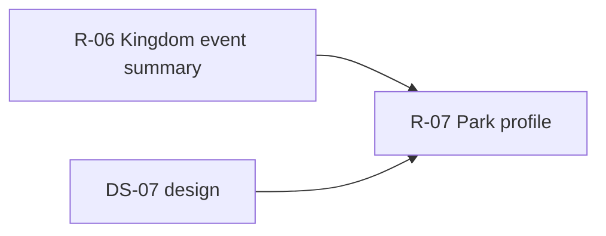

# DS-07: Park Profile & AJAX — Discovery Design Note

**Milestone:** DS-07  
**Branch:** `megiddo/ds-07-park-discovery`  
**Target IDs:** T-PRK-01 through T-PRK-05, T-PRA-01, T-PRA-03  
**Depends on:** M0.1, DS-02 (auth INSERT — T-PRA-02 excluded), DS-03 (banner — T-PRA-04 excluded), DS-06 (shared event list — coordinate R-06/R-07), DS-11 (search — T-PRA-01 excluded)  
**Execution sprint:** R-07
**Test sprint:** T-07

---

## 1. Backend survey

### 1.1 Scope summary

Park frontend violations span:

- **`Controller_Park`** (~514 lines) — park profile page (`profile` is the primary violation cluster; `index` uses mostly API models).
- **`Controller_ParkAjax`** (~820 lines) — park/kingdom admin AJAX; many actions already delegate to `Model_Park` / `Model_Player`.

`profile` embeds **large inline SQL** for event/calendar summaries, map coords, park roster, and attendance averages. Several ParkAjax actions are thin API wrappers; in-scope violations are **playersearch**, **checkabbr**, and **`Ork3::$Lib` weather** on profile.

**T-PRA-02** (auth INSERT), **T-PRA-04** (banner CRUD), and **T-PRA-01** (playersearch) are **out of R-07** — cross-referenced only.

### 1.2 Database tables touched

| Table | DS-07 usage |
|-------|-------------|
| `ork_event`, `ork_event_calendardetail` | Park-scoped event list; at_park_id inclusion |
| `ork_event_rsvp` | RSVP aggregates in event summary |
| `ork_event_staff` | Draft/staff visibility per event row |
| `ork_calendar_item` | Park + kingdom-level items merged into list |
| `ork_attendance` | Roster sign-in stats; weekly/monthly averages |
| `ork_mundane` | Roster listing |
| `ork_officer` | Officer roles on roster cards |
| `ork_class` | Last class on roster |
| `ork_park` | Host park coords fallback; abbr uniqueness (AJAX) |

### 1.3 Frontend violations — `Controller_Park`

#### T-PRK-01: `profile` (events)

| Lines | Behavior |
|-------|----------|
| 139–218 | Park-scoped event query: draft clause, RSVP aggregate JOIN, my_rsvp subquery, per-row staff/draft PHP filter |

**Overlap:** Same pattern as DS-06 `GetKingdomEventSummary` with `park_id` / `at_park_id` scope.

#### T-PRK-02: `profile` (calendar)

| Lines | Behavior |
|-------|----------|
| 220–336 | Calendar items merge; per-event coord resolution (N+1 queries); map location builder |

**Gap:** Kingdom profile batches coords (DS-06 G3p2); park profile still N+1 per event.

#### T-PRK-03: `profile` (roster)

| Lines | Behavior |
|-------|----------|
| 338–417 | `ghettocache` wrapper around complex roster SQL (sign-in buckets, officer roles, avatar fields) |

**Overlap:** Mirrors `Controller_Kingdom::players_json` (T-KNG-04) with park scope.

#### T-PRK-04: `profile` (averages)

| Lines | Behavior |
|-------|----------|
| 419–464 | Monthly AVG(distinct players/month) and weekly deduped player-weeks / week_count |

**Gap:** Semantics match Report Top Parks; not exposed as park-scoped API.

#### T-PRK-05: *(throughout)*

| Pattern | Lines |
|---------|-------|
| `Ork3::$Lib->authorization` | 37, 137, 194, 470–479 |
| `Ork3::$Lib->weather->for_park` | 88 |
| `Ork3::$Lib->player->GetCircleAwardIds` | 507 |
| `ghettocache` | 338–339, 415 |

**Note:** Weather and GetCircleAwardIds deferred to DS-14 unless a thin WeatherService already exists.

### 1.4 Frontend violations — `Controller_ParkAjax`

#### T-PRA-01: `park` → playersearch

| Lines | Behavior |
|-------|----------|
| 178–251 | Abbr resolution; scoped player search SQL with LIKE |

**Owner:** R-11 (DS-11).

#### T-PRA-03: `kingdom` → checkabbr

| Lines | Behavior |
|-------|----------|
| 601–645 | Park abbreviation uniqueness within kingdom; kingdom/park ownership preflight |

**Gap:** `Park->GetParkInKingdomByAbbreviation` exists; exclude-current-park uniqueness not exposed as API.

#### Out of scope

| ID | Action | Owner |
|----|--------|-------|
| T-PRA-02 | `addauth` INSERT | R-02 |
| T-PRA-04 | `banner` | R-03 |

#### Already idiomatic (no R-07 refactor required)

ParkAjax actions using `Model_Park` / `Model_Player` only: `setofficers`, `vacateofficer`, `addparkday`, `editparkday`, `deleteparkday`, `setdetails`, merge/transfer flows, etc.

### 1.5 Backend surface (existing)

| Layer | Location | Relevant to R-07 |
|-------|----------|------------------|
| Domain | `class.Park.php` | `GetParkDetails`, `GetParkDays`, `GetOfficers`, `GetParkInKingdomByAbbreviation` |
| Domain | `class.Report.php` | Kingdom-level averages (park-scoped extension needed) |
| Domain | `class.Weather.php` | `for_park` — used directly from controller |
| Service | `ParkService.*` | Core park CRUD; no profile aggregation |
| Tests | `ParkService.test.php` | No profile/roster/averages tests |

### 1.6 Repeated patterns

1. **Event summary query** — shared with kingdom (draft + RSVP + staff); scope filter differs.
2. **Roster SQL** — park vs kingdom roster share attendance subquery semantics (DS-06 T-KNG-04).
3. **Attendance averages** — park weekly/monthly formulas duplicated from kingdom/report logic.

### 1.7 Existing test coverage

| Asset | Status |
|-------|--------|
| `ParkService.test.php` | Basic park operations |
| PHPUnit | **No** park profile aggregation tests |

---

## 2. Test design

### 2.1 Backend unit/integration tests (implement in T-07)

Add `tests/Integration/ParkProfileTest.php`:

| Test case | Target | Validates |
|-----------|--------|-----------|
| `testGetParkEventSummary` | T-PRK-01, T-PRK-02 | Host + at_park events; calendar items; draft filter |
| `testParkEventSummaryBatchCoords` | T-PRK-02 | No N+1; map locations shape |
| `testGetParkPlayersRoster` | T-PRK-03 | Sign-in buckets; cache key bust on attendance write |
| `testGetParkAttendanceAverages` | T-PRK-04 | Monthly + weekly match report semantics |
| `testParkEventStaffSeesDraft` | T-PRK-01 | Staff delegate visibility |

Add `tests/Integration/ParkAjaxTest.php`:

| Test case | Target | Validates |
|-----------|--------|-----------|
| `testCheckParkAbbreviationUnique` | T-PRA-03 | Conflict within kingdom; exclude current park |

Skip when `ork3_test_db_available()` is false.

### 2.2 Infection scope (T-07, DS-7)

```bash
sh bin/run-infection.sh \
  --filter=class.Park.php \
  --filter=class.KingdomProfile.php \
  --test-framework-options="--filter=ParkProfileTest|ParkAjaxTest"
```

If event summary lives in shared `KingdomProfile` from R-06, include that file. Target ≥ `minMsi` / `minCoveredMsi` (15).

### 2.3 Frontend functional tests (implement in T-07)

| Flow | Steps | Assert |
|------|-------|--------|
| Park profile load | Open Park/profile/{id} | Events, map, roster, averages |
| Event at alternate park | Event with at_park_id | Appears on host park profile |
| Roster buckets | Players tab | Sign-in year buckets correct |
| Weekly/monthly averages | Summary cards | Match report numbers |
| Check park abbr | Admin edits abbr to conflict | AJAX returns taken=true |

---

## 3. Proposed revision

### 3.1 Principle

Extend **`ParkProfile`** domain (or `class.Park.php`) for park-scoped reads. **Reuse** R-06 `GetKingdomEventSummary` with a `Scope=Park` parameter rather than duplicating SQL. Move roster and averages into domain; keep weather as optional WeatherService wrapper in DS-14.

### 3.2 New domain API (R-07)

Extend `class.Park.php` or add `class.ParkProfile.php`:

| Method | Maps from | Notes |
|--------|-----------|-------|
| `GetParkEventSummary` | T-PRK-01, T-PRK-02 | Delegates to shared event summary engine from R-06 |
| `GetParkPlayersRoster` | T-PRK-03 | Cached JSON shape; bust on attendance/officer writes |
| `GetParkAttendanceAverages` | T-PRK-04 | Monthly + weekly |
| `CheckParkAbbreviationAvailable` | T-PRA-03 | Within kingdom; exclude park_id |

Shared from R-06 (consume, do not reimplement):

| Method | Purpose |
|--------|---------|
| `GetKingdomEventSummary` / internal `EventSummaryEngine` | Park-scoped variant |

### 3.3 Service registration (R-07)

Add to `ParkService.registration.php`:

- `Park.GetParkEventSummary`
- `Park.GetParkPlayersRoster`
- `Park.GetParkAttendanceAverages`
- `Park.CheckParkAbbreviationAvailable`

### 3.4 Per-target replacement (R-07)

| ID | Location | Change |
|----|----------|--------|
| T-PRK-01 | `profile` events | `GetParkEventSummary` |
| T-PRK-02 | `profile` calendar/map | Same API with map coords |
| T-PRK-03 | `profile` roster | `GetParkPlayersRoster` |
| T-PRK-04 | `profile` averages | `GetParkAttendanceAverages` |
| T-PRK-05 | throughout | Cache in domain; weather/circles deferred DS-14 |
| T-PRA-03 | checkabbr | domain check |

### 3.5 Out of scope for R-07

| Item | Deferred to |
|------|-------------|
| T-PRA-01 playersearch | R-11 |
| T-PRA-02 addauth | R-02 |
| T-PRA-04 banner | R-03 |
| `weather->for_park` | DS-14 (or thin WeatherService if added opportunistically) |
| `GetCircleAwardIds` | DS-14 |
| ParkAjax CRUD already on API | No change unless `$DB` found on audit |

### 3.6 Execution order (R-07)

1. **Block on R-06** shared event summary engine (or implement park scope first with shared extraction PR).
2. `GetParkPlayersRoster`.
3. `GetParkAttendanceAverages`.
4. `CheckParkAbbreviationAvailable`.
5. Thin `Controller_Park::profile`; verify no `$DB`.
6. ParkAjax abbr check only (other actions already clean).
7. Milestone Infection + full suite.

### 3.7 Dependency graph



---

## Related documents

| Doc | Link |
|-----|------|
| DS-06 kingdom discovery | [ds-06-kingdom-discovery.md](./ds-06-kingdom-discovery.md) |
| DS-02 auth INSERT discovery | [ds-02-auth-insert-discovery.md](./ds-02-auth-insert-discovery.md) |
| DS-03 banner discovery | [ds-03-banner-discovery.md](./ds-03-banner-discovery.md) |
| Implementation plan | [03-implementation-plan.md](./03-implementation-plan.md) |
| Test framework | [06-test-framework.md](./06-test-framework.md) |
| [validations/v-07-park-validation.md](./validations/v-07-park-validation.md) | Phase 1.6 — canary URLs + test mutation boundaries (V-07) |
