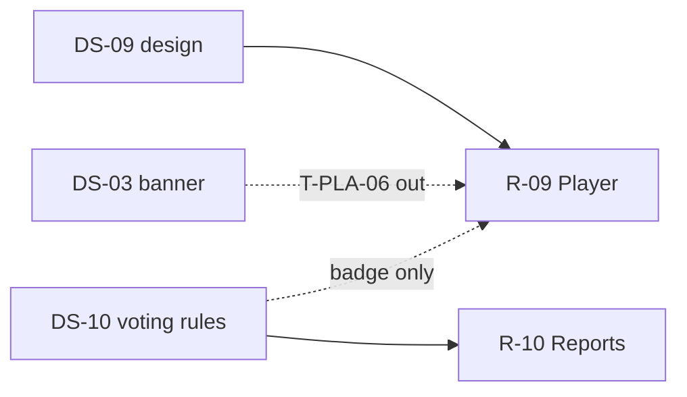

# DS-09: Player Profile & AJAX — Discovery Design Note

**Milestone:** DS-09  
**Branch:** `megiddo/ds-09-player-discovery`  
**Target IDs:** T-PLR-01 through T-PLR-08, T-PLA-01 through T-PLA-05, T-PLM-01 through T-PLM-04  
**Depends on:** M0.1, DS-03 (banner — T-PLA-06 excluded), DS-10 (voting badge — cross-ref only), DS-14 (authorization/cache — T-PLR-08 partial)  
**Execution sprint:** R-09
**Test sprint:** T-09

---

## 1. Backend survey

### 1.1 Scope summary

Player frontend violations span three files:

- **`controller.Player.php`** (~1,050 lines) — revised player profile (`profile`), legacy `index`, reconcile sub-view.
- **`controller.PlayerAjax.php`** (~990 lines) — profile AJAX (awards, merge, email, username check, recommendations).
- **`model.Player.php`** (~250 lines) — thin wrappers with cache busting and direct `Ork3::$Lib` bypasses.

The **revised player profile** (`profile` → `Playernew_index.tpl`) performs **heavy synchronous `$DB` reads** for display data that either has no SOAP surface or is duplicated from `class.Report`. AJAX endpoints are **partially migrated**: writes like `updateprofile`/`merge` delegate to `Model_Player`, but several reads/writes still hit `$DB` directly.

**T-PLA-06** (banner CRUD) is **out of R-09** (DS-03).

### 1.2 Database tables touched

| Table | DS-09 usage |
|-------|-------------|
| `ork_mundane` | Username check; persona lookup; merge kingdom/park; email UPDATE; suspension context |
| `ork_mundane_note` | Notes count; EditNote |
| `ork_officer` | Officer roles list; admin badge officer exclusion |
| `ork_authorization` | Admin role badges; HasAuthority gates |
| `ork_kingdom` / `ork_park` / `ork_parktitle` | Officer entity labels; admin badges |
| `ork_award` / `ork_kingdomaward` / `ork_awards` | Custom title sentinel; beltline; max ranks; reconcile map |
| `ork_recommendations` | Recommendations (via Report — already backend path) |
| `ork_attendance` | Custom milestone date helpers |
| `ork_player_milestones` | Custom milestones |

### 1.3 Frontend violations — `controller.Player.php`

#### T-PLR-01: `profile` (custom title)

| Lines | Behavior |
|-------|----------|
| 384–393 | Direct `SELECT award_id … name='Custom Title'` for sentinel ID; hardcoded fallback `CustomAwardId = 94` |

**Existing backend:** `Player::getCustomTitleAwardId()` (cached private lookup).

**Gap:** Frontend duplicates domain helper; not on SOAP.

#### T-PLR-02: `profile` (notes count)

| Lines | Behavior |
|-------|----------|
| 401–404 | Direct `COUNT(*)` on notes for tab visibility |

**Existing backend:** `Player::GetNotes()` returns full bodies; `PlayerAjax::notes` loads via model.

**Gap:** No count-only API.

#### T-PLR-03: `profile` (officers)

| Lines | Behavior |
|-------|----------|
| 417–443 | Direct officer-roles SQL (kingdom/park scope, active filter, entity labels) |

**Existing backend:** `Kingdom::GetOfficers`, `Park::GetOfficers` — current officers only, different shape.

**Gap:** No per-player historical officer-role list API.

#### T-PLR-04: `profile` / legacy `index` (recommendations)

| Lines | Behavior |
|-------|----------|
| 413 (lazy) / legacy 245–247 | **No raw SQL today.** `profile` defers to AJAX; uses `Model_Reports::recommended_awards` |

**Existing backend:** `Report::PlayerAwardRecommendations()` (cached) via model.

**Gap:** Inventory line drift — backend path already correct; remaining work is SOAP exposure if required.

#### T-PLR-05: `profile` (admin auth badges)

| Lines | Behavior |
|-------|----------|
| 485–529 | Direct SQL: global ORK-admin check + scoped admin/create grant badges |

**Existing backend:** `Authorization::HasAuthority()` for viewer gate.

**Gap:** Display queries bypass service; scoped badge rules live only in controller.

#### T-PLR-06: `profile` (peerage / beltline / titles)

| Lines | Behavior |
|-------|----------|
| 598–764 | Three direct peerage/beltline/title SQL blocks + dedupe logic |

**Existing backend:** `Report::BeltlineData()` (kingdom-wide, alias-aware peerage).

**Gap:** Player-scoped beltline read duplicated 3×; not exposed per-player.

#### T-PLR-07: `reconcile` (award map)

| Lines | Behavior |
|-------|----------|
| 994–1006 | Direct `SELECT kingdomaward_id, award_id … kingdom_id` map |

**Existing backend:** `Model_Award::fetch_award_option_list` (different shape — DS-10).

**Gap:** Kingdom-specific award→kingdomaward map only in frontend reconcile view.

#### T-PLR-08: *(throughout)*

| Pattern | Lines |
|---------|-------|
| `Ork3::$Lib->authorization->HasAuthority` | ctor 26, `index` 237, `profile` 408/494, `reconcile` 964 |

**Gap:** No lightweight auth-check API at frontend edge; cross-cut with DS-14.

### 1.4 Frontend violations — `controller.PlayerAjax.php`

#### T-PLA-01: `check_username`

| Lines | Behavior |
|-------|----------|
| 32–37 | Direct `SELECT mundane_id … username` |

**Existing backend:** `UpdatePlayer` uniqueness check; `unique_username()` on create only.

**Gap:** No `CheckUsernameAvailable` SOAP method; shared with `Controller_SelfReg`.

#### T-PLA-02: `player` → `awardranks` / `info`

| Lines | Behavior |
|-------|----------|
| 376–400 | Max rank per award_id; persona lookup |

**Existing backend:** `AwardsForPlayer` returns full awards; `GetPlayer` exposes persona.

**Gap:** Dedicated max-rank aggregation not exposed.

#### T-PLA-03: `merge`

| Lines | Behavior |
|-------|----------|
| 547–581 | Direct kingdom/park lookup for both players; mirrors 3-tier auth before delegating |

**Existing backend:** `MergePlayer` enforces identical auth tier.

**Gap:** **Duplicated auth mirror** in Ajax — drift risk.

#### T-PLA-04: `save_my_email`

| Lines | Behavior |
|-------|----------|
| 722–727 | **Direct `UPDATE ork_mundane SET email`** — no token, no audit |

**Existing backend:** `UpdatePlayer` sets email with auth + validation side effects.

**Gap:** Highest integrity risk — bypasses domain write path.

#### T-PLA-05: `add_second`

| Lines | Behavior |
|-------|----------|
| 753–759 | Post-success persona `SELECT` after `AddSecondToRecommendation` |

**Existing backend:** Domain method exists; `player_info()` available.

**Gap:** Persona should return from second API.

### 1.5 Frontend violations — `model.Player.php`

#### T-PLM-01: `bust_player_roster_caches`

| Lines | Behavior |
|-------|----------|
| 71–87 | Direct `SELECT kingdom_id, park_id` for cache key |

**Gap:** Roster bust should use player snapshot from domain.

#### T-PLM-02: `edit_note`

| Lines | Behavior |
|-------|----------|
| 19–21 | Direct `Ork3::$Lib->player->EditNote` bypass |

**Gap:** Inconsistent with `add_note`/`remove_note` which use `$this->Player->…`.

#### T-PLM-03: cache helpers

| Lines | Behavior |
|-------|----------|
| 38–64 | Direct `Ork3::$Lib->ghettocache` get/cache/bust |

**Gap:** Frontend owns cache keys/TTLs (60s details, 20min roster); FR-7 infrastructure cleanup.

#### T-PLM-04: milestone/date helpers

| Lines | Behavior |
|-------|----------|
| 221–246 | Direct `GetCustomMilestones`, `get_*_attendance_date` |

**Existing backend:** All four methods in `class.Player.php` with ghettocache on dates.

**Gap:** Not on `PlayerService` SOAP.

### 1.6 Backend surface (existing)

| Layer | Location | Relevant to R-09 |
|-------|----------|------------------|
| Domain | `class.Player.php` | Notes, milestones, merge, suspension, beltline-adjacent reads |
| Domain | `class.Report.php` | `BeltlineData`, `PlayerAwardRecommendations` |
| Domain | `class.Authorization.php` | `HasAuthority` |
| Service | `PlayerService.*` | 16 registered methods; many DS-09 reads/writes **not** registered |
| Tests | `PlayerService.test.php` | Deprecated (`die()` guard) |

**In domain but not SOAP-registered (DS-09 relevant):** `GetNotes`, `EditNote`, `AddNote`, `RemoveNote`, `getCustomTitleAwardId`, attendance date helpers, `GetCustomMilestones`, `player_info`, `unique_username`.

### 1.7 Cross-cutting patterns

| Pattern | Instances | Proposed direction |
|---------|-----------|-------------------|
| Beltline peerage SQL | T-PLR-06 (3 queries) vs `Report::BeltlineData` | `Player::GetBeltlineForPlayer($mundane_id)` |
| Merge auth tier | T-PLA-03 Ajax + `MergePlayer` | Remove Ajax pre-check or shared `CanMergePlayers` |
| Email update | T-PLA-04 vs `UpdatePlayer` | `Player::SaveOwnEmail({Token, Email})` |
| Username probe | T-PLA-01 | `Player::CheckUsernameAvailable` |
| Admin badges | T-PLR-05 | `Authorization::GetDisplayGrants` |
| Officer role list | T-PLR-03 | `Player::GetOfficerRoles` |
| ghettocache in model | T-PLM-03 | Move cache ownership to domain |

### 1.8 Inventory drift notes

- **T-PLR-04** line reference in `03-implementation-plan.md` (465–466) no longer matches recommendation SQL; severity reduced.
- **T-PLR-07** is in `reconcile()`, not `profile()`.
- Hardcoded milestone award IDs in `profile()` (~784–816) are FR-6 candidates but not separately inventoried.

### 1.9 Existing test coverage

| Asset | Status |
|-------|--------|
| `PlayerService.test.php` | Deprecated |
| PHPUnit | **No** player profile aggregation or Ajax SQL tests |

---

## 2. Test design

### 2.1 Backend unit/integration tests (implement in T-09)

Add `tests/Integration/PlayerProfileTest.php`:

| Test case | Target | Validates |
|-----------|--------|-----------|
| `testGetCustomTitleAwardId` | T-PLR-01 | Cached sentinel; no hardcoded fallback in API |
| `testHasNotesCount` | T-PLR-02 | Boolean without loading bodies |
| `testGetOfficerRoles` | T-PLR-03 | Kingdom/park scope; entity labels |
| `testGetDisplayGrants` | T-PLR-05 | Global admin vs scoped; officer-linked excluded |
| `testGetBeltlineForPlayer` | T-PLR-06 | Alias-aware peerage parity with `BeltlineData` |
| `testReconcileAwardMap` | T-PLR-07 | Kingdomaward map shape |

Add `tests/Integration/PlayerAjaxTest.php`:

| Test case | Target | Validates |
|-----------|--------|-----------|
| `testCheckUsernameAvailable` | T-PLA-01 | Available/taken; exclude own ID |
| `testGetAwardMaxRanks` | T-PLA-02 | Max rank aggregation |
| `testMergeAuthTierMatrix` | T-PLA-03 | Matches `MergePlayer` server auth |
| `testSaveOwnEmail` | T-PLA-04 | Auth-only self update; validation parity |
| `testAddSecondReturnsPersona` | T-PLA-05 | No extra read required |

Add `tests/Unit/ModelPlayerCacheTest.php`:

| Test case | Target | Validates |
|-----------|--------|-----------|
| `testRosterCacheBustOnUpdate` | T-PLM-01, T-PLM-03 | Invalidates on update/move/merge |
| `testEditNoteViaService` | T-PLM-02 | Consistent with add/remove |
| `testCustomMilestonesAndDates` | T-PLM-04 | SOAP-registered equivalents |

Skip integration tests when `ork3_test_db_available()` is false.

### 2.2 Infection scope (T-09, DS-7)

```bash
sh bin/run-infection.sh \
  --filter=class.Player.php \
  --filter=class.Authorization.php \
  --filter=class.Report.php \
  --test-framework-options="--filter=PlayerProfileTest|PlayerAjaxTest|ModelPlayerCacheTest"
```

Focus mutators on: merge auth tier branches, email validation, beltline alias rules, username exclude-self, admin badge officer exclusion.

**Out of R-09 tests:** T-PLA-06 (DS-03).

### 2.3 Frontend functional tests (implement in T-09)

| Flow | Steps | Assert |
|------|-------|--------|
| Player profile load | Open Player/profile/{id} | Beltline, officers, admin badges, notes tab |
| Username check | Edit profile with taken username | AJAX returns taken |
| Save email | Self-service email update | Persists; audit trail |
| Merge players | Kingdom/park/cross-kingdom tiers | Auth matrix enforced |
| Award ranks AJAX | Awards tab rank display | Max ranks correct |

---

## 3. Proposed revision

### 3.1 Principle

Expose player profile read aggregates and small Ajax probes through `PlayerService` (and `AuthorizationService` for display grants). Move cache ownership from `model.Player.php` into domain. Eliminate direct `$DB` and `Ork3::$Lib` bypasses in model layer.

### 3.2 New domain / service API (R-09)

| Proposed method | Maps from | Notes |
|-----------------|-----------|-------|
| `Player.GetCustomTitleAwardId` | T-PLR-01 | Wrap existing private helper |
| `Player.GetNotesCount` | T-PLR-02 | Boolean/count only |
| `Player.GetOfficerRoles` | T-PLR-03 | Per-player historical list |
| `Authorization.GetDisplayGrants` | T-PLR-05 | Admin badge data |
| `Player.GetBeltlineForPlayer` | T-PLR-06 | Single alias-aware implementation |
| `Player.GetReconcileAwardMap` | T-PLR-07 | Kingdom-scoped map |
| `Player.CheckUsernameAvailable` | T-PLA-01 | Exclude optional mundane_id |
| `Player.GetAwardMaxRanks` | T-PLA-02 | Or extend `AwardsForPlayer` |
| Remove Ajax merge pre-check | T-PLA-03 | Trust `MergePlayer` auth |
| `Player.SaveOwnEmail` | T-PLA-04 | Validation + audit |
| Return persona from `AddSecondToRecommendation` | T-PLA-05 | Extend domain response |
| Domain roster cache bust helper | T-PLM-01, T-PLM-03 | No kingdom/park SELECT in model |
| Register `EditNote` via SOAP | T-PLM-02 | Match add/remove |
| Register milestones + date helpers | T-PLM-04 | SOAP surface |

### 3.3 Per-target replacement (R-09)

| ID | Location | Change |
|----|----------|--------|
| T-PLR-01 | `profile` | `GetCustomTitleAwardId` |
| T-PLR-02 | `profile` | `GetNotesCount` |
| T-PLR-03 | `profile` | `GetOfficerRoles` |
| T-PLR-04 | AJAX recommendations | Already backend — optional SOAP |
| T-PLR-05 | `profile` | `GetDisplayGrants` |
| T-PLR-06 | `profile` | `GetBeltlineForPlayer` |
| T-PLR-07 | `reconcile` | `GetReconcileAwardMap` |
| T-PLR-08 | throughout | Lightweight auth API (DS-14 coordination) |
| T-PLA-01–05 | PlayerAjax | Service methods above |
| T-PLM-01–04 | model.Player | Thin delegates; cache in domain |

### 3.4 Out of scope for R-09

| Item | Deferred to |
|------|-------------|
| T-PLA-06 banner CRUD | R-03 (DS-03) |
| `voting_eligible` Ajax badge | R-10 (DS-10) |
| Hardcoded milestone award IDs | FR-6 follow-up |

### 3.5 Execution order (R-09)

1. **T-PLA-04** (direct UPDATE — highest integrity risk).
2. **T-PLA-03** (dedupe merge auth).
3. **T-PLR-06** (largest SQL duplication — beltline/titles).
4. **T-PLR-05 / T-PLR-03** (profile badge data).
5. **T-PLA-01 / T-PLA-02 / T-PLA-05** (small Ajax SQL reads).
6. **T-PLR-01 / T-PLR-02 / T-PLR-07** (small profile reads).
7. **T-PLM-01…04** (model layer cleanup + cache).
8. **T-PLR-08** (authorization edge — align with DS-14).

### 3.6 Dependency graph



---

## Related documents

| Doc | Link |
|-----|------|
| DS-03 banner discovery | [ds-03-banner-discovery.md](./ds-03-banner-discovery.md) |
| DS-10 reports discovery | [ds-10-reports-discovery.md](./ds-10-reports-discovery.md) |
| Implementation plan | [03-implementation-plan.md](./03-implementation-plan.md) |
| Test framework | [06-test-framework.md](./06-test-framework.md) |
