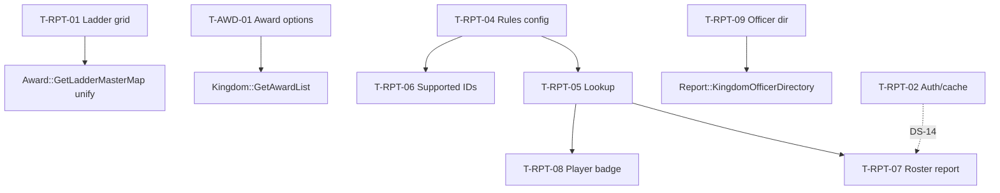

# DS-10: Reports, Voting Rules, Awards — Discovery Design Note

**Milestone:** DS-10  
**Branch:** `megiddo/ds-10-reports-discovery`  
**Target IDs:** T-RPT-01 through T-RPT-09, T-AWD-01  
**Depends on:** M0.1, DS-09 (voting badge in PlayerAjax — cross-ref), DS-14 (HasAuthority / ghettocache — T-RPT-02 partial)  
**Execution sprint:** R-10
**Test sprint:** T-10

---

## 1. Backend survey

### 1.1 Scope summary

Reports frontend violations span three files:

- **`controller.Reports.php`** (~1,400 lines) — ladder grid report with direct SQL; 29 `Ork3::$Lib` call sites for auth gates, park lookup, and cache.
- **`model.Reports.php`** (~530 lines) — hardcoded kingdom voting rules, voting eligibility orchestration, attendance dates SQL, officer directory principality merge.
- **`model.Award.php`** (~120 lines) — award dropdown HTML with pseudo-ladder IDs and peerage categorization rules.

**Call chain (voting):** Controller → `Model_Reports::_all_voting_rules()` (frontend config) → `get_voting_eligible*` → `APIModel('Report')->GetVotingEligible()` → `Report::GetVotingEligible()` (backend engine).

**Call chain (awards dropdown):** Controller → `Model_Award::fetch_award_option_list()` → `Kingdom::GetAwardList` / `Award::GetAwardList` → categorization + HTML in model.

**Split-brain:** Voting eligibility **engine** lives in `class.Report.php`; **rule config** lives in frontend model. Award list raw data is on SOAP; HTML assembly is frontend-only.

### 1.2 Database tables touched

| Table | DS-10 usage |
|-------|-------------|
| `ork_attendance` | Ladder grid sign-ins; attendance date picker; voting eligibility |
| `ork_park` / `ork_kingdom` | Ladder grid scope names; voting rules; officer directory |
| `ork_kingdomaward` / `ork_award` / `ork_awards` | Ladder grid ranks; voting knight threshold; award options |
| `ork_mundane` | Ladder grid players; voting roster; officer directory emails |
| `ork_event` | Voting eligibility (kingdom events, exclude flags) |
| `ork_dues` | Voting eligibility |
| `ork_officer` | Officer directory pivot |
| `ork_configuration` | Principality toggle (`IncludePrincipalityInStatistics`) |
| `ork_recommendations` | *(indirect via reports controller gates)* |

### 1.3 Frontend violations — `controller.Reports.php`

#### T-RPT-01: `ladder_grid`

| Lines | Behavior |
|-------|----------|
| 1032–1303 | Six direct `$DB->DataSet()` queries; hardcoded `$knightGroupMap`, `$ladderToMasterMap` (subset of `Award::GetLadderMasterMap()`); presentation logic; `ghettocache` read/write |

**Existing backend:** `Award::GetLadderMasterMap()` — fuller map with `MaxRank`; no `Report::*LadderGrid*` method.

**Gap:** Entire report assembly must move to backend; dedupe master map with domain helper.

**Queries (in order):** scope name → ladder column defs → player ranks (`GREATEST(MAX(rank), COUNT(awards_id))`) → master/paragon flags → 12-month sign-in → knighthood memberships (`peerage = 'Knight'`).

#### T-RPT-02: *(throughout)*

| Pattern | Behavior |
|---------|----------|
| `authorization->HasAuthority` | ~16 gates on heraldry, guilds, awards, recommendations, voting, reconciliation |
| `park->GetParkKingdomId` | Line 201, `player_award_recommendations` |
| `ghettocache` | Ladder grid cache; reconciliation cache bust (1140–1141, 1301, 1390–1397) |

**Gap:** Cross-cut with DS-14 / T-LIB-*; cache bust on reconciliation write should move with write path.

**Note:** `kingdom_officer_directory` is in `$public_reports` (no login required); `ladder_grid` requires login but not officer role.

### 1.4 Frontend violations — `model.Reports.php`

#### T-RPT-03: `get_attendance_dates`

| Lines | Behavior |
|-------|----------|
| 140–154 | Direct `$DB` SQL: `SELECT DISTINCT DATE(date) … FROM ork_attendance` scoped by kingdom_id or park_id |

**Existing backend:** No dedicated "distinct dates" method.

**Gap:** Small isolated API for date-picker UI in `Controller_Reports::attendance()`.

#### T-RPT-04: `_all_voting_rules`

| Lines | Behavior |
|-------|----------|
| 334–474 | **Hardcoded kingdom-specific business rules** — 16 kingdom entries with flags: `AttendanceMode`, `ProvinceMode`, `KingdomEventBonus`, `HomeParkOnly`, `ExcludeOnline`, `ExcludeEvents`, `ActiveKnightThreshold`, `MaxOutsideKingdomCredits`, etc. |

**Existing backend:** `Report::GetVotingEligible()` **implements** all rule flags in SQL but **expects rules passed in** — no kingdom→config lookup in backend.

**Gap:** Config must move backend-side (DB table, kingdom config JSON, or `ork_configuration` extension).

#### T-RPT-05: `_voting_rules`

| Lines | Behavior |
|-------|----------|
| 324–328 | Thin wrapper over `_all_voting_rules()` |

**Gap:** Collapses into T-RPT-04 backend rules store.

#### T-RPT-06: `supported_voting_kingdom_ids`

| Lines | Behavior |
|-------|----------|
| 319–322 | `array_keys(_all_voting_rules())` — gates voting UI in Reports, PlayerAjax, Kingdom, Park profiles |

**Gap:** Backend should expose `SupportedVotingKingdomIds`.

#### T-RPT-07: `get_voting_eligible`

| Lines | Behavior |
|-------|----------|
| 477–490 | Orchestrates rule merge + service call; resolves park→kingdom via `APIModel('Park')->GetParkKingdomId` |

**Existing backend:** `Report::GetVotingEligible($request)` — full roster report (~400 lines SQL).

**Gap:** API should accept `KingdomId`/`ParkId` only; backend loads rules internally. SOAP registration missing.

#### T-RPT-08: `get_voting_eligible_for_player`

| Lines | Behavior |
|-------|----------|
| 492–499 | Single-player path; consumed by `Controller_PlayerAjax` which also runs direct `$DB` to read `mundane.kingdom_id` |

**Existing backend:** Same `Report::GetVotingEligible()` — optimized when `MundaneId` set.

**Gap:** Dedicated `GetVotingEligibleForPlayer(MundaneId)` API; remove PlayerAjax `$DB` lookup.

#### T-RPT-09: `kingdom_officer_directory`

| Lines | Behavior |
|-------|----------|
| 511–530 | `Ork3::$Lib->kingdom->StatsIncludesPrincipalities` + `GetPrincipalities`; N+1 calls to `Report->KingdomOfficerDirectory` per principality |

**Existing backend:** `Report::KingdomOfficerDirectory($request)` — SQL pivot for officers per park/kingdom.

**Gap:** Move principality merge into backend (single call); confirm PII (email) policy at API layer.

### 1.5 Frontend violations — `model.Award.php`

#### T-AWD-01: `fetch_award_option_list`

| Lines | Behavior |
|-------|----------|
| 15–117 | Hardcoded `$pseudoLadderIds` (24 kingdomaward IDs); peerage/title categorization rules; HTML `<optgroup>`/`<option>` assembly with `data-*` attributes; `ghettocache` (1200s TTL) |

**Existing backend:** `Kingdom::GetAwardList`, `Award::GetAwardList` (raw lists on SOAP); `Award::GetLadderMasterMap()` related but separate.

**Gap:** New API returning structured groups `{ label, items: [{ KingdomAwardId, AwardId, Name, … }] }`; frontend renders HTML. **7 controllers** consume this.

### 1.6 Backend surface (existing)

| Capability | Location | SOAP exposed? |
|------------|----------|---------------|
| Voting eligibility engine | `Report::GetVotingEligible` | No |
| Voting rule config | `Model_Reports::_all_voting_rules` | No |
| Officer directory SQL | `Report::KingdomOfficerDirectory` | No |
| Principality merge | `model.Reports::kingdom_officer_directory` | No |
| Ladder grid report | `controller.Reports::ladder_grid` | No |
| Ladder master map | `Award::GetLadderMasterMap` | No |
| Attendance date list | `model.Reports::get_attendance_dates` | No |
| Award list (raw) | `Kingdom::GetAwardList`, `Award::GetAwardList` | Yes |
| Award dropdown HTML | `model.Award::fetch_award_option_list` | No |
| Legacy reports | `Report::*` (6 methods) | Yes |

### 1.7 Cross-cutting patterns

1. **Voting split-brain** — engine in domain, config in frontend model.
2. **HTML in models** — award optgroups should be structured JSON + template rendering.
3. **Unregistered Report methods** — `GetVotingEligible`, `KingdomOfficerDirectory` exist in domain but not on SOAP.
4. **Public report PII** — officer directory exposes emails without login.

### 1.8 Existing test coverage

| Asset | Status |
|-------|--------|
| `ReportService.test.php` | Legacy 6-method reports only |
| PHPUnit | **No** ladder grid, voting rules, or award option tests |

---

## 2. Test design

### 2.1 Backend unit/integration tests (implement in T-10)

Add `tests/Integration/VotingRulesTest.php`:

| Test case | Target | Validates |
|-----------|--------|-----------|
| `testSupportedKingdomIds` | T-RPT-04–06 | Matches legacy 16-kingdom set |
| `testProvinceModeEligibility` | T-RPT-07 | Province vs kingdom attendance modes |
| `testHomeParkOnlyRule` | T-RPT-07 | Outside-park credits excluded |
| `testActiveKnightThreshold` | T-RPT-07 | Knight count gate |
| `testSinglePlayerBadge` | T-RPT-08 | Compact payload; no frontend kingdom lookup |

Add `tests/Integration/LadderGridTest.php`:

| Test case | Target | Validates |
|-----------|--------|-----------|
| `testLadderGridAssembly` | T-RPT-01 | Rank vs count semantics; scope name |
| `testKnightGroupAliasing` | T-RPT-01 | `alias_award_id` handling |
| `testMasterMapUnification` | T-RPT-01 | Uses `GetLadderMasterMap` not duplicate map |

Add `tests/Unit/AttendanceDatesTest.php`:

| Test case | Target | Validates |
|-----------|--------|-----------|
| `testDistinctDatesByKingdom` | T-RPT-03 | Sorted date strings |
| `testDistinctDatesByPark` | T-RPT-03 | Park scope |

Add `tests/Integration/OfficerDirectoryTest.php`:

| Test case | Target | Validates |
|-----------|--------|-----------|
| `testKingdomOfficerDirectory` | T-RPT-09 | Monarch/Regent/PM/Champion/GMR pivot |
| `testPrincipalityMerge` | T-RPT-09 | Toggle on/off via config |

Add `tests/Unit/AwardOptionGroupsTest.php`:

| Test case | Target | Validates |
|-----------|--------|-----------|
| `testPseudoLadderIds` | T-AWD-01 | 24 pseudo-ladder regression |
| `testPeerageBuckets` | T-AWD-01 | Knight/Master/Paragon/Squire grouping |
| `testOfficerVsAwardBucket` | T-AWD-01 | Officer role separation |

Skip integration tests when `ork3_test_db_available()` is false.

### 2.2 Infection scope (T-10, DS-7)

```bash
sh bin/run-infection.sh \
  --filter=class.Report.php \
  --filter=class.Award.php \
  --filter=class.Kingdom.php \
  --test-framework-options="--filter=VotingRulesTest|LadderGridTest|AttendanceDatesTest|OfficerDirectoryTest|AwardOptionGroupsTest"
```

Focus mutators on: voting rule flag branches, ladder rank/count logic, pseudo-ladder ID list, principality merge toggle, attendance date scope filter.

### 2.3 Frontend functional tests (implement in T-10)

| Flow | Steps | Assert |
|------|-------|--------|
| Voting eligible report | Kingdom with rules → run report | Eligible/ineligible columns match pre-refactor |
| Player voting badge | Open player profile in voting kingdom | Badge JSON correct |
| Ladder grid | Kingdom + park scope | Grid columns and knight groups |
| Attendance report | Date picker | Distinct dates populate |
| Award dropdown | Kingdom admin award select | Optgroups render from structured API |
| Officer directory | Public kingdom page | Principality sections when enabled |

---

## 3. Proposed revision

### 3.1 Principle

Move voting rule **configuration** into backend alongside the existing eligibility **engine**. Register unexposed Report methods on SOAP. Replace HTML assembly in models with structured JSON. Consolidate ladder master map with `Award::GetLadderMasterMap()`.

### 3.2 New domain / service API (R-10)

| Proposed method | Maps from | Returns |
|-----------------|-----------|---------|
| `Report.GetLadderAwardGrid` | T-RPT-01 | `{ LadderAwards, GridRows, ScopeName }` |
| `Report.GetAttendanceDates` | T-RPT-03 | Sorted date strings |
| `Report.GetVotingRules` | T-RPT-04–06 | Rule config + supported kingdom IDs |
| `Report.GetVotingEligible` | T-RPT-07 | Full roster (rules internal) |
| `Report.GetVotingEligibleForPlayer` | T-RPT-08 | Single-player eligibility |
| `Report.GetKingdomOfficerDirectory` | T-RPT-09 | Rows + principality merge |
| `Award.GetAwardOptionGroups` | T-AWD-01 | Grouped structured options |

**Rules storage options (pick at R-10):**

1. New `ork_voting_rule` table (preferred for auditability).
2. JSON blob in `ork_configuration` per kingdom.
3. PHP config file in `system/lib/ork3/` (interim — still backend-owned).

### 3.3 Per-target replacement (R-10)

| ID | Location | Change |
|----|----------|--------|
| T-RPT-01 | `ladder_grid` | `GetLadderAwardGrid` |
| T-RPT-02 | throughout | Auth gates via service or per-report backend enforcement; cache bust with write path |
| T-RPT-03 | `get_attendance_dates` | `GetAttendanceDates` |
| T-RPT-04–06 | `_all_voting_rules` etc. | Backend rules store |
| T-RPT-07 | `get_voting_eligible` | Thin model wrapper; rules internal |
| T-RPT-08 | `get_voting_eligible_for_player` + PlayerAjax | `GetVotingEligibleForPlayer` |
| T-RPT-09 | `kingdom_officer_directory` | Single backend call with principality merge |
| T-AWD-01 | `fetch_award_option_list` | `GetAwardOptionGroups` + template rendering |

### 3.4 Out of scope for R-10

| Item | Deferred to |
|------|-------------|
| `HasAuthority` edge pattern (29 sites) | DS-14 coordination |
| Legacy Report SOAP methods (6) | No change unless touched |
| Reconciliation cache bust detail | Moves with reconciliation write milestone |

### 3.5 Execution order (R-10)

1. **T-RPT-04–06** voting rules store (unblocks all voting paths).
2. **T-RPT-07–08** register `GetVotingEligible` variants; thin controllers.
3. **T-RPT-03** attendance dates (small, isolated).
4. **T-RPT-01** ladder grid (largest controller SQL).
5. **T-RPT-09** officer directory + principality merge.
6. **T-AWD-01** award option groups (7 controller consumers).
7. **T-RPT-02** auth/cache cleanup as touched files allow.

### 3.6 Dependency graph



---

## Related documents

| Doc | Link |
|-----|------|
| DS-09 player discovery | [ds-09-player-discovery.md](./ds-09-player-discovery.md) |
| Implementation plan | [03-implementation-plan.md](./03-implementation-plan.md) |
| Test framework | [06-test-framework.md](./06-test-framework.md) |
| [validations/v-10-reports-validation.md](./validations/v-10-reports-validation.md) | Phase 1.6 — canary URLs + test mutation boundaries (V-10) |
