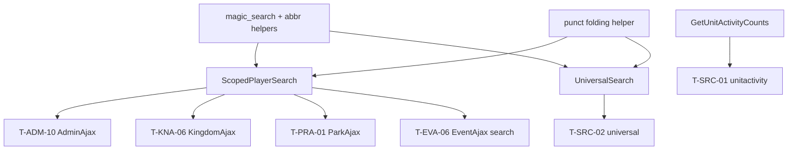

# DS-11: Search & Player Search — Discovery Design Note

**Milestone:** DS-11  
**Branch:** `megiddo/ds-11-search-discovery`  
**Target IDs:** T-SRC-01, T-SRC-02, T-ADM-10, T-KNA-06, T-PRA-01, T-EVA-06 (search portion)  
**Depends on:** M0.1, DS-06 (kingdom family scope — T-KNA-06), DS-07 (park scope — T-PRA-01), DS-08 (admin playersearch — T-ADM-10), DS-04 (event auth playersearch — T-EVA-06)  
**Execution sprint:** R-11

---

## 1. Backend survey

### 1.1 Scope summary

Search frontend violations span **six controllers** plus one mostly-clean search controller:

| File | Role |
|------|------|
| `controller.SearchAjax.php` | Universal multi-category search (players, parks, kingdoms, units) — **~140 lines raw SQL** |
| `controller.Search.php` | Unit activity lazy-load endpoint — **direct SQL + ghettocache** |
| `controller.AdminAjax.php` | Global admin playersearch — **direct SQL** |
| `controller.KingdomAjax.php` | Kingdom-scoped playersearch — **direct SQL + abbr resolution** |
| `controller.ParkAjax.php` | Park-scoped playersearch — **direct SQL + abbr resolution** |
| `controller.EventAjax.php` | Event staff playersearch — **direct SQL + event scope ordering** |

**Existing backend:** `class.SearchService.php` already implements `Player()`, `Park()`, `Kingdom()`, `Unit()`, and `magic_search()` (abbreviation prefix resolution via `Kingdom::GetKingdomByAbbreviation` / `Park::GetParkInKingdomByAbbreviation`). Legacy SOAP `Search/SearchService.php` is consumed by templates via `JSONModel('Search')`.

**Split-brain:** Player search logic exists in **two parallel stacks**:

1. **SOAP/JSON SearchService** — fulltext + LIKE, token-based ORK admin bypass, `magic_search` abbr prefix, cached per method.
2. **Frontend AJAX copies** — reimplemented LIKE queries, duplicated abbr resolution with raw `$DB`, scope/focus/budget rules only in `SearchAjax` / `*Ajax` controllers.

Universal search (`SearchAjax::universal`) adds **typographic punctuation folding** (U+2019 → `'`, etc.) not present in `SearchService::Player`.

### 1.2 Database tables touched

| Table | DS-11 usage |
|-------|-------------|
| `ork_mundane` | All player search endpoints |
| `ork_kingdom` | Abbr resolution; kingdom search; join labels |
| `ork_park` | Abbr resolution; park search; scope filters |
| `ork_unit` | Universal search unit category |
| `ork_unit_mundane` | Unit activity counts (T-SRC-01) |
| `ork_attendance` | Unit activity 12-month sign-in subquery (T-SRC-01) |
| `ork_event` | EventAjax playersearch scope ordering (park_id, kingdom_id) |

### 1.3 Frontend violations — search-specific

#### T-SRC-01: `Controller_Search::unitactivity`

| Lines | Behavior |
|-------|----------|
| 92–114 | Accept comma-separated `unit_id` list (max 25); `ghettocache` 300s TTL; SQL counts distinct members with attendance in last 12 months per unit |

**Existing backend:** `Unit` service list via `Model_Unit::get_unit_list` (used by `unitsearch`) — no activity-count companion API.

**Gap:** Activity aggregation must move to domain; cache key should live in `SearchService` or `Unit` domain, not `Controller_Search`.

#### T-SRC-02: `Controller_SearchAjax::universal`

| Lines | Behavior |
|-------|----------|
| 5–169 | Multi-category search with rolling budgets (4/3/2/3 default; `focus=` gives one category 10); abbr prefix `KD:PK term`; punct folding; ORK admin restricted-name bypass via `HasAuthority(AUTH_ADMIN)`; inactive player toggle; kingdom/park proximity ordering |

**Existing backend:** Partial overlap — `SearchService::Player/Park/Kingdom/Unit` each search one category; `magic_search` handles abbr prefix without raw `$DB`.

**Gap:** No unified multi-category endpoint; no punct folding in backend; universal JSON shape differs from SOAP Player rows.

#### T-ADM-10: `Controller_AdminAjax::global` → `playersearch`

| Lines | Behavior |
|-------|----------|
| 25–53 | Global active-player search; **no restricted-name gate** (searches given_name/surname for all matches); LIMIT 20; returns `MundaneId`, `Persona`, `PAbbr`, `KAbbr` |

**Owner:** Consolidated in R-11. Cross-ref DS-08.

#### T-KNA-06: `Controller_KingdomAjax::playersearch`

| Lines | Behavior |
|-------|----------|
| 1032–1143 | Scope modes: `own` (family kingdom IDs via `GetFamilyKingdomIds`), `exclude`, `all`; optional `park_id`; abbr prefix override; include inactive/suspended toggles; LIMIT 15; richer row shape |

**Existing backend:** `SearchService::Player` accepts kingdom/park scope but **not** family-kingdom scope, exclude mode, or suspended toggle.

**Gap:** Kingdom admin search semantics are frontend-only.

#### T-PRA-01: `Controller_ParkAjax::park` → `playersearch`

| Lines | Behavior |
|-------|----------|
| 178–251 | Scope `own` / `exclude` / `all` relative to park; `prioritize` ordering; abbr prefix override; include inactive/suspended |

**Gap:** Park-scoped exclude/own semantics not on SearchService.

#### T-EVA-06 (search portion): `Controller_EventAjax::auth` → `playersearch`

| Lines | Behavior |
|-------|----------|
| 434–491 | Auth gate `HasAuthority(AUTH_EVENT, event_id, AUTH_CREATE)`; loads event park/kingdom for ORDER BY proximity; active-only; LIMIT 15 |

**Note:** `addauth` INSERT (same method) is **out of R-11** (R-02 / DS-02).

**Gap:** Event-prioritized ordering is frontend-only; auth gate stays in controller but query moves backend.

### 1.4 Backend surface (existing)

| Layer | Location | Relevant to R-11 |
|-------|----------|------------------|
| Domain | `class.SearchService.php` | `Player`, `Park`, `Kingdom`, `Unit`, `magic_search` |
| Domain | `class.Kingdom.php` | `GetKingdomByAbbreviation`, `GetFamilyKingdomIds` |
| Domain | `class.Park.php` | `GetParkInKingdomByAbbreviation` |
| Domain | `class.Authorization.php` | ORK admin check (used inline in SearchService::Player) |
| Service | `orkservice/Search/SearchService.*` | JSON registrations for legacy search actions |
| Tests | — | **No** SearchService unit/integration tests |

### 1.5 Repeated patterns (consolidation targets)

1. **Abbr prefix parsing** — duplicated in `SearchAjax`, `KingdomAjax`, `ParkAjax`; backend has `magic_search` using domain helpers.
2. **LIKE escape** — `str_replace` for `'`, `%`, `_`, `\` in every controller copy.
3. **Restricted-name gate** — `SearchService::Player` and `SearchAjax::universal` implement ORK admin bypass; AdminAjax/KingdomAjax/ParkAjax/EventAjax **do not** apply restricted gate (admin/support use case).
4. **Scope ordering** — CASE expressions prioritizing user's kingdom/park/event repeated with variations.
5. **Response shape drift** — camelCase keys differ between universal search (`id`, `name`, `abbr`) and admin AJAX (`MundaneId`, `Persona`, `KAbbr`).

### 1.6 `Controller_Search` — non-violation note

`unitsearch()` (lines 46–85) correctly delegates to `Model_Unit::get_unit_list` (SOAP). Only `unitactivity` and constructor `HasAuthority` (DS-14 cross-cut) are in scope for R-11 / DS-14 respectively.

---

## 2. Test design

### 2.1 Backend unit/integration tests (implement in R-11)

Add `tests/Integration/SearchServiceTest.php`:

| Test case | Target | Validates |
|-----------|--------|-----------|
| `testMagicSearchAbbrevPrefix` | T-SRC-02, T-KNA-06, T-PRA-01 | `KD:PK term` resolves kingdom/park IDs |
| `testUniversalMultiCategory` | T-SRC-02 | Budget rollover; focus=player returns 10 players |
| `testPunctFolding` | T-SRC-02 | U+2019 in stored name matches ASCII apostrophe query |
| `testOrkAdminRestrictedBypass` | T-SRC-02 | Token with AUTH_ADMIN sees restricted mundane fields |
| `testKingdomFamilyScope` | T-KNA-06 | `scope=own` includes principality family IDs |
| `testParkExcludeScope` | T-PRA-01 | `scope=exclude` omits home park |
| `testEventProximityOrder` | T-EVA-06 | Event park players rank before kingdom before global |
| `testAdminGlobalSearch` | T-ADM-10 | Active-only; 20-result cap |
| `testUnitActivityCounts` | T-SRC-01 | 12-month distinct member count per unit_id |

Add `tests/Unit/SearchEscapeTest.php` (pure):

| Test case | Target | Validates |
|-----------|--------|-----------|
| `testLikeEscape` | all | `%`, `_`, `'`, `\` in search term do not broaden LIKE |

Skip integration tests when `ork3_test_db_available()` is false.

### 2.2 Infection scope (R-11, DS-7)

```bash
sh bin/run-infection.sh \
  --filter=class.SearchService.php \
  --filter=class.Kingdom.php \
  --test-framework-options="--filter=SearchServiceTest|SearchEscapeTest"
```

Focus mutators on: abbr prefix branch, restricted-name gate, scope CASE ordering, punct-fold REPLACE chain, budget/focus arithmetic, unit activity date interval.

### 2.3 Frontend functional tests (implement in R-11)

| Flow | Steps | Assert |
|------|-------|--------|
| Universal nav search | Type 3 chars in header search | Players/parks/kingdoms/units populate; local kingdom prioritized |
| Admin permissions search | Admin → add global admin | playersearch finds target by persona |
| Kingdom attendance modal | Kingdom admin → add player | own-then-exclude two-phase search works |
| Park attendance modal | Park admin → add outside player | exclude scope returns non-park players |
| Event staff auth | Event manager → grant staff | playersearch prioritizes event park |
| Unit list activity | Open unit search default list | Activity counts load after list (lazy endpoint) |
| Abbr prefix | Search `GP: monkey` on kingdom page | Results scoped to GP |

---

## 3. Proposed revision

### 3.1 Principle

Consolidate all player/universal/unit-activity search into **`SearchService` domain methods** exposed via JSON (and optionally SOAP for legacy template callers). Frontend controllers become thin JSON proxies passing session token and scope parameters. Unify abbr resolution on existing `magic_search`. Add punct folding to backend `Player` path. Preserve **response-shape compatibility** per endpoint during R-11 (adapter layer in controller if needed) to avoid simultaneous JS template churn.

### 3.2 New domain / service API (R-11)

| Proposed method | Maps from | Returns |
|-----------------|-----------|---------|
| `SearchService.UniversalSearch` | T-SRC-02 | `{ players, parks, kingdoms, units }` (current universal shape) |
| `SearchService.ScopedPlayerSearch` | T-ADM-10, T-KNA-06, T-PRA-01, T-EVA-06 | Configurable scope; returns per-caller row shape via `Format` param or separate thin wrappers |
| `SearchService.GetUnitActivityCounts` | T-SRC-01 | `{ unit_id: active_member_count }` map |
| *(extend)* `SearchService.Player` | legacy templates | Add punct folding; optional `IncludeInactive`, `IncludeSuspended` |

**ScopedPlayerSearch request shape (draft):**

```
{
  Token, Query,
  Scope: 'global' | 'kingdom_own' | 'kingdom_exclude' | 'kingdom_all' |
         'park_own' | 'park_exclude' | 'park_all' | 'event_prioritized',
  KingdomId?, ParkId?, EventId?,
  IncludeInactive?, IncludeSuspended?, Limit?
}
```

Implement `Scope` as enum-like string in domain — not six separate copy-pasted SQL blocks.

### 3.3 Per-target replacement (R-11)

| ID | Location | Change |
|----|----------|--------|
| T-SRC-01 | `unitactivity` | `GetUnitActivityCounts`; controller returns JSON only |
| T-SRC-02 | `universal` | `UniversalSearch`; remove `$DB` and inline `HasAuthority` (pass Token) |
| T-ADM-10 | AdminAjax playersearch | `ScopedPlayerSearch` scope=global |
| T-KNA-06 | KingdomAjax playersearch | `ScopedPlayerSearch` scope=kingdom_* |
| T-PRA-01 | ParkAjax playersearch | `ScopedPlayerSearch` scope=park_* |
| T-EVA-06 | EventAjax playersearch | `ScopedPlayerSearch` scope=event_prioritized; auth gate remains in controller |

### 3.4 Out of scope for R-11

| Item | Deferred to |
|------|-------------|
| T-EVA-06 `addauth` INSERT | R-02 (DS-02) |
| `Controller_Search::__construct` HasAuthority admin menu | DS-14 |
| Legacy `SearchService.php` SOAP template migration | Optional follow-up; keep JSON registrations working |
| Fulltext vs LIKE strategy unification | R-11 may keep LIKE for scoped search; universal can adopt SearchService::Player fulltext path later |

### 3.5 Execution order (R-11)

1. **Extract shared helpers** — LIKE escape, punct fold SQL builder, abbr prefix (reuse `magic_search`).
2. **`GetUnitActivityCounts`** — smallest isolated endpoint (T-SRC-01).
3. **`ScopedPlayerSearch`** — single domain method; wire AdminAjax first (simplest shape).
4. **Kingdom/Park/Event scopes** — one at a time with integration tests per scope mode.
5. **`UniversalSearch`** — compose category searches; match budget/focus semantics.
6. **Remove `$DB` from all six controllers**; verify `rg '\$DB->' orkui/controller/controller.Search*.php orkui/controller/controller.*Ajax.php` clean for search paths.
7. Milestone Infection + full suite.

### 3.6 Dependency graph



---

## Related documents

| Doc | Link |
|-----|------|
| DS-08 admin discovery | [ds-08-admin-discovery.md](./ds-08-admin-discovery.md) |
| DS-06 kingdom discovery | [ds-06-kingdom-discovery.md](./ds-06-kingdom-discovery.md) |
| DS-07 park discovery | [ds-07-park-discovery.md](./ds-07-park-discovery.md) |
| DS-04 eventajax discovery | [ds-04-eventajax-discovery.md](./ds-04-eventajax-discovery.md) |
| Implementation plan | [03-implementation-plan.md](./03-implementation-plan.md) |
| Test framework | [06-test-framework.md](./06-test-framework.md) |
