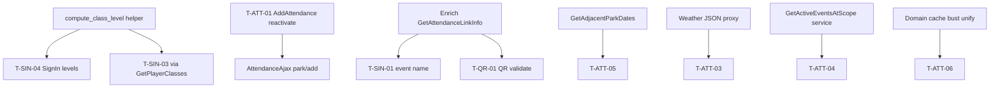

# DS-12: Attendance & Sign-In — Discovery Design Note

**Milestone:** DS-12  
**Branch:** `megiddo/ds-12-attendance-discovery`  
**Target IDs:** T-ATT-01 through T-ATT-06, T-SIN-01 through T-SIN-04, T-QR-01  
**Depends on:** M0.1, DS-09 (player profile class display — threshold duplication), DS-14 (authorization gates, ghettocache, weather — partial), DS-04 (event active-at-scope — cross-ref)  
**Execution sprint:** R-12
**Test sprint:** T-12

---

## 1. Backend survey

### 1.1 Scope summary

Attendance/sign-in frontend violations span **five files**:

| File | Role |
|------|------|
| `controller.Attendance.php` | Kingdom/park/event attendance pages — auth gates + active event lookup |
| `controller.AttendanceAjax.php` | JSON API for add/edit/delete, weather, links, myclass |
| `controller.SignIn.php` | Self-sign-in via attendance link token — event name, last class, class progression |
| `controller.QR.php` | QR PNG generation for sign-in links — token validation SQL |
| `model.Attendance.php` | SOAP wrappers + adjacent dates SQL + cache busting |

**Call chain (writes):** Most attendance CRUD already delegates to `Model_Attendance` → `APIModel('Attendance')` → `class.Attendance.php`. Violations are **side effects and reads** left in controllers after successful service calls, or **direct `$DB` / `Ork3::$Lib`** where no thin API exists.

**Call chain (sign-in):** `SignIn/index` → `GetAttendanceLinkInfo` (backend) → direct `$DB` for display enrichment → POST → `UseAttendanceLink` / `UpdateSelfSigninClass` (backend).

**Split-brain:** Link lifecycle (create, validate, consume) is **fully implemented** in `class.Attendance.php` but consumed via `APIModel` direct domain instantiation (not SOAP-registered). QR validation duplicates link lookup already in `GetAttendanceLinkInfo`.

### 1.2 Database tables touched

| Table | DS-12 usage |
|-------|-------------|
| `ork_attendance` | Adjacent dates; last class; per-class credit sums; sign-in duplicate checks (backend) |
| `ork_mundane` | Auto-reactivate UPDATE (T-ATT-01); editor persona SELECT (T-ATT-02) |
| `ork_class_reconciliation` | Sign-in class progression credits (T-SIN-03) |
| `ork_attendance_link` | QR token validation (T-QR-01); link info (backend) |
| `ork_event` | Event name for sign-in scope label (T-SIN-01); active event context (T-ATT-04) |
| `ork_class` | Active classes list (via GetClasses — already backend) |

### 1.3 Frontend violations — `controller.AttendanceAjax.php`

#### T-ATT-01: `park` → `add`

| Lines | Behavior |
|-------|----------|
| 29–41 | After successful `AddAttendance`, if player `active=0`, **direct UPDATE** `ork_mundane SET active=1`; returns `reactivated` flag |

**Existing backend:** `Attendance::AddAttendance` inserts row and busts `Player.GetPlayerClasses` — **does not** reactivate inactive players. `UseAttendanceLink` also does not reactivate.

**Gap:** Business rule "adding attendance reactivates profile" must move into `AddAttendance` (and likely `UseAttendanceLink` for parity).

#### T-ATT-02: `attendance` → `edit`

| Lines | Behavior |
|-------|----------|
| 157–166 | After successful `SetAttendance`, direct SELECT `persona` for editor's `mundane_id` |

**Existing backend:** `SetAttendance` returns status only; editor persona not included.

**Gap:** Enrich `SetAttendance` response or add `Player::GetPersona` one-liner API; remove controller `$DB`.

#### T-ATT-03: `park/weather`, `weather_at`

| Lines | Behavior |
|-------|----------|
| 86, 119 | `Ork3::$Lib->weather->archive_for_date($park_id, $date)` and `archive_for_coords($lat, $lng, $date)` |

**Existing backend:** `class.Weather.php` — full archive implementation; no WeatherService JSON surface.

**Gap:** Expose via JSON/WeatherService or Attendance companion endpoint; controller passes through only.

**Note:** Auth on `weather_at` is login-only (no officer gate) — preserve behavior.

### 1.4 Frontend violations — `controller.Attendance.php`

#### T-ATT-04: *(throughout)*

| Pattern | Lines | Behavior |
|---------|-------|----------|
| `HasAuthority` gates | 52–53, 183–184 | `CanAddAttendance` for kingdom/park EDIT auth |
| `GetActiveEventsAtScope` | 94–95, 229–230 | Active event banner on attendance day pages |

**Existing backend:** `Authorization::HasAuthority`; `Event::GetActiveEventsAtScope` — both domain-only.

**Gap:** Presentation auth gate may remain in controller (UI flag) **or** call lightweight `Attendance.AttendanceAuthority` (exists in domain, not exposed to frontend). Active event lookup should use service/JSONModel, not `Ork3::$Lib` in controller.

### 1.5 Frontend violations — `model.Attendance.php`

#### T-ATT-05: `get_adjacent_park_dates`

| Lines | Behavior |
|-------|----------|
| 143–160 | Two `$DB` queries: prev/next `DATE(date)` for park attendance navigation |

**Existing backend:** No adjacent-date method on Report or Attendance.

**Gap:** Small read API on `Attendance` or `Report` domain.

#### T-ATT-06: cache (private helper)

| Lines | Behavior |
|-------|----------|
| 64–77 | `Ork3::$Lib->ghettocache->bust` for player attendance caches after writes |

**Existing backend:** `Attendance::AddAttendance` / `SetAttendance` / `RemoveAttendance` / `UseAttendanceLink` already bust `Player.GetPlayerClasses` in domain. Model duplicates bust keys for `Model_Player.*` frontend cache namespaces.

**Gap:** Consolidate cache bust list in domain on all write paths; model becomes pass-through only (coordinate with DS-14 ghettocache policy).

### 1.6 Frontend violations — `controller.SignIn.php`

#### T-SIN-01: `index` (event name)

| Lines | Behavior |
|-------|----------|
| 40–47 | Direct SELECT `name FROM ork_event` when link is event-scoped |

**Existing backend:** `Event::GetEvent`, `SearchService::Event` — name available via API.

**Gap:** Include `EventName` in `GetAttendanceLinkInfo` response or call Event service from model.

#### T-SIN-02: `index` (last class)

| Lines | Behavior |
|-------|----------|
| 98–113 | Direct SELECT last `class_id` from attendance; match name from `GetClasses` |

**Existing backend:** `Attendance::GetPlayerLastClass` — **same query**, already wired via `AttendanceAjax::myclass` and `Model_Attendance::get_player_last_class`.

**Gap:** SignIn duplicates domain method; should call model/API.

#### T-SIN-03: `index` (credits)

| Lines | Behavior |
|-------|----------|
| 120–136 | SUM credits from `ork_attendance` + add `ork_class_reconciliation.reconciled` per class |

**Existing backend:** `Player::GetPlayerClasses` — sophisticated dedupe-by-date credit totals **including reconciliation** (cached).

**Gap:** SignIn uses simpler SUM (may disagree with profile display semantics). R-12 should use `GetPlayerClasses` credits, not raw SUM.

#### T-SIN-04: `index` (levels)

| Lines | Behavior |
|-------|----------|
| 137–164 | **Class level calculation** with hardcoded thresholds `[5, 12, 21, 34, 53]`; computes Level 1–6 and credits-to-next |

**Existing backend:** No shared `ComputeClassLevel()` helper. Thresholds duplicated in:

- `Playernew_index.tpl` (lines ~228, ~6198)
- `revised.js` (line ~807 — **4 thresholds only**, missing 53)

**Gap:** Extract level thresholds + calculator to `system/lib/ork3/` (e.g. `ClassLevel` helper or method on `Player`); SignIn and profile templates consume same API.

### 1.7 Frontend violations — `controller.QR.php`

#### T-QR-01: `link`

| Lines | Behavior |
|-------|----------|
| 18–26 | Direct SELECT validates token exists and `expires_at > NOW()` before generating QR PNG |

**Existing backend:** `GetAttendanceLinkInfo` — full validation including revoked check.

**Gap:** QR endpoint should call `GetAttendanceLinkInfo` (or thin `ValidateAttendanceLinkToken` returning bool); no separate SQL. QR **generation** (phpqrcode) may remain in controller (presentation) or move to util — not a DB violation once validation is backend.

### 1.8 Backend surface (existing)

| Layer | Location | Relevant to R-12 |
|-------|----------|------------------|
| Domain | `class.Attendance.php` | Full link + CRUD + `GetPlayerLastClass` + `GetExistingSignin` |
| Domain | `class.Player.php` | `GetPlayerClasses` (credits + reconciliation) |
| Domain | `class.Event.php` | `GetActiveEventsAtScope` |
| Domain | `class.Weather.php` | `archive_for_date`, `archive_for_coords` |
| Domain | `class.Report.php` | `AttendanceForDate`, `RecentParkAttendees` (already used) |
| Service | `AttendanceService.registration.php` | **Only** GetClasses, CreateClass, SetClass, AddAttendance, RemoveAttendance registered on SOAP |
| Service | Unregistered domain methods | SetAttendance, link CRUD, GetPlayerLastClass, etc. — work via APIModel direct domain call |
| Tests | — | **No** Attendance link or sign-in tests |

### 1.9 Cross-milestone overlaps

| Pattern | Also in | Notes |
|---------|---------|-------|
| `GetActiveEventsAtScope` | DS-04, DS-06, DS-07 | Event banner on attendance pages |
| `ghettocache` bust | DS-14 | Model + domain duplicate bust keys |
| Class level thresholds | DS-09 profile UI | Consolidate in R-12 or shared helper used by R-09 |
| Weather lib calls | DS-07 T-PRK-05, DS-08 | WeatherService exposure optional batch |

---

## 2. Test design

### 2.1 Backend unit/integration tests (implement in T-12)

Add `tests/Unit/ClassLevelTest.php`:

| Test case | Target | Validates |
|-----------|--------|-----------|
| `testLevelBoundaries` | T-SIN-04 | Credits 0→L1, 5→L2, 12→L3, 21→L4, 34→L5, 53→L6 |
| `testCreditsToNext` | T-SIN-04 | `ToNext` at each level; null at L6 |

Add `tests/Integration/AttendanceSignInTest.php`:

| Test case | Target | Validates |
|-----------|--------|-----------|
| `testAddAttendanceReactivatesInactive` | T-ATT-01 | Inactive player → active=1 after AddAttendance |
| `testUseLinkReactivatesInactive` | T-ATT-01 | Parity for self-sign-in path |
| `testGetAdjacentParkDates` | T-ATT-05 | Prev/next dates correct |
| `testGetAttendanceLinkInfoIncludesEventName` | T-SIN-01 | Event-scoped link returns name |
| `testGetPlayerLastClass` | T-SIN-02 | Matches latest attendance row |
| `testSignInClassProgressionUsesGetPlayerClasses` | T-SIN-03 | Credits match dedupe semantics |
| `testValidateLinkTokenForQr` | T-QR-01 | Expired/revoked tokens rejected |

Add `tests/Integration/AttendanceWriteTest.php`:

| Test case | Target | Validates |
|-----------|--------|-----------|
| `testSetAttendanceReturnsEditorPersona` | T-ATT-02 | Response includes editor persona |
| `testCacheBustOnWrite` | T-ATT-06 | Player class cache bust after add/update/delete |

Skip integration tests when `ork3_test_db_available()` is false.

### 2.2 Infection scope (T-12, DS-7)

```bash
sh bin/run-infection.sh \
  --filter=class.Attendance.php \
  --filter=class.Player.php \
  --test-framework-options="--filter=ClassLevelTest|AttendanceSignInTest|AttendanceWriteTest"
```

Focus mutators on: reactivate branch, level threshold comparisons, adjacent date `<`/`>` filters, link expiry UTC parsing, duplicate sign-in guard.

### 2.3 Frontend functional tests (implement in T-12)

| Flow | Steps | Assert |
|------|-------|--------|
| Park attendance add | Officer adds inactive player | Player reactivated; appears on day list |
| Attendance edit | Change class/credits on row | Editor persona returned; list updates |
| Park weather widget | Open attendance day page | Historic weather JSON loads |
| Adjacent dates | Navigate prev/next on park attendance | Dates match records |
| Sign-in link | Open valid link → pick class → submit | Attendance recorded; redirect to profile |
| Sign-in change class | Second visit same day | Update class, no duplicate credit |
| Class progression display | Sign-in page class list | Level/credits match profile page |
| QR code | Generate QR for active link | PNG returned; expired link errors |

---

## 3. Proposed revision

### 3.1 Principle

Keep attendance **writes** in `class.Attendance.php` (already authoritative). Move remaining **read enrichment and side effects** (reactivate, adjacent dates, link validation, class progression) into domain. Expose missing methods on JSON API (registration gap is technical debt — R-12 should register link/SetAttendance methods or document APIModel-direct pattern explicitly). Frontend controllers become thin JSON/template glue.

### 3.2 New domain / service API (R-12)

| Proposed method | Maps from | Returns |
|-----------------|-----------|---------|
| *(extend)* `Attendance.AddAttendance` | T-ATT-01 | Auto-reactivate inactive mundane; `{ Status, Detail, Reactivated? }` |
| *(extend)* `Attendance.UseAttendanceLink` | T-ATT-01 | Same reactivate side effect |
| *(extend)* `Attendance.SetAttendance` | T-ATT-02 | Include `EditorPersona` in success payload |
| `Attendance.GetAdjacentParkDates` | T-ATT-05 | `{ prev, next }` date strings |
| *(extend)* `Attendance.GetAttendanceLinkInfo` | T-SIN-01, T-QR-01 | Add `EventName`, `ScopeType`; QR calls this |
| `Player.ComputeClassProgress` | T-SIN-03, T-SIN-04 | Per-class `{ Credits, Level, ToNext }` using `GetPlayerClasses` + shared thresholds |
| `Weather.GetArchiveForPark` / `GetArchiveForCoords` | T-ATT-03 | Existing Weather methods wrapped |
| `Event.GetActiveEventsAtScope` | T-ATT-04 | Register on Event JSON if not already |

**Shared helper (new file or Player method):**

```php
// Threshold credits to reach Level N+1 from Level N
CLASS_LEVEL_THRESHOLDS = [5, 12, 21, 34, 53];
function compute_class_level(float $credits): array { /* Level, ToNext */ }
```

### 3.3 Per-target replacement (R-12)

| ID | Location | Change |
|----|----------|--------|
| T-ATT-01 | AttendanceAjax `park/add` | Remove UPDATE; read `Reactivated` from AddAttendance |
| T-ATT-02 | AttendanceAjax `attendance/edit` | Use SetAttendance enriched response |
| T-ATT-03 | AttendanceAjax weather actions | WeatherService JSON proxy |
| T-ATT-04 | Attendance kingdom/park | `GetActiveEventsAtScope` via JSONModel; auth gate stays or uses AttendanceAuthority |
| T-ATT-05 | Model adjacent dates | `GetAdjacentParkDates` |
| T-ATT-06 | Model cache bust | Domain-only bust; remove ghettocache from model |
| T-SIN-01 | SignIn event name | From enriched link info |
| T-SIN-02 | SignIn last class | `get_player_last_class` model call |
| T-SIN-03 | SignIn credits | `ComputeClassProgress` / GetPlayerClasses |
| T-SIN-04 | SignIn levels | Shared `compute_class_level` helper |
| T-QR-01 | QR link | Validate via GetAttendanceLinkInfo; keep PNG gen in controller |

### 3.4 Out of scope for R-12

| Item | Deferred to |
|------|-------------|
| `Controller_Attendance::behold` face recognition | Separate feature; uses Model already |
| Full SOAP registration audit for Attendance | Optional; APIModel-direct is current pattern |
| Profile template threshold unification | R-09 coordination — helper owned in R-12 |
| Weather cron/refresh | DS-08 / ops |
| Attendance link create/list/delete AJAX | Already on model → domain; verify no `$DB` on audit only |

### 3.5 Execution order (R-12)

1. **`compute_class_level` helper + ClassLevelTest** — unblocks T-SIN-04 and profile alignment.
2. **T-ATT-01 reactivate in AddAttendance + UseAttendanceLink** — highest business-rule risk.
3. **T-ATT-05 adjacent dates** — small isolated read.
4. **T-SIN-01 enrich GetAttendanceLinkInfo** — unblocks SignIn + T-QR-01.
5. **T-SIN-02/03/04 SignIn refactor** — consume backend APIs.
6. **T-ATT-02 SetAttendance enrichment**.
7. **T-ATT-03 weather JSON proxy**.
8. **T-ATT-04 active event + auth cleanup**.
9. **T-ATT-06 cache bust consolidation**.
10. **T-QR-01** validation swap.
11. Milestone Infection + full suite.

### 3.6 Dependency graph



---

## Related documents

| Doc | Link |
|-----|------|
| DS-09 player discovery | [ds-09-player-discovery.md](./ds-09-player-discovery.md) |
| DS-04 eventajax discovery | [ds-04-eventajax-discovery.md](./ds-04-eventajax-discovery.md) |
| Implementation plan | [03-implementation-plan.md](./03-implementation-plan.md) |
| Test framework | [06-test-framework.md](./06-test-framework.md) |
| [validations/v-12-attendance-validation.md](./validations/v-12-attendance-validation.md) | Phase 1.6 — canary URLs + test mutation boundaries (V-12) |
