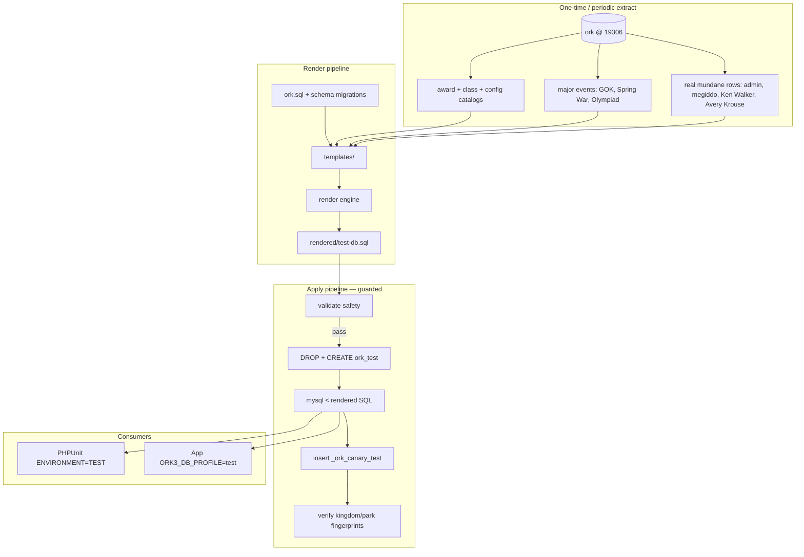

# Test Database Tool — Architecture

**Status:** Plan (not implemented)  
**Stack:** Docker MariaDB × 2, compositional SQL renderer, shell/CLI orchestration  
**Safety model:** Fail-closed — no database CLI args on data commands; deployment tier guard; destructive ops abort unless every validation passes

---

## 1. Problem statement

ORK3 needs a **dedicated test database** with:

1. **Identical schema** to production (via `ork.sql` + filtered `db-migrations/`)
2. **Controlled fake data** at realistic scale (5 kingdoms, parks, players, attendance, units)
3. **Reference catalogs** copied from real data (awards, classes, configuration keys)
4. **Hybrid players** — a few real operator accounts plus generated personas
5. **Time-relative data** — attendance and event dates re-rendered to the trailing 3 years on each build
6. **Hard safety rails** — impossible to accidentally wipe dev/prod data

---

## 2. Design principles

| Principle | Rationale |
|-----------|-----------|
| **Two physical containers** | Volume isolation — test wipe never touches `data-db` |
| **Non-default host port for test** | Test DB binds `19307:3306`; tool refuses host port `3306` or `19306` for destructive ops |
| **No CLI database args** | `extract` / `render` / `apply` hardcode mirror + sandbox — repo ships to production |
| **Deployment tier guard** | Data commands refused on production hosts before any DB connection |
| **Composable templates** | Stable identity data (kingdom names) separate from shifting temporal data (dates) |
| **Schema from repo, content from tiers** | Migrations are classified schema vs content; content migrations may be skipped per table |
| **Idempotent render** | Same content seed + new `anchor_date` → same identities, shifted dates only |
| **Single entry CLI** | `bin/ork-db` — profile-aware command palette ([10-cli-reference.md](./10-cli-reference.md)) |

---

## 3. Infrastructure layout

### 3.1 Docker services

Extend `docker-compose.php8.yml` (or add `docker-compose.php8-test-db.yml` overlay):

```yaml
  ork3testdb:
    image: mariadb:latest
    command: --sql-mode=''
    restart: always
    environment:
      MARIADB_DATABASE: 'ork_test'
      MARIADB_USER: 'ork'
      MARIADB_PASSWORD: 'secret'
      MARIADB_ROOT_PASSWORD: 'root'
    ports:
      - '19307:3306'          # test port — NOT 3306, NOT 19306
    volumes:
      - data-test-db:/var/lib/mysql
    container_name: ork3-php8-test-db
    networks:
      - ork3-php8-net
```

| Service | Container | Host port | Database | Volume |
|---------|-----------|-----------|----------|--------|
| `ork3db` (existing) | `ork3-php8-db` | **19306** | `ork` | `data-db` |
| `ork3testdb` (new) | `ork3-php8-test-db` | **19307** | `ork_test` | `data-test-db` |

Both containers share network `ork3-php8-net`. App container resolves:
- Dev: `ork3-php8-db:3306`
- Test: `ork3-php8-test-db:3306`

### 3.2 Configuration routing

#### `config.test.php` (PHPUnit / Infection)

```php
define('DB_HOSTNAME', getenv('ORK3_TEST_DB_HOST') ?: '127.0.0.1');
define('DB_PORT', (int) (getenv('ORK3_TEST_DB_PORT') ?: 19307));
define('DB_DATABASE', 'ork_test');
```

#### `config.dev.php` (Docker app — unchanged default)

Stays on `ork3-php8-db` / `ork` / implicit port 3306.

#### App profile switching (`bin/ork-db use`)

Writes `ORK3_DB_PROFILE=prod|dev` to gitignored `.ork3-db.local` (or updates compose env override). When `dev`:

```php
// config.dev.php — add profile branch at top of DB section
$profile = getenv('ORK3_DB_PROFILE') ?: 'prod';
if ($profile === 'dev') {
    define('DB_HOSTNAME', 'ork3-php8-test-db');
    define('DB_DATABASE', 'ork_test');
} else {
    define('DB_HOSTNAME', 'ork3-php8-db');
    define('DB_DATABASE', 'ork');
}
```

App container receives `ORK3_DB_PROFILE` via `env_file` merge. `bin/ork-db use dev` sets the file and runs `docker compose restart ork3app`.

---

## 4. Pipeline overview



---

## 5. Component map (planned repo layout)

```
tools/ork-db/
  README.md
  cli.php                     # CLI router
  Render.php
  Validate.php
  Extract.php
  lib/
  templates/
  manifests/
  extracted/                  # gitignored
  rendered/                   # gitignored

bin/
  ork-db                      # thin wrapper → php tools/ork-db/cli.php
```

---

## 6. Data flow: render vs apply

| Stage | Input | Output | Mutates DB? |
|-------|-------|--------|-------------|
| **extract** | Dev DB `ork` | `extracted/*.sql` snippets | No (read-only SELECT … INTO OUTFILE or CLI dump) |
| **render** | Templates + extracts + `anchor_date=today` | `rendered/test-db-YYYYMMDD.sql` | No |
| **validate** | Target host:port + DB name | Exit 0/1 + diagnostic report | No (read-only probes) |
| **apply** | Rendered SQL + validate pass | Fresh `ork_test` | **Yes — test container only** |

`anchor_date` defaults to **today** (local timezone `America/Chicago`, matching ORK3 config). All attendance months and event occurrences are computed relative to `anchor_date - 3 years` through `anchor_date`.

---

## 7. Integration points

| Consumer | Connection | When |
|----------|------------|------|
| `bin/run-unit-tests.sh` | `ENVIRONMENT=TEST` → `config.test.php` → `127.0.0.1:19307` | Every test run |
| `bin/run-infection.sh` | Same | Mutation sign-off |
| Manual browser testing | `bin/ork-db use dev` | Optional — browse fake data |
| CI (future) | `docker compose up ork3testdb` + `ork-db apply` | Ephemeral sandbox per job |

---

## 8. Non-goals (v1)

- Syncing test data back to dev
- Partial table refresh (apply is full wipe + reload)
- Running against remote/production hosts
- Asset files (heraldry images, waivers) — DB rows only; asset dirs remain empty/default
- Automatic extract from production — manual extract from local dev is sufficient for v1
