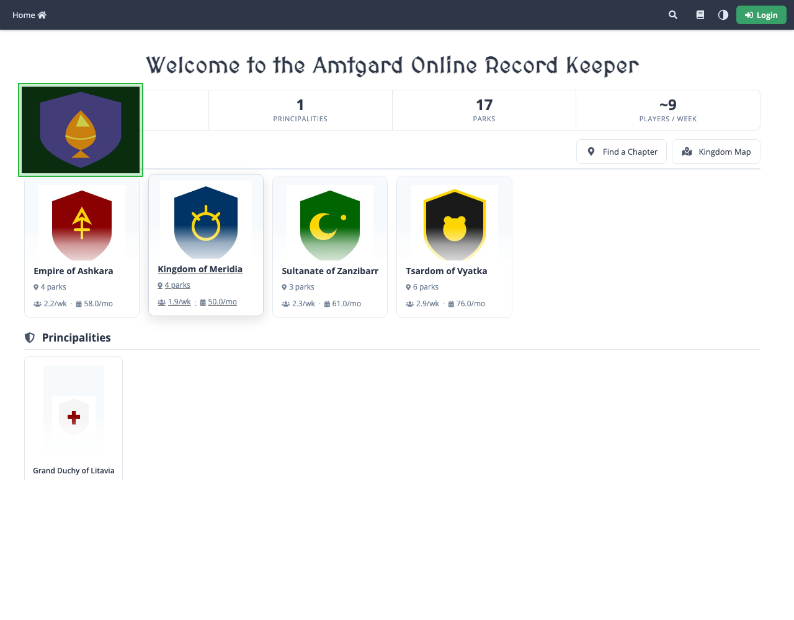
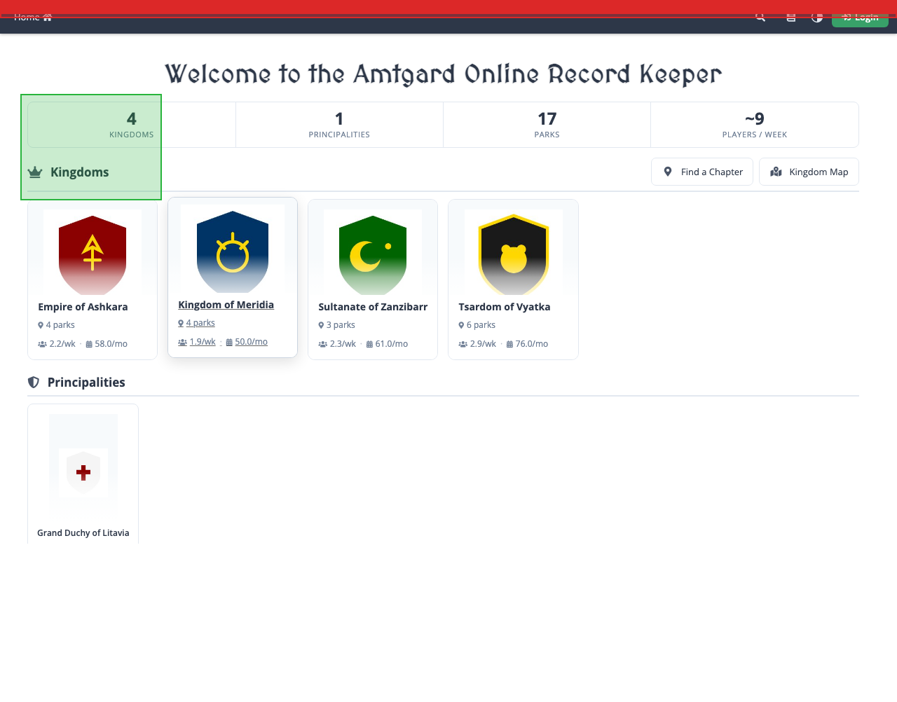

# Fuzzy Validator

A **fuzzy visual-validation harness** for HTML-driven websites.

It answers a question that unit tests and click-path e2e usually miss:

> After a change to templates, CSS, JS, or rendering, does each page still look and structure the same — except for the parts that are *allowed* to move?

The tool loads pages in a real browser (Playwright), takes stabilized captures, and compares each **candidate** run against a previously recorded **baseline** across three layers: static assets (CSS/JS), the DOM tree, and full-page **screenshots**. Comparisons that would otherwise drown in noise use *learned fuzz*: small allowlists of regions and nodes that were observed to change even when the code did not. Everything outside those allowances is gated hard.

When a validate run finishes you get an exit code (for CI) and an HTML report. Annotated screenshots in that report use **green** for allowed fuzz / overlay surface and **red** for unexpected drift (gate fail):

<table>
<tr>
<td align="center" width="50%">
<br/>
<sub>Pass — allowed fuzz only</sub>
</td>
<td align="center" width="50%">
<br/>
<sub>Fail — red outside allowed fuzz</sub>
</td>
</tr>
</table>

It is packaged here as `bin/fuzzy-validator`, but the design is site-agnostic: a page registry, capture + stabilize, discovery of volatility, baselines, drift overlays, and validate / refuzz / setpoint / overlay workflows. ORK3-specific wiring (docker, dual DBs, npm scripts) is at the end under [Using it in this repository](#using-it-in-this-repository-ork3).

---

## Why “fuzzy” validation?

Exact screenshot or DOM diffs are brittle on almost any real site. Harmless differences show up every run:

- session tokens, CSRF fields, “logged in as …” labels
- relative timestamps (“3 hours ago”)
- rotating content (avatars, featured items, ads)
- font hinting and subpixel layout across OS/GPU
- list membership when the underlying data set changes

If you demand byte-identical screenshots, you get a wall of false failures and people mute the check. If you manually paint ignore boxes, you maintain a second fragile UI map that goes stale when the layout moves.

**Fuzzy validation** here means: keep a strict notion of “the page should match,” but first *learn which parts of the page are naturally unstable*, then compare only the rest.

| Approach | Failure mode |
|----------|----------------|
| Exact screenshot diff | Constant noise from dates, sessions, data |
| Exact DOM string diff | Same noise in attributes and text nodes |
| Manual ignore regions | Maintainer tax; boxes drift when layout changes |
| **This tool** | Discover volatility from repeated captures; commit small JSON allowlists; fail only outside them |

“Fuzz” in this project does **not** mean sending random inputs into the app (security/chaos fuzzing). It means **fuzzy matching**: calibrated ignore zones (`fuzzZones` on screenshots, `fuzzNodes` on the DOM tree) derived from observation.

The hard counterpart is the **asset** layer: CSS and JS bodies must be byte-identical. Silent stylesheet or inline-script drift fails immediately — no soft allowlist. Visual and structural noise is expected; accidental asset rewrites are not.

---

## What it checks

| Layer | What is captured | How it compares | Purpose |
|-------|------------------|-----------------|---------|
| **Assets** | CSS and JS files/inline bodies as bytes | Exact equality (unified diff on failure) | Catch unintended static or inline script/style changes |
| **DOM** | Canonicalized HTML tree | Tree compare; learned `fuzzNodes` ignored | Catch markup/structure regressions while allowing volatile labels and tokens |
| **Screenshots** | Full-page PNG after stabilization | Image compare; learned `fuzzZones` ignored; score + budget | Catch visual regressions while allowing regions that move every session |

**Baselines** are the last accepted captures (screenshot, DOM, assets).  
**Fuzz manifests** are the committed allowlists that make those compares workable.  
Together they are the **setpoint contract**: validate fails if the candidate differs outside the fuzz.

Two more tools sit *on top of* that contract without rewriting it:

| Need | Command / artifact |
|------|--------------------|
| Natural data noise; layout unchanged | **`refuzz`** — widen learned fuzz, then promote a new setpoint when ready |
| Planned UI change during a feature (keep gold master locked) | **Drift overlay** — classify expected **natural** / **intentional** drift at validate time |
| Accepted new UI as the next gold master | **`record`** + [setpoint capture](#setpoint-capture) / [publish](#setpoint-publish) |

Stabilization before capture (fixed clock, reduced animation, font/network readiness, optional auth) shrinks *artificial* flakiness so discovery mostly sees genuine page volatility.

---

## Concepts

### Pages

A **page** is one URL under gate — home, profile, admin screen, and so on. Pages are declared in `manifests/pages.json5` with an `id`, path/URL, auth needs, wait hints, and optional `skip` / drift class. Without registry entries, day-to-day commands have nothing to run against. Targeting a page from the CLI is shown with `record` / `validate` / `refuzz` / `overlay` below.

### Profiles

A **profile** is a named environment for the *same* logical pages: different auth, different backend data, different score thresholds, and **separate** baselines and fuzz files under `manifests/<profile>/` and `baselines/<profile>/`.

Typical setup: a deterministic sandbox profile with perfect scores, plus a messier staging or prod-like profile with slightly looser screenshot/DOM thresholds. Config lives in `manifests/profiles.json5` (see [format descriptions](#format-descriptions) below; shared knobs in `defaults.json5`). Selecting a profile from the CLI is shown with the commands below; the default is whatever `defaultProfiles` lists (often more than one, run in sequence).

### Phases

A run can exercise one comparison layer or all of them. That selection is the **phase**:

| Phase value | Layers run |
|-------------|------------|
| `assets` | CSS/JS only |
| `dom` | DOM only |
| `visual` | Screenshots only |
| `all` | Assets → DOM → screenshots |

`validate` defaults to `all`. `record` defaults to `visual`. When cutting full baselines, pass `--phase all` on `record` (examples below).

### Drift overlays

A **drift overlay** is a versioned JSON5 file of *extra* allowances applied at **`validate` time**. It does **not** rewrite baselines or the setpoint zip. Entries are classified:

| Class | Meaning |
|-------|---------|
| **natural** | Volatility expected without a product change (same idea as learned fuzz; overlay can refine it) |
| **intentional** | Drift expected because of planned development mutation (tie to a requirement ref) |

Layout under the tool root:

```text
overlays/
  natural/         reviewed shared natural refinements (optional)
  intentional/     promoted workstream overlays (git-tracked)
  putative/        drafts from planning; loaded only with --putative
```

At gate time the tool merges calibrated fuzz ∪ overlay entries, then labels each remaining diff **expected** (by class) or **unexpected**. Unexpected diffs still fail the gate. Optional `annotations.json` may assess unexpected drifts for humans — it is **display-only** and never changes exit codes.

Schema-check overlays with [`overlay validate`](#overlay-validate--summarize); apply them on [`validate`](#validate) via `--overlay` / `--overlay-dir`. Format: [Drift overlay](#drift-overlay-schemaversion-2).

---

## How you use it in practice

Workflows below are the operational map. Flag-by-flag details live in [Command reference](#command-reference).

### 0. Happy path (defaults)

Assumptions: the site is reachable at the process env base URL, the page is already in `manifests/pages.json5`, and `manifests/profiles.json5` / `defaults.json5` are already configured (see [format descriptions](#format-descriptions)). Use the tool root defaults for profiles, calibration count, and report paths.

```bash
# First capture: learn fuzz, write baselines/<profile>/ and manifests/<profile>/*fuzz*.json.
fuzzy-validator record --page player-profile --phase all

# Day-to-day gate against those baselines (default --phase all).
fuzzy-validator validate --page player-profile
```

After either command, open the newest `reports/run-*/index.html` in a browser ([Reading reports](#reading-reports)). Also check the terminal `FUZZ_GATE` line and exit code. `record` additionally writes `baselines/<profile>/` and `manifests/<profile>/*fuzz*.json`.

Later sessions repeat `validate`. Re-`record` / `refuzz` only when the known-good contract should change; packaging for other machines is in [§1](#1-first-time-for-a-new-site-or-page-no-baselines-yet) and [setpoint publish](#setpoint-publish).

### 1. First time for a new site or page (no baselines yet)

1. **Register** the page in `manifests/pages.json5` (`id`, URL/path, auth, waits). Configure environments in `manifests/profiles.json5` if needed (see [format descriptions](#format-descriptions)).
2. **Point the tool at a known-good build** of the site — set the process env base URL, or pass `--base-url` on `record` ([record → `--base-url`](#record)).
3. **`record --phase all`** to learn fuzz and write local baselines ([record](#record)).
4. **Review the report** — open `reports/run-*/index.html` ([Reading reports](#reading-reports)). Green should cover real noise; unexpected red means stabilize waits/auth/assets and record again.
5. **Package and publish a setpoint** so others can restore — `setpoint capture`, copy the zip to `setpoints/bootstrap/` (and/or external store), then `setpoint publish` ([setpoint capture](#setpoint-capture), [setpoint publish](#setpoint-publish)). Commit `setpoint.json` + `manifests/**/*.json`, not loose `baselines/`.

Other machines then follow [§3](#3-setpoint-validation-from-prior-capture).

### 2. Day-to-day development

While changing templates, CSS, or JS, run `validate` on the pages you touched ([validate](#validate)):

```bash
fuzzy-validator validate --pages home-authenticated,player-profile --phase all
```

**Review the run.** Open the newest `reports/run-*/index.html` ([Reading reports](#reading-reports)). The terminal prints `FUZZ_GATE …` and an exit code (`0` pass, `1` fail, `2` harness error). On the annotated screenshots in that report, **green** is allowed fuzz / overlay surface and **red** (or a hard asset diff in the assets view) is unexpected failure.

| Outcome | Action |
|---------|--------|
| Red / asset fail you caused | Fix the bug; re-run `validate` |
| Planned UI still in flight (gold master locked) | Use a drift [overlay](#drift-overlays) and re-validate. Full process: [§4](#4-requirements-driven-development-expected-drift-via-overlays--agent-skills) |
| Intentional UI accepted as the next gold master | [`record`](#record) on a known-good commit of that UI, then [setpoint capture](#setpoint-capture) / [publish](#setpoint-publish) |
| Data noise only; layout unchanged | [`refuzz`](#refuzz), then [setpoint capture](#setpoint-capture) / [publish](#setpoint-publish) |

Most sessions never run `record` or `setpoint`. Creating a checkpoint: **capture → store zip → publish → commit pointer**. Consuming one: **restore → validate**. Feature work that expects UI drift: **restore → validate with overlay** (keep setpoint locked until you promote).

### 3. Setpoint validation from prior capture

A prior maintainer already packaged baselines into a setpoint zip and committed `setpoint.json` + fuzz manifests. On a fresh clone: unpack the zip, then `validate`.

```bash
fuzzy-validator setpoint restore
fuzzy-validator validate --pages home-authenticated,player-profile --phase all
```

Details: [setpoint restore](#setpoint-restore), [validate](#validate), [Reading reports](#reading-reports). Missing baselines → exit `2` and a restore hint.

### 4. Requirements-driven development (expected drift via overlays + agent skills)

Use this when a feature plan will **deliberately change the UI**, but you want the current gold-master setpoint to stay locked until that new look is accepted. You declare the planned changes as an **overlay** (expected drift), build the feature, then compare work against the locked setpoint. Planned differences show up as expected; anything else still fails.

The loop is agent-assisted: for the draft and evaluation steps, copy the linked `orchestrator.prompt` into a **new** agent chat and follow what it asks for.

1. Make sure you have a current gold-master setpoint for the pages you will touch (capture and publish one first if needed — see [§1](#1-first-time-for-a-new-site-or-page-no-baselines-yet)). Restore it on your machine before the later steps (`setpoint restore`).
2. From the requirements, draft an overlay of intentional UI drift  (or have [this agent skill do it for you](../../docs/megiddo/fuzzy-validator/skills/putative-drift-overlay/orchestrator.prompt)) so later checks know which changes were planned. Copy [this prompt](../../docs/megiddo/fuzzy-validator/skills/putative-drift-overlay/orchestrator.prompt) into a new agent chat; point it at your requirements/plan docs and name the workstream. Review the draft, reject anything speculative, then promote the reviewed overlay into the workstream’s intentional overlays (the agent will say where).
3. Implement the feature on your branch. Leave the gold-master setpoint alone — do not re-record or publish a new one just to silence differences you already planned for.
4. Compare current work to the locked setpoint with that overlay applied, on both sandbox and prod-mirror profiles. The recommended approache is to use  [this agent skill prompt](../../docs/megiddo/fuzzy-validator/skills/run-setpoint-drift/orchestrator.prompt) in a new agent chat and tell it which overlay to use. If it stops because the prod mirror looks stale, refresh the mirror (or give an explicit override) before continuing. Open the HTML report when it finishes.
5. Correct real product bugs, or accept and fold missing planned drift into the overlay when the requirements were incomplete. Optional agent notes on failures are commentary only — they do not clear a fail. Repeat from step 4 (and update the overlay via step 2 if the plan changed) until unexpected errors are winnowed down. When the new UI is accepted as the next contract, record and publish a new setpoint ([§1](#1-first-time-for-a-new-site-or-page-no-baselines-yet) / [setpoint capture](#setpoint-capture)).

Day-to-day checks without a feature plan stay [§2](#2-day-to-day-development). Clone-and-restore only stays [§3](#3-setpoint-validation-from-prior-capture).

---

## Reading reports

Every `record`, `validate`, and `refuzz` writes a directory under `reports/run-<id>/` (UTC timestamp unless you pass `--run-id`).

1. Open `reports/run-<id>/index.html` in a browser (newest `run-*` after a local run).
2. Drill into a page → screenshot / DOM / assets views.
3. On annotated screenshots: **green** = allowed fuzz / overlay surface; **red** = unexpected drift (fail).
4. Pair with the terminal `FUZZ_GATE` line and process exit code.

When you pass drift overlays on `validate`, also check:

| Artifact | Role |
|----------|------|
| **Unexpected** section (HTML) | Failures — primary gate signal |
| **Expected intentional / natural** | Informational; covered by overlay or calibrated fuzz |
| **`drifts.json`** | Machine-readable inventory (`expected` / `unexpected` + class) |
| **`pages/<id>/reproduce.md`** | Mechanical steps to reproduce (no LLM); links baseline / candidate / diff |
| **Assessment** column | Optional `annotations.json` — display-only; never hides Unexpected |

Evidence of the same green/red screenshot language appears in the preamble images above.

---

## Command reference

Entry point: `bin/fuzzy-validator` (from this repo’s root, or the tool’s dispatcher). Each section: why → what → basic usage → parameters (one example each).

### `record`

**Why.** You need a known-good contract: baselines plus learned fuzz allowlists. Without `record`, `validate` has nothing trustworthy to compare against (except after [setpoint restore](#setpoint-restore) of someone else’s capture).

**What.** Captures each target page N times (stabilized Playwright), discovers screenshot `fuzzZones` and DOM `fuzzNodes` from differences across those runs, requires CSS/JS bytes to be identical across the runs, and writes `baselines/<profile>/` plus `manifests/<profile>/*fuzz*.json`. Default `--phase` is `visual` only — use `--phase all` for a full first baseline.

**Basic usage**

```bash
# Learn fuzz and write full baselines for one registry page across defaultProfiles.
fuzzy-validator record --page player-profile --phase all
```

Inspect `reports/run-*/index.html` ([Reading reports](#reading-reports)), then `baselines/` and `manifests/`.

**Parameters**

```bash
# --page: single pages.json5 id.
fuzzy-validator record --page player-profile --phase all

# --pages: several ids in one run.
fuzzy-validator record --pages home-authenticated,player-profile --phase all

# --all: every non-skipped registry page.
fuzzy-validator record --all --phase all

# --phase: which layers to capture/discover (visual|assets|dom|all). Default visual.
fuzzy-validator record --page player-profile --phase dom

# --repeat: calibration capture count (overrides defaults.json5 calibrationRuns).
fuzzy-validator record --page player-profile --phase all --repeat 8

# --profile: only this profile’s auth, thresholds, and output dirs.
fuzzy-validator record --profile test --page player-profile --phase all

# --profiles: explicit profile list (comma-separated).
fuzzy-validator record --profiles test,mirror --page player-profile --phase all

# --base-url: site root for this run (overrides process env base URL).
fuzzy-validator record --page player-profile --phase all --base-url http://localhost:19080/orkui/

# --ensure-sandbox: run bin/ork-db deploy-sandbox before the test profile (ORK integration).
fuzzy-validator record --profile test --ensure-sandbox --page player-profile --phase all

# --dry-run: print profile:page targets; do not capture.
fuzzy-validator record --page player-profile --dry-run

# --run-id: fixed reports/run-<id>/ directory name instead of a UTC timestamp.
fuzzy-validator record --page player-profile --phase all --run-id my-record-1

# --urls FILE: read targets from a file (one URL or page:id per line).
fuzzy-validator record --urls /tmp/pages.txt --phase all
```

### `validate`

**Why.** Day-to-day gate: after a code change, decide pass/fail against the known-good contract without rewriting baselines. Optional drift overlays classify planned or refined allowances without mutating the setpoint.

**What.** Captures each target once, compares to `baselines/` under the fuzz allowlists ∪ any loaded overlays (and hard asset equality), scores against profile thresholds, writes `reports/run-*/` (including `drifts.json` and mechanical `reproduce.md` when overlays / classification apply), prints `FUZZ_GATE`, exits `0`/`1`/`2`. Default `--phase` is `all`.

**Basic usage**

```bash
# Full gate for one page; then open reports/run-*/index.html.
fuzzy-validator validate --page player-profile

# Same gate with a workstream overlay (setpoint stays locked).
fuzzy-validator validate --page player-profile \
  --overlay overlays/intentional/my-feature.json5
```

**Parameters**

```bash
# --page: single registry id.
fuzzy-validator validate --page player-profile

# --pages: several ids.
fuzzy-validator validate --pages home-authenticated,player-profile

# --all: every non-skipped registry page (slow: pages × profiles).
fuzzy-validator validate --all

# --phase: visual|assets|dom|all (default all).
fuzzy-validator validate --page player-profile --phase visual

# --profile: only this profile.
fuzzy-validator validate --profile test --page player-profile

# --profiles: explicit list.
fuzzy-validator validate --profiles mirror --page player-profile

# --overlay: comma-separated overlay file paths (schemaVersion 2).
fuzzy-validator validate --page home-authenticated \
  --overlay overlays/intentional/my-feature.json5

# --overlay-dir: load every *.json5 / *.json in a directory.
fuzzy-validator validate --all --overlay-dir overlays/intentional

# --putative: also load overlays/putative/ (off by default; drafts only).
fuzzy-validator validate --all --overlay-dir overlays/intentional --putative

# --require-fresh-mirror: exit 2 if ork-db extract manifest is older than 7 days.
fuzzy-validator validate --all --require-fresh-mirror

# --mirror-stale-ok: override stale-mirror check; reason is recorded in drifts.json.
fuzzy-validator validate --all --require-fresh-mirror --mirror-stale-ok "import scheduled Monday"

# --annotations: display-only assessment file (never changes exit code).
fuzzy-validator validate --page player-profile --annotations /tmp/annotations.json

# --annotations-out: write an empty annotations shell for an agent evaluator.
fuzzy-validator validate --page player-profile --annotations-out reports/run-local/annotations.json

# --base-url: site root for this run.
fuzzy-validator validate --page player-profile --base-url http://localhost:19080/orkui/

# --ensure-sandbox: deploy-sandbox before test profile (ORK integration).
fuzzy-validator validate --profile test --ensure-sandbox --page player-profile

# --dry-run: print targets only.
fuzzy-validator validate --pages home-authenticated,player-profile --dry-run

# --run-id: fixed report directory id.
fuzzy-validator validate --page player-profile --run-id pr-1234

# --visual-min-score: override screenshot pass floor for this run.
fuzzy-validator validate --page player-profile --visual-min-score 0.98

# --dom-min-score: override DOM pass floor for this run.
fuzzy-validator validate --page player-profile --dom-min-score 0.99

# --assets-min-score: override assets pass floor (normally leave at 1.0).
fuzzy-validator validate --page player-profile --assets-min-score 1.0

# --skip-capture: gate using candidate files already staged under calibrations/ (evidence / replay).
fuzzy-validator validate --page player-profile --skip-capture

# --tool-root: alternate tool root (e.g. evidence tree).
fuzzy-validator validate --tool-root tools/fuzzy-validator/evidence --page home-authenticated --skip-capture
```

| Exit | Meaning |
|------|---------|
| `0` | Pass (no unexpected drift below thresholds) |
| `1` | Regression — at least one **unexpected** failure |
| `2` | Harness error (missing baselines, bad registry/overlay, stale mirror with `--require-fresh-mirror`, unreachable site, …) |

### `overlay validate` / `summarize`

**Why.** Check overlay files before a long validate run, and inventory what a workstream claims as expected drift.

**What.** Loads one or more overlay paths, merges them, checks schema + conflicts (`validate`), or prints entry counts by class/page (`summarize`). Does **not** capture pages.

**Basic usage**

```bash
fuzzy-validator overlay validate overlays/putative/example-workstream.json5
fuzzy-validator overlay summarize overlays/intentional/my-feature.json5
```

**Parameters**

```bash
# One or more overlay paths (positional).
fuzzy-validator overlay validate overlays/natural/shared.json5 overlays/intentional/ws.json5

fuzzy-validator overlay summarize overlays/intentional/ws.json5
```

Promote a reviewed putative draft into `overlays/intentional/` before relying on it in CI (do not pass `--putative` in lights-out gates unless you mean to).

### `refuzz`

**Why.** Layout and assets are fine, but real data moved enough that `validate` fails in regions that should be allowed. Widens fuzz from observed baseline↔candidate drift without pretending the UI redesign was intentional.

**What.** Captures a candidate, merges natural drift into screenshot/DOM fuzz manifests, refreshes baselines for the selected pages. Does not replace a deliberate UI re-`record`. Default `--phase` is `all` (`visual`|`dom`|`all` — no assets phase).

**Basic usage**

```bash
# Merge drift into fuzz + re-baseline one page; then review reports/run-*/index.html.
fuzzy-validator refuzz --page player-profile --phase all
```

**Parameters**

```bash
# --page: single registry id.
fuzzy-validator refuzz --page player-profile

# --pages: several ids.
fuzzy-validator refuzz --pages home-authenticated,player-profile

# --all: every non-skipped registry page.
fuzzy-validator refuzz --all --phase all

# --natural: only pages with driftClass: natural in pages.json5.
fuzzy-validator refuzz --natural --phase all

# --phase: visual|dom|all (default all).
fuzzy-validator refuzz --page player-profile --phase visual

# --profile: only this profile.
fuzzy-validator refuzz --profile test --page player-profile --phase all

# --profiles: explicit list.
fuzzy-validator refuzz --profiles test,mirror --page player-profile --phase all

# --base-url: site root for this run.
fuzzy-validator refuzz --page player-profile --phase all --base-url http://localhost:19080/orkui/

# --ensure-sandbox: deploy-sandbox before test profile (ORK integration).
fuzzy-validator refuzz --profile test --ensure-sandbox --page player-profile --phase all

# --dry-run: print targets only.
fuzzy-validator refuzz --page player-profile --dry-run

# --run-id: fixed report directory id.
fuzzy-validator refuzz --page player-profile --phase all --run-id refuzz-2026-07-14
```

Promote afterward with [setpoint capture](#setpoint-capture) / [publish](#setpoint-publish) if others need the new baselines.

### `setpoint capture`

**Why.** Baselines are too large for git as loose files. Capture packages them into a zip you can store and later restore.

**What.** Runs `record --all --phase all` for the selected profiles, then zips `baselines/` into `setpoints/out/<timestamp-sha>.zip`. Does **not** update `setpoint.json` (that is [publish](#setpoint-publish)).

**Basic usage**

```bash
# Re-record all active pages for default profiles; write setpoints/out/<name>.zip.
fuzzy-validator setpoint capture
```

Copy the printed zip path to `setpoints/bootstrap/` and/or external storage, then [publish](#setpoint-publish).

**Parameters**

```bash
# --out-dir: write the zip somewhere other than setpoints/out/.
fuzzy-validator setpoint capture --out-dir /tmp/fuzzy-bundles

# --profile: capture only one profile’s re-record + baselines.
fuzzy-validator setpoint capture --profile test

# --profiles: explicit profile list for the embedded record.
fuzzy-validator setpoint capture --profiles test,mirror

# --base-url: site root passed through to the embedded record.
fuzzy-validator setpoint capture --base-url http://localhost:19080/orkui/

# --ensure-sandbox: deploy-sandbox before test profile during the embedded record.
fuzzy-validator setpoint capture --ensure-sandbox

# --dry-run: print what would run; do not record or zip.
fuzzy-validator setpoint capture --dry-run
```

### `setpoint publish`

**Why.** The team and CI need one agreed “current” zip filename without committing PNGs into git history.

**What.** Updates `setpoint.json`: sets `latestBundle` to the zip’s filename and records hash/metadata under `setpoints` (see [format descriptions](#format-descriptions)). Does not upload the zip; you copy it to `setpoints/bootstrap/` or external storage yourself.

**Basic usage**

```bash
# Point setpoint.json at this zip; then commit setpoint.json + manifests/.
fuzzy-validator setpoint publish --bundle setpoints/out/20260714T032101Z-3cd6d803-b5bf99b9776808d8.zip
```

**Parameters**

```bash
# --bundle: explicit zip path (recommended).
fuzzy-validator setpoint publish --bundle setpoints/out/20260714T032101Z-3cd6d803-b5bf99b9776808d8.zip

# Omit --bundle: use the newest zip already in setpoints/out/.
fuzzy-validator setpoint publish

# --drive-folder: human hint string stored in setpoint.json (not an upload).
fuzzy-validator setpoint publish --bundle setpoints/out/20260714T032101Z-3cd6d803-b5bf99b9776808d8.zip --drive-folder "ORK3 Fuzzy Setpoints"
```

### `setpoint restore`

**Why.** After clone or CI checkout, heavy baselines are absent until extracted from a setpoint zip.

**What.** Resolves a zip, verifies content sha256 against `setpoint.json` (unless `--no-verify`), extracts members under `baselines/…` into local `baselines/…`, overwriting those paths. Does not wipe unrelated files under `baselines/`, and does not modify `manifests/`.

Bundle resolution: `--bundle` if given; else `setpoint.json` → `latestBundle` in `setpoints/bootstrap/`, then `setpoints/out/`, or download via `--base-url` into `setpoints/cache/`.

**Basic usage**

```bash
# Unpack latestBundle from setpoints/bootstrap/ (usual after clone) into baselines/.
fuzzy-validator setpoint restore
```

**Parameters**

```bash
# --bundle: explicit local zip (ignore latestBundle lookup).
fuzzy-validator setpoint restore --bundle setpoints/bootstrap/20260714T032101Z-3cd6d803-b5bf99b9776808d8.zip

# --base-url: HTTP directory; download latestBundle into setpoints/cache/, then unpack.
fuzzy-validator setpoint restore --base-url https://example.com/fuzzy-setpoints/

# --no-verify: skip sha256 check against setpoint.json.
fuzzy-validator setpoint restore --bundle /tmp/old-setpoint.zip --no-verify

# --tool-root: treat another directory as the tool root for pointer + extract paths.
fuzzy-validator setpoint restore --tool-root tools/fuzzy-validator
```

---

## Outputs (and why they exist)

Heavy binary baselines usually do **not** live as loose files in git. Git keeps small, reviewable **fuzz manifests** and a **setpoint pointer**; screenshots and asset bytes ride in a zip you restore locally or in CI.

```
tools/fuzzy-validator/
  manifests/          page registry, profiles, defaults, fuzz allowlists
  overlays/           drift overlays (natural / intentional / putative) — additive; never rewrite setpoints
  setpoint.json       which baseline bundle is “current”
  setpoints/          bootstrap (committed) + out/cache (local)
  baselines/          restored or recorded “known good” captures
  calibrations/       scratch captures used while learning or staging candidates
  reports/            HTML gate results for humans (+ drifts.json, reproduce.md)
  evidence/           committed end-to-end proof fixtures (tool development)
  playwright/         browser capture + stabilization
  python/             discovery, gates, scoring, CLI package, unit tests
                      fuzzy_validator/ — thin cli.py + record/validate/refuzz/setpoint_cli/overlay_cli
                      + runtime (profile activate, subprocess seam), capture, pages, parser

```

| Path | Why it exists |
|------|----------------|
| **`manifests/pages.json5`** | Declares which URLs to capture, auth, waits, skip flags, drift class. Without it the tool has no page list. |
| **`manifests/profiles.json5`** | Named environments, auth, and score floors — see [format descriptions](#format-descriptions). |
| **`manifests/defaults.json5`** | Global knobs (calibration run count, color tolerances, default score floors). |
| **`manifests/<profile>/*.fuzz.json`** | Screenshot allowlists (rectangles). Committed so PRs can review forgiven noise. |
| **`manifests/<profile>/*.dom-fuzz.json`** | DOM allowlists (paths + `subtree` / `text` / `attributes`). Same review role. |
| **`overlays/{natural,intentional,putative}/`** | Classified drift overlays applied at validate time; setpoint stays locked. See [Drift overlay](#drift-overlay-schemaversion-2). |
| **`setpoint.json`** | Pointer + metadata for the latest baseline **bundle** — see [format descriptions](#format-descriptions). |
| **`setpoints/bootstrap/*.zip`** | Offline restore after clone / in CI without fetching external storage. |
| **`setpoints/out/`**, **`setpoints/cache/`** | Local staging for newly captured zips and downloads (gitignored). |
| **`baselines/<profile>/`** | Known-good screenshot PNG, DOM JSON, asset manifest, raw CSS/JS used by `validate`. |
| **`calibrations/`** | Transient N-run / candidate files so Playwright and Python can hand off via the filesystem; safe to delete. |
| **`reports/run-<id>/`** | Human narrative: `index.html`, layer views, annotated screenshots, `drifts.json`, per-page `reproduce.md`. |
| **`evidence/`** | Self-contained proof tree for developing the tool itself — not your product baselines. |
| **`playwright/`**, **`python/`** | Capture runtime vs compare/discover/report logic. CLI lives under `python/fuzzy_validator/` (thin `cli.py` + command modules). |

---

## Format descriptions

### `setpoint.json`

Committed pointer to the canonical baseline zip. Written by `setpoint publish`; read by `setpoint restore` when no `--bundle` is given.

```json
{
  "schemaVersion": 1,
  "latestBundle": "20260714T032101Z-3cd6d803-b5bf99b9776808d8.zip",
  "driveFolder": "ORK3 Fuzzy Setpoints",
  "setpoints": {
    "20260714T032101Z-3cd6d803-b5bf99b9776808d8.zip": {
      "gitSha": "3cd6d803",
      "capturedAt": "2026-07-14T03:21:01Z",
      "contentSha256": "b5bf99b9776808d82b052171f78718fd47e1b60eb0bd459204eb82c49f7d63ba",
      "profiles": ["test", "mirror"],
      "pageCount": 30
    }
  }
}
```

| Field | Role |
|-------|------|
| `schemaVersion` | Pointer-file schema version |
| `latestBundle` | Filename of the current zip (`setpoint restore` looks this up under `setpoints/bootstrap/`, `out/`, or via download) |
| `driveFolder` | Optional human hint for where maintainers store zips externally |
| `setpoints.<filename>` | Metadata for a published zip: short git sha, capture time, content sha256 (integrity check on restore), profiles included, page count |

Zip naming from `setpoint capture`: `{UTC}-{gitSha}-{contentSha256prefix}.zip`.

### `manifests/profiles.json5`

Named environments for the same page registry. Each profile has its own baselines under `baselines/<name>/` and fuzz files under `manifests/<name>/`.

```json5
{
  "profiles": {
    "test": {
      "orkDbUse": "dev",
      "label": "Sandbox (ork_test @ 19307)",
      "thresholds": {
        "assetsMinScore": 1.0,
        "domMinScore": 1.0,
        "visualMinScore": 1.0
      },
      "auth": {
        "username": "megiddo",
        "passwordEnv": "ORK3_E2E_TEST_PASSWORD",
        "passwordDefault": "test-db-player"
      }
    },
    "mirror": {
      "orkDbUse": "prod",
      "label": "Mirror (ork @ 19306)",
      "thresholds": {
        "assetsMinScore": 1.0,
        "domMinScore": 0.99,
        "visualMinScore": 0.98
      },
      "auth": {
        "username": "admin",
        "passwordDefault": "password",
        "usernameEnv": "ORK3_E2E_USERNAME",
        "passwordEnv": "ORK3_E2E_PASSWORD"
      }
    }
  },
  "defaultProfiles": ["test", "mirror"]
}
```

| Field | Role |
|-------|------|
| `defaultProfiles` | Profile names run when the CLI does not pass `--profile` / `--profiles` |
| `profiles.<name>.label` | Human description |
| `profiles.<name>.orkDbUse` | Integration hook: which app DB profile to select before capture (`dev` / `prod` in this repo) |
| `profiles.<name>.thresholds.*` | Minimum scores for assets / DOM / screenshot layers during `validate` (override `defaults.json5`) |
| `profiles.<name>.auth.username` | Login user for pages that need auth |
| `profiles.<name>.auth.passwordDefault` | Password used when the env var below is unset |
| `profiles.<name>.auth.passwordEnv` | Env var name that overrides the default password |
| `profiles.<name>.auth.usernameEnv` | Optional env var name that overrides `username` |

### Drift overlay (`schemaVersion: 2`)

Additive allowances for `validate --overlay` / `--overlay-dir`. Does not modify baselines or `setpoint.json`.

```json5
{
  schemaVersion: 2,
  id: "example-intentional-header",
  workstream: "docs/example",
  createdAt: "2026-07-19T12:00:00Z",
  basedOnSetpoint: "pin-after-restore",
  entries: [
    {
      id: "example-header-title",
      class: "intentional",          // natural | intentional
      layer: "dom",                  // visual | dom | assets
      profiles: ["test", "mirror"],
      pages: ["home-authenticated"],
      dom: { pathPrefix: "/html/body/div/h1", match: "subtree" },
      // visual: { x, y, width, height }  — screenshot boxes
      // assets: { ids: ["css-000"] }     — explicit only; assets stay hard by default
      rationale: "Header title changes per requirement",
      requirementRef: "docs/.../requirements.md#REQ-12",  // required for intentional
      source: "putative"             // calibrated | manual | putative | promoted
    }
  ]
}
```

| Field | Role |
|-------|------|
| `basedOnSetpoint` | Which gold-master bundle this overlay was authored against |
| `entries[].class` | `natural` or `intentional` — used in report classification |
| `entries[].layer` | Which gate layer the allowance applies to |
| `entries[].requirementRef` | Required for `intentional` — ties drift to a written requirement |
| `entries[].source` | Provenance; promote `putative` → `intentional/` after human review |

Conflicts (same region, contradictory classes) fail closed (`overlay validate` / `validate` exit `2`).

---

## How it works (pipeline)

```text
Playwright
  stabilize (clock, fonts, network, auth)
  → full-page screenshot (PNG)
  → canonical DOM
  → CSS/JS bytes + asset manifest
        │
record  → intersect differences across N runs
          → fuzzZones (screenshot) + fuzzNodes (DOM)
          → require assets identical across runs
          → write baselines + manifests
validate → gate assets → gate DOM → gate screenshots
          → apply drift overlays (optional)
          → classify expected natural | intentional | unexpected
          → score vs thresholds → HTML report + drifts.json + reproduce.md
refuzz  → treat baseline↔candidate drift as new natural fuzz
          → merge into manifests; refresh baselines
overlay → schema + conflict check / summarize (no capture)
setpoint → capture zip / publish pointer / restore into baselines/
```

1. **Stabilize** — neutralize capture flakiness so N runs on the same commit mostly agree except for real page volatility.  
2. **Discover (record)** — pairwise-diff N screenshots and DOM trees; keep regions/nodes that change across comparisons as fuzz; abort if CSS/JS diverge across those runs.  
3. **Gate (validate)** — one candidate; assets exact (unless an explicit asset overlay entry); DOM/screenshots may differ inside learned fuzz ∪ overlays; scores must meet profile thresholds; unexpected diffs fail.  
4. **Report** — green = forgiven fuzz / overlay surface; red = unexpected diff; expected classes listed separately; annotations optional and non-masking.

---

## Using it in this repository (ORK3)

ORK3 uses this tool to gate front-end refactors against local docker. Two profiles map to two databases (`test` = deterministic sandbox, `mirror` = local prod-like data). Run from the **repo root** via `bin/fuzzy-validator`.

### Quick start (ORK3)

```bash
npm ci
npx playwright install chromium
pip install -r tools/fuzzy-validator/python/requirements.txt

docker compose -f docker-compose.php8.yml up -d
bin/ork-db deploy-sandbox --yes

export ORK3_E2E_BASE_URL=http://localhost:19080/orkui/
export ORK3_E2E_USERNAME=admin ORK3_E2E_PASSWORD=password
# test profile defaults: megiddo / test-db-player

bin/fuzzy-validator setpoint restore
bin/fuzzy-validator validate --pages home-authenticated,player-profile --phase all
```

Open `tools/fuzzy-validator/reports/run-*/index.html`.

```bash
# npm aliases that forward args to bin/fuzzy-validator validate|record.
npm run fuzz:validate -- --page player-profile --phase all
npm run fuzz:record -- --page player-profile --phase all

# Run deploy-sandbox before the test profile, then gate that profile only.
bin/fuzzy-validator validate --profile test --ensure-sandbox --page player-profile --phase all
```

| Profile | Database | Typical auth | Thresholds |
|---------|----------|--------------|------------|
| **test** | `ork_test` @ 19307 | `megiddo` / `test-db-player` | assets/dom/visual **1.0** |
| **mirror** | `ork` @ 19306 | `ORK3_E2E_*` or admin/password | assets 1.0; dom 0.99; visual 0.98 |

Default `validate` / `record` run both profiles unless you pass `--profile` / `--profiles`.

### ORK3 gotchas

- Run `setpoint restore` after clone; otherwise `validate` exits `2`.  
- Prefer `bin/fuzzy-validator` over legacy `calibrate.sh` / `gate.sh`.  
- Screenshot compare can differ macOS vs Linux; prefer a **Linux** docker/host gate for sign-off when they disagree. **Planned default:** containerized runner (Ubuntu 26.04 + pinned Chromium) so capture/validate are stable across host OS — see [`docs/megiddo/fuzzy-validator/version-2.1/`](../../docs/megiddo/fuzzy-validator/version-2.1/) (**status: plan**).  
- Do not lower `assetsMinScore` to hide a refactor; fix the drift or intentionally re-record.  
- Do not use overlays (or annotations) to soft-pass unexpected regressions; overlays are for *declared* expected drift only.  
- `validate --all` is slow (many pages × two profiles).  
- For dual-profile sign-off with a freshness check: `validate … --require-fresh-mirror` (override only with `--mirror-stale-ok "reason"`). Refresh the local prod mirror / re-`bin/ork-db extract` when prompted.

Agent orchestration skills (run setpoint drift; draft putative overlays from requirements): [`docs/megiddo/fuzzy-validator/skills/`](../../docs/megiddo/fuzzy-validator/skills/).

### Tests (ORK3)

```bash
pip install -r tools/fuzzy-validator/python/requirements-dev.txt
pytest tools/fuzzy-validator/python/tests/ \
  --cov=tools/fuzzy-validator/python/lib \
  --cov=tools/fuzzy-validator/python \
  --cov-fail-under=95
```

Deeper notes: [`docs/megiddo/fuzzy-validator/`](../../docs/megiddo/fuzzy-validator/). Prefer this README and `bin/fuzzy-validator … --help` day to day.
